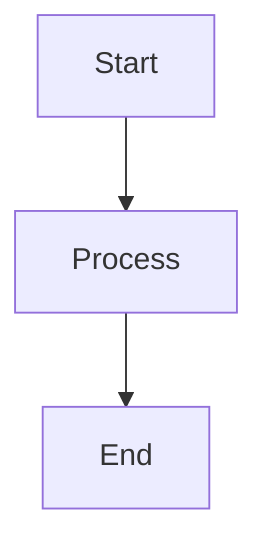

# Adding a New Question

No scripts needed. Just create a markdown file and Vite picks it up automatically at build time.

## Steps

1. Create a `.md` file in the appropriate category folder under `src/content/`:

```
src/content/
  algorithm/        ← Algorithm questions
  javascript/       ← JavaScript questions
  nodejs/           ← Node.js questions
  react/            ← React questions
  design-system/    ← Design System questions
  design-patterns/  ← Design Patterns questions
  system-design/    ← System Design questions
```

2. Name the file using the question id (e.g., `algo-99.md`, `js-15.md`).

3. Use this template:

```markdown
---
id: algo-99
title: My New Problem
category: Algorithm
subcategory: Arrays & Hashing
difficulty: Medium
pattern: Hash Map
companies: [Google, Amazon]
timeComplexity: O(n)
spaceComplexity: O(n)
keyTakeaway: One sentence summary of the key insight.
similarProblems: [Two Sum, Contains Duplicate]
leetcodeUrl: https://leetcode.com/problems/my-new-problem/
---

Problem description goes here. Supports full **markdown** and `inline code`.

## Examples

**Input:** nums = [1, 2, 3]
**Output:** 6
*Optional explanation of the example.*

## Brute Force

```js
function solve(nums) {
  // brute force approach
}
```

### Brute Force Explanation

Why the brute force works and its tradeoffs.

## Solution

```js
function solve(nums) {
  // optimal approach
}
```

## Explanation

Step-by-step walkthrough of the optimal solution.

## Diagram


```

4. Start the dev server (`npm run dev`) — the new question appears automatically.

## Optional sections

All sections below the frontmatter are optional except `## Solution`. You can omit any of:

- `## Examples`
- `## Brute Force` / `### Brute Force Explanation`
- `## Explanation`
- `## Diagram`

## Adding test cases

If the question needs runnable tests in the code playground, add an entry to `src/data/testCases.ts`:

```ts
'algo-99': {
  functionName: 'solve',
  testCases: [
    { args: [[1, 2, 3]], expected: 6 },
    { args: [[0]], expected: 0 },
  ],
},
```

## Adding to a learning path

To include the question in a learning path, add its id to the `questionIds` array in the frontmatter of the relevant file in `src/content/learning-paths/`.

## Adding to the study plan

Add the question id to the relevant week in `src/content/study-plan.json`.

## Frontmatter fields reference

| Field | Required | Type | Description |
|-------|----------|------|-------------|
| `id` | Yes | string | Unique identifier (e.g., `algo-99`) |
| `title` | Yes | string | Display title |
| `category` | Yes | string | One of: Algorithm, JavaScript, Node.js, React, Design System, Design Patterns, System Design |
| `subcategory` | Yes | string | Sub-grouping (e.g., "Arrays & Hashing") |
| `difficulty` | Yes | string | Easy, Medium, or Hard |
| `pattern` | Yes | string | Algorithm pattern (e.g., "Hash Map") |
| `companies` | Yes | string[] | Company tags |
| `timeComplexity` | Yes | string | e.g., "O(n)" |
| `spaceComplexity` | Yes | string | e.g., "O(1)" |
| `keyTakeaway` | Yes | string | One sentence insight |
| `similarProblems` | Yes | string[] | Related problem names |
| `leetcodeUrl` | No | string | Link to LeetCode problem |

## Mermaid diagram tips

- Wrap node labels with special characters in quotes: `A["O(n) time"]`
- Avoid unquoted `()`, `<`, `>`, `&`, `#` in node labels
- Keep diagrams simple — flowchart TD or LR work best
