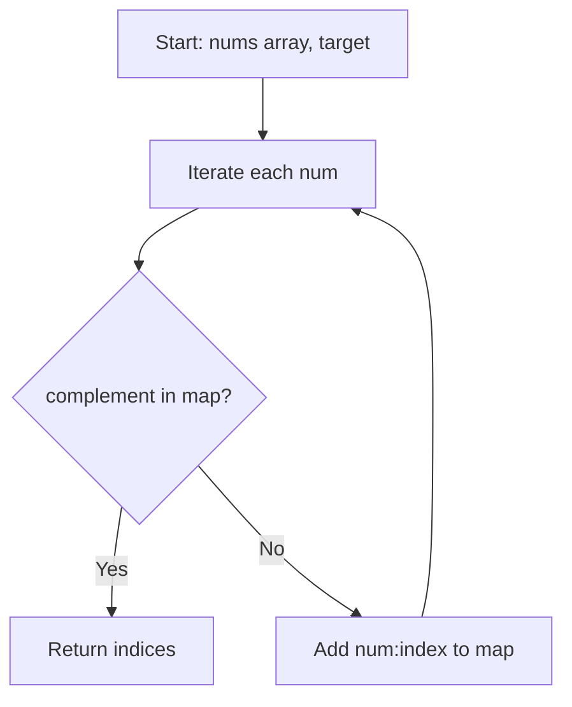

Given an array of integers `nums` and an integer `target`, return indices of the two numbers such that they add up to `target`. You may assume that each input would have exactly one solution, and you may not use the same element twice.

## Examples

**Input:** nums = [2,7,11,15], target = 9
**Output:** [0,1]
**Explanation:** Because nums[0] + nums[1] == 9, we return [0, 1].

**Input:** nums = [3,2,4], target = 6
**Output:** [1,2]
**Explanation:** Because nums[1] + nums[2] == 6, we return [1, 2].


## Brute Force

```js
function twoSumBrute(nums, target) {
  for (let i = 0; i < nums.length; i++) {
    for (let j = i + 1; j < nums.length; j++) {
      if (nums[i] + nums[j] === target) {
        return [i, j];
      }
    }
  }
  return [];
}
```

### Brute Force Explanation

The brute force checks every pair (i, j) with two nested loops, resulting in O(n^2) time. The hash map approach eliminates the inner loop by trading O(n) space for O(1) complement lookups.

## Solution

```js
function twoSum(nums, target) {
  const map = new Map();
  for (let i = 0; i < nums.length; i++) {
    const complement = target - nums[i];
    if (map.has(complement)) {
      return [map.get(complement), i];
    }
    map.set(nums[i], i);
  }
  return [];
}
```

## Explanation

APPROACH: Hash Map Lookup

For each number, compute its complement (target - num) and check if we've already
seen that complement. A hash map stores each number's index as we iterate, giving
us O(1) lookups instead of scanning the array again.

```
For each nums[i]:
  complement = target - nums[i]
  if complement in map → return [map[complement], i]
  else → store nums[i] → i in map
```

WALKTHROUGH with nums = [2, 7, 11, 15], target = 9:

```
Step   i   nums[i]   complement   map before         found?
────   ─   ───────   ──────────   ────────────────   ──────
 1     0     2         7          {}                 No  → map = {2:0}
 2     1     7         2          {2:0}              Yes → return [0, 1]
```

WHY THIS WORKS:
- Each element is visited at most once, so O(n) time
- The map stores at most n entries, so O(n) space
- By checking before inserting, we never match an element with itself


## Diagram



## TestConfig
```json
{
  "functionName": "twoSum",
  "validator": "validateTwoSum",
  "testCases": [
    {
      "args": [
        [
          2,
          7,
          11,
          15
        ],
        9
      ],
      "expected": [
        0,
        1
      ]
    },
    {
      "args": [
        [
          3,
          2,
          4
        ],
        6
      ],
      "expected": [
        1,
        2
      ]
    },
    {
      "args": [
        [
          3,
          3
        ],
        6
      ],
      "expected": [
        0,
        1
      ]
    },
    {
      "args": [
        [
          1,
          5,
          3,
          7
        ],
        8
      ],
      "expected": [
        1,
        2
      ],
      "isHidden": true
    },
    {
      "args": [
        [
          0,
          4,
          3,
          0
        ],
        0
      ],
      "expected": [
        0,
        3
      ],
      "isHidden": true
    },
    {
      "args": [
        [
          -1,
          -2,
          -3,
          -4,
          -5
        ],
        -8
      ],
      "expected": [
        2,
        4
      ],
      "isHidden": true
    },
    {
      "args": [
        [
          1,
          2
        ],
        3
      ],
      "expected": [
        0,
        1
      ],
      "isHidden": true
    },
    {
      "args": [
        [
          5,
          75,
          25
        ],
        100
      ],
      "expected": [
        1,
        2
      ],
      "isHidden": true
    },
    {
      "args": [
        [
          2,
          5,
          5,
          11
        ],
        10
      ],
      "expected": [
        1,
        2
      ],
      "isHidden": true
    },
    {
      "args": [
        [
          1,
          3,
          4,
          2
        ],
        6
      ],
      "expected": [
        2,
        3
      ],
      "isHidden": true
    }
  ]
}
```
