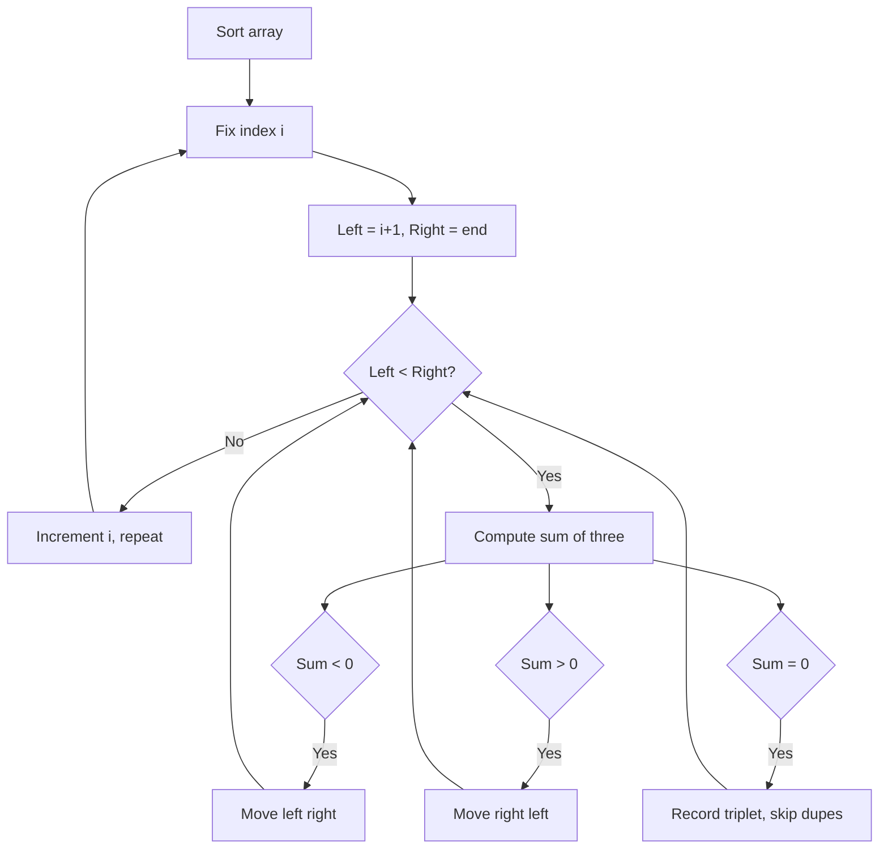

Given an integer array nums, return all the triplets `[nums[i], nums[j], nums[k]]` such that `i != j`, `i != k`, and `j != k`, and `nums[i] + nums[j] + nums[k] == 0`. The solution set must not contain duplicate triplets.

## Examples

**Input:** nums = [-1,0,1,2,-1,-4]
**Output:** [[-1,-1,2],[-1,0,1]]
**Explanation:** The triplets [-1,-1,2] and [-1,0,1] each sum to 0, and these are the only unique such triplets.

**Input:** nums = [0,0,0]
**Output:** [[0,0,0]]
**Explanation:** The only triplet is [0,0,0], which sums to 0.


## Brute Force

```js
function threeSumBrute(nums) {
  nums.sort((a, b) => a - b);
  const result = [];
  const seen = new Set();
  for (let i = 0; i < nums.length; i++) {
    for (let j = i + 1; j < nums.length; j++) {
      for (let k = j + 1; k < nums.length; k++) {
        if (nums[i] + nums[j] + nums[k] === 0) {
          const key = nums[i] + ',' + nums[j] + ',' + nums[k];
          if (!seen.has(key)) {
            seen.add(key);
            result.push([nums[i], nums[j], nums[k]]);
          }
        }
      }
    }
  }
  return result;
}
// Time: O(n^3) | Space: O(n)
```

## Solution

```js
function threeSum(nums) {
  nums.sort((a, b) => a - b);
  const result = [];

  for (let i = 0; i < nums.length - 2; i++) {
    if (i > 0 && nums[i] === nums[i - 1]) continue; // skip duplicates

    let left = i + 1;
    let right = nums.length - 1;

    while (left < right) {
      const sum = nums[i] + nums[left] + nums[right];
      if (sum === 0) {
        result.push([nums[i], nums[left], nums[right]]);
        while (left < right && nums[left] === nums[left + 1]) left++;
        while (left < right && nums[right] === nums[right - 1]) right--;
        left++;
        right--;
      } else if (sum < 0) {
        left++;
      } else {
        right--;
      }
    }
  }

  return result;
}
```

## Explanation

APPROACH: Sort + Fix One + Two Pointers

Sort the array. For each element, use two pointers on the remaining subarray to find pairs that sum to the negation of the fixed element.

```
nums = [-1, 0, 1, 2, -1, -4]
sorted = [-4, -1, -1, 0, 1, 2]

Fix i=0, nums[i]=-4, find pairs summing to 4:
  [-4, -1, -1, 0, 1, 2]
   ^    L              R    -1+2=1 < 4 → L++
   ^        L          R    -1+2=1 < 4 → L++
   ^            L      R     0+2=2 < 4 → L++
   ^               L   R     1+2=3 < 4 → L++  → done

Fix i=1, nums[i]=-1, find pairs summing to 1:
  [-4, -1, -1, 0, 1, 2]
        ^   L         R    -1+2=1 ✓ → add [-1,-1,2], L++, R--
        ^      L   R        0+1=1 ✓ → add [-1,0,1], L++, R--
        ^         LR        done

Fix i=2, nums[i]=-1, same as i=1 → SKIP (duplicate)

Result: [[-1,-1,2], [-1,0,1]]
```

WHY THIS WORKS:
- Sorting enables two-pointer approach and duplicate skipping
- Skip duplicate fixed elements (if nums[i] === nums[i-1])
- Skip duplicate pairs by advancing past equal values after finding a match

## Diagram



## TestConfig
```json
{
  "functionName": "threeSum",
  "validator": "validateThreeSum",
  "testCases": [
    {
      "args": [
        [
          -1,
          0,
          1,
          2,
          -1,
          -4
        ]
      ],
      "expected": [
        [
          -1,
          -1,
          2
        ],
        [
          -1,
          0,
          1
        ]
      ]
    },
    {
      "args": [
        [
          0,
          1,
          1
        ]
      ],
      "expected": []
    },
    {
      "args": [
        [
          0,
          0,
          0
        ]
      ],
      "expected": [
        [
          0,
          0,
          0
        ]
      ]
    },
    {
      "args": [
        [
          0,
          0,
          0,
          0
        ]
      ],
      "expected": [
        [
          0,
          0,
          0
        ]
      ],
      "isHidden": true
    },
    {
      "args": [
        [
          -2,
          0,
          1,
          1,
          2
        ]
      ],
      "expected": [
        [
          -2,
          0,
          2
        ],
        [
          -2,
          1,
          1
        ]
      ],
      "isHidden": true
    },
    {
      "args": [
        [
          1,
          2,
          -2,
          -1
        ]
      ],
      "expected": [],
      "isHidden": true
    },
    {
      "args": [
        [
          -1,
          0,
          1
        ]
      ],
      "expected": [
        [
          -1,
          0,
          1
        ]
      ],
      "isHidden": true
    },
    {
      "args": [
        [
          -4,
          -2,
          -1,
          0,
          1,
          2,
          3
        ]
      ],
      "expected": [
        [
          -4,
          1,
          3
        ],
        [
          -2,
          -1,
          3
        ],
        [
          -2,
          0,
          2
        ],
        [
          -1,
          0,
          1
        ]
      ],
      "isHidden": true
    },
    {
      "args": [
        [
          3,
          -2,
          1,
          0
        ]
      ],
      "expected": [],
      "isHidden": true
    },
    {
      "args": [
        [
          -1,
          -1,
          -1,
          2
        ]
      ],
      "expected": [
        [
          -1,
          -1,
          2
        ]
      ],
      "isHidden": true
    }
  ]
}
```
