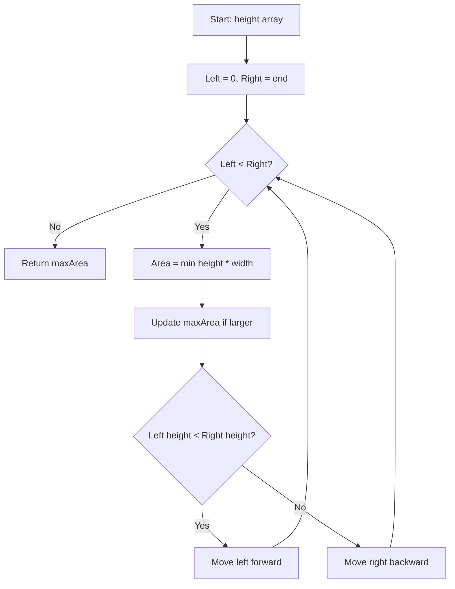

You are given an integer array `height` of length `n`. There are `n` vertical lines drawn such that the two endpoints of the ith line are `(i, 0)` and `(i, height[i])`. Find two lines that together with the x-axis form a container, such that the container contains the most water. Return the maximum amount of water a container can store.

## Examples

**Input:** height = [1,8,6,2,5,4,8,3,7]
**Output:** 49
**Explanation:** The lines at index 1 and 8 form a container with area min(8,7) (8-1) = 49.*


## Brute Force

```js
function maxAreaBrute(height) {
  let maxWater = 0;
  for (let i = 0; i < height.length; i++) {
    for (let j = i + 1; j < height.length; j++) {
      const water = Math.min(height[i], height[j]) * (j - i);
      maxWater = Math.max(maxWater, water);
    }
  }
  return maxWater;
}
// Time: O(n^2) | Space: O(1)
```

## Solution

```js
function maxArea(height) {
  let left = 0;
  let right = height.length - 1;
  let maxWater = 0;

  while (left < right) {
    const water = Math.min(height[left], height[right]) * (right - left);
    maxWater = Math.max(maxWater, water);

    if (height[left] < height[right]) {
      left++;
    } else {
      right--;
    }
  }

  return maxWater;
}
```

## Explanation

APPROACH: Two Pointers (Greedy)

Start with widest container (L=0, R=end). Move the pointer with the shorter height inward — keeping the taller one can only help find more water.

```
height = [1, 8, 6, 2, 5, 4, 8, 3, 7]

  8 |   █           █
  7 |   █     ~~~   █ ~ █    area = min(8,7) × 7 = 49
  6 |   █ █   ~~~   █ ~ █
  5 |   █ █   █ ~   █ ~ █
  4 |   █ █   █ █   █ ~ █
  3 |   █ █   █ █ █ █ ~ █
  2 |   █ █ █ █ █ █ █ ~ █
  1 | █ █ █ █ █ █ █ █ ~ █
    └─────────────────────
      0 1 2 3 4 5 6 7 8

  L=0 R=8: area = min(1,7)×8 = 8   → L shorter, L++
  L=1 R=8: area = min(8,7)×7 = 49  → R shorter, R--
  L=1 R=7: area = min(8,3)×6 = 18  → R shorter, R--
  L=1 R=6: area = min(8,8)×5 = 40  → equal, move either
  ...
  Best = 49
```

WHY THIS WORKS:
- Moving the shorter pointer might find a taller line → more water
- Moving the taller pointer can only decrease width without gaining height
- Greedy choice guarantees we don't miss the optimal

## Diagram



## TestConfig
```json
{
  "functionName": "maxArea",
  "testCases": [
    {
      "args": [
        [
          1,
          8,
          6,
          2,
          5,
          4,
          8,
          3,
          7
        ]
      ],
      "expected": 49
    },
    {
      "args": [
        [
          1,
          1
        ]
      ],
      "expected": 1
    },
    {
      "args": [
        [
          4,
          3,
          2,
          1,
          4
        ]
      ],
      "expected": 16
    },
    {
      "args": [
        [
          1,
          2,
          1
        ]
      ],
      "expected": 2,
      "isHidden": true
    },
    {
      "args": [
        [
          2,
          3,
          10,
          5,
          7,
          8,
          9
        ]
      ],
      "expected": 36,
      "isHidden": true
    },
    {
      "args": [
        [
          1,
          2,
          4,
          3
        ]
      ],
      "expected": 4,
      "isHidden": true
    },
    {
      "args": [
        [
          1,
          8,
          100,
          2,
          100,
          4,
          8,
          3,
          7
        ]
      ],
      "expected": 200,
      "isHidden": true
    },
    {
      "args": [
        [
          5,
          5,
          5,
          5
        ]
      ],
      "expected": 15,
      "isHidden": true
    },
    {
      "args": [
        [
          10,
          1,
          1,
          1,
          1,
          1,
          1,
          10
        ]
      ],
      "expected": 70,
      "isHidden": true
    },
    {
      "args": [
        [
          3,
          1,
          2,
          4,
          5
        ]
      ],
      "expected": 12,
      "isHidden": true
    }
  ]
}
```
