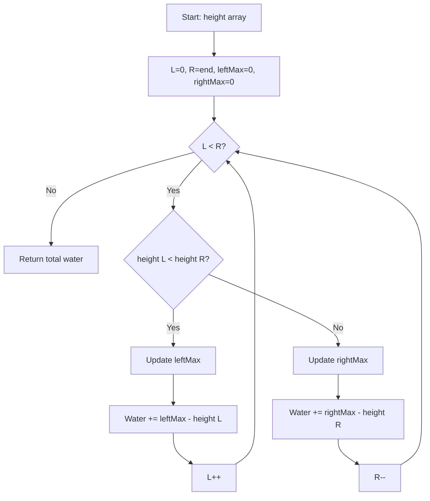

Given `n` non-negative integers representing an elevation map where the width of each bar is 1, compute how much water it can trap after raining.

## Examples

**Input:** height = [0,1,0,2,1,0,1,3,2,1,2,1]
**Output:** 6
**Explanation:** The elevation map traps 6 units of rain water.

**Input:** height = [4,2,0,3,2,5]
**Output:** 9
**Explanation:** The bars trap water in the valleys between them, totaling 9 units.


## Brute Force

```js
function trapBrute(height) {
  let water = 0;
  for (let i = 0; i < height.length; i++) {
    let leftMax = 0;
    let rightMax = 0;
    for (let j = 0; j <= i; j++) leftMax = Math.max(leftMax, height[j]);
    for (let j = i; j < height.length; j++) rightMax = Math.max(rightMax, height[j]);
    water += Math.min(leftMax, rightMax) - height[i];
  }
  return water;
}
// Time: O(n^2) | Space: O(1)
```

## Solution

```js
function trap(height) {
  let left = 0;
  let right = height.length - 1;
  let leftMax = 0;
  let rightMax = 0;
  let water = 0;

  while (left < right) {
    if (height[left] < height[right]) {
      if (height[left] >= leftMax) {
        leftMax = height[left];
      } else {
        water += leftMax - height[left];
      }
      left++;
    } else {
      if (height[right] >= rightMax) {
        rightMax = height[right];
      } else {
        water += rightMax - height[right];
      }
      right--;
    }
  }

  return water;
}
```

## Explanation

APPROACH: Two Pointers with Left Max / Right Max

Water at each bar = min(leftMax, rightMax) - height[i]. Use two pointers to compute this without precomputing arrays.

```
height = [0, 1, 0, 2, 1, 0, 1, 3, 2, 1, 2, 1]

                        █
            █ ~ ~ ~ ~ ~ █ █
      █ ~ ~ █ █ ~ █ ~ ~ █ █ ~ █
  ────█─────█─█───█─█───█─█───█────
  0   1   0   2   1   0   1   3   2   1   2   1

  Water at each position:
  pos:    0  1  2  3  4  5  6  7  8  9  10 11
  height: 0  1  0  2  1  0  1  3  2  1   2  1
  leftM:  0  1  1  2  2  2  2  3  3  3   3  3
  rightM: 3  3  3  3  3  3  3  3  2  2   2  1
  water:  0  0  1  0  1  2  1  0  0  1   0  0 = 6

  Two-pointer approach tracks leftMax and rightMax:
  Process the side with the smaller max (guaranteed to be the bottleneck)
```

WHY THIS WORKS:
- Water level at position i is determined by the shorter of left/right max walls
- The pointer with smaller max determines the water level at that side
- Moving inward from the shorter side is safe — the other side is at least as tall

## Diagram



## TestConfig
```json
{
  "functionName": "trap",
  "testCases": [
    {
      "args": [
        [
          0,
          1,
          0,
          2,
          1,
          0,
          1,
          3,
          2,
          1,
          2,
          1
        ]
      ],
      "expected": 6
    },
    {
      "args": [
        [
          4,
          2,
          0,
          3,
          2,
          5
        ]
      ],
      "expected": 9
    },
    {
      "args": [
        [
          1,
          0,
          1
        ]
      ],
      "expected": 1
    },
    {
      "args": [
        []
      ],
      "expected": 0,
      "isHidden": true
    },
    {
      "args": [
        [
          3,
          0,
          0,
          2,
          0,
          4
        ]
      ],
      "expected": 10,
      "isHidden": true
    },
    {
      "args": [
        [
          1,
          2,
          3,
          4,
          5
        ]
      ],
      "expected": 0,
      "isHidden": true
    },
    {
      "args": [
        [
          5,
          4,
          3,
          2,
          1
        ]
      ],
      "expected": 0,
      "isHidden": true
    },
    {
      "args": [
        [
          5,
          2,
          1,
          2,
          1,
          5
        ]
      ],
      "expected": 14,
      "isHidden": true
    },
    {
      "args": [
        [
          2,
          0,
          2
        ]
      ],
      "expected": 2,
      "isHidden": true
    },
    {
      "args": [
        [
          0,
          7,
          1,
          4,
          6
        ]
      ],
      "expected": 7,
      "isHidden": true
    }
  ]
}
```
