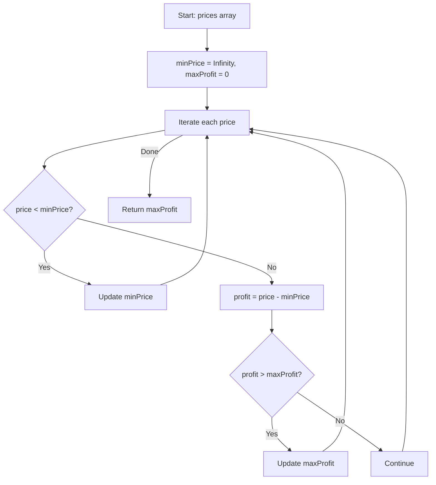

You are given an array `prices` where `prices[i]` is the price of a given stock on the ith day. You want to maximize your profit by choosing a single day to buy and a single day to sell in the future. Return the maximum profit you can achieve. If you cannot achieve any profit, return 0.

## Examples

**Input:** prices = [7,1,5,3,6,4]
**Output:** 5
**Explanation:** Buy on day 2 (price = 1) and sell on day 5 (price = 6), profit = 6-1 = 5.

**Input:** prices = [7,6,4,3,1]
**Output:** 0
**Explanation:** No transactions yield a positive profit.


## Brute Force

```js
function maxProfitBrute(prices) {
  let maxProfit = 0;
  for (let i = 0; i < prices.length; i++) {
    for (let j = i + 1; j < prices.length; j++) {
      maxProfit = Math.max(maxProfit, prices[j] - prices[i]);
    }
  }
  return maxProfit;
}
// Time: O(n^2) | Space: O(1)
```

## Solution

```js
function maxProfit(prices) {
  let minPrice = Infinity;
  let maxProfit = 0;

  for (const price of prices) {
    minPrice = Math.min(minPrice, price);
    maxProfit = Math.max(maxProfit, price - minPrice);
  }

  return maxProfit;
}
```

## Explanation

APPROACH: Track Minimum Price (Sliding Window / Kadane's variant)

Track the minimum price seen so far. At each day, calculate potential profit (price - minPrice) and update max profit.

```
prices = [7, 1, 5, 3, 6, 4]

Day   Price   MinSoFar   Profit   MaxProfit
───   ─────   ────────   ──────   ─────────
 0      7        7         0         0
 1      1        1         0         0
 2      5        1         4         4
 3      3        1         2         4
 4      6        1         5         5  ← best
 5      4        1         3         5

Answer: 5 (buy at 1, sell at 6)
```

```
Price
  7 │ ●
  6 │               ●
  5 │       ●
  4 │                   ●
  3 │           ●
  2 │
  1 │   ● ← buy here    ↑ sell here
    └───────────────────────
      0   1   2   3   4   5
```

WHY THIS WORKS:
- We must buy before selling, so tracking the running minimum ensures we consider the best buy point
- At each price, the best possible profit is current price minus the cheapest price before it

## Diagram



## TestConfig
```json
{
  "functionName": "maxProfit",
  "testCases": [
    {
      "args": [
        [
          7,
          1,
          5,
          3,
          6,
          4
        ]
      ],
      "expected": 5
    },
    {
      "args": [
        [
          7,
          6,
          4,
          3,
          1
        ]
      ],
      "expected": 0
    },
    {
      "args": [
        [
          2,
          4,
          1
        ]
      ],
      "expected": 2
    },
    {
      "args": [
        [
          1,
          2
        ]
      ],
      "expected": 1,
      "isHidden": true
    },
    {
      "args": [
        [
          2,
          1
        ]
      ],
      "expected": 0,
      "isHidden": true
    },
    {
      "args": [
        [
          3,
          3,
          3
        ]
      ],
      "expected": 0,
      "isHidden": true
    },
    {
      "args": [
        [
          1
        ]
      ],
      "expected": 0,
      "isHidden": true
    },
    {
      "args": [
        [
          1,
          4,
          2,
          7
        ]
      ],
      "expected": 6,
      "isHidden": true
    },
    {
      "args": [
        [
          2,
          1,
          4
        ]
      ],
      "expected": 3,
      "isHidden": true
    },
    {
      "args": [
        [
          3,
          2,
          6,
          5,
          0,
          3
        ]
      ],
      "expected": 4,
      "isHidden": true
    }
  ]
}
```
