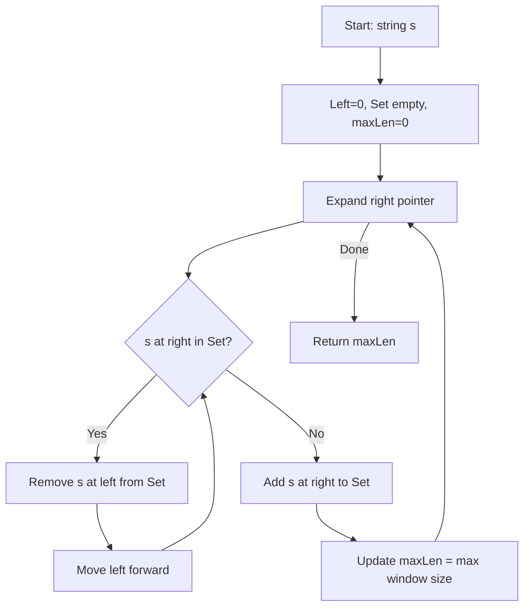

Given a string `s`, find the length of the longest substring without repeating characters.

## Examples

**Input:** s = "abcabcbb"
**Output:** 3
**Explanation:** The answer is "abc", with the length of 3.

**Input:** s = "bbbbb"
**Output:** 1
**Explanation:** All characters are the same, so the longest substring without repeating characters is "b" with length 1.

**Input:** s = "pwwkew"
**Output:** 3
**Explanation:** The answer is "wke". Note that "pwke" is a subsequence, not a substring.


## Brute Force

```js
function lengthOfLongestSubstringBrute(s) {
  let maxLen = 0;
  for (let i = 0; i < s.length; i++) {
    const seen = new Set();
    for (let j = i; j < s.length; j++) {
      if (seen.has(s[j])) break;
      seen.add(s[j]);
      maxLen = Math.max(maxLen, j - i + 1);
    }
  }
  return maxLen;
}
// Time: O(n^2) | Space: O(min(m, n))
```

## Solution

```js
function lengthOfLongestSubstring(s) {
  const charIndex = new Map();
  let maxLen = 0;
  let left = 0;

  for (let right = 0; right < s.length; right++) {
    if (charIndex.has(s[right]) && charIndex.get(s[right]) >= left) {
      left = charIndex.get(s[right]) + 1;
    }
    charIndex.set(s[right], right);
    maxLen = Math.max(maxLen, right - left + 1);
  }

  return maxLen;
}
```

## Explanation

APPROACH: Sliding Window with Hash Set

Expand the window right. If duplicate found, shrink from left until no duplicates. The set tracks characters in the current window.

```
s = "abcabcbb"

Step   L   R   char   window set     action           length
────   ─   ─   ────   ──────────     ──────           ──────
 1     0   0   'a'    {a}            add              1
 2     0   1   'b'    {a,b}          add              2
 3     0   2   'c'    {a,b,c}        add              3 ← max
 4     0   3   'a'    dup! remove    {b,c,a} L→1      3
 5     1   4   'b'    dup! remove    {c,a,b} L→2      3
 6     2   5   'c'    dup! remove    {a,b,c} L→3      3
 7     3   6   'b'    dup! remove    {c,b}   L→5      2
 8     5   7   'b'    dup! remove    {b}     L→7      1

Answer: 3 ("abc")
```

```
 a  b  c  a  b  c  b  b
[─────────]                window = "abc", len=3
    [─────────]            window = "bca", len=3
       [─────────]         window = "cab", len=3
          [─────────]      window = "abc", len=3
```

WHY THIS WORKS:
- The window always contains unique characters (enforced by the set)
- When a duplicate enters, we shrink from left until it's removed
- Each character is added and removed at most once → O(n)

## Diagram



## TestConfig
```json
{
  "functionName": "lengthOfLongestSubstring",
  "testCases": [
    {
      "args": [
        "abcabcbb"
      ],
      "expected": 3
    },
    {
      "args": [
        "bbbbb"
      ],
      "expected": 1
    },
    {
      "args": [
        "pwwkew"
      ],
      "expected": 3
    },
    {
      "args": [
        ""
      ],
      "expected": 0,
      "isHidden": true
    },
    {
      "args": [
        " "
      ],
      "expected": 1,
      "isHidden": true
    },
    {
      "args": [
        "au"
      ],
      "expected": 2,
      "isHidden": true
    },
    {
      "args": [
        "dvdf"
      ],
      "expected": 3,
      "isHidden": true
    },
    {
      "args": [
        "abcdef"
      ],
      "expected": 6,
      "isHidden": true
    },
    {
      "args": [
        "aab"
      ],
      "expected": 2,
      "isHidden": true
    },
    {
      "args": [
        "tmmzuxt"
      ],
      "expected": 5,
      "isHidden": true
    }
  ]
}
```
