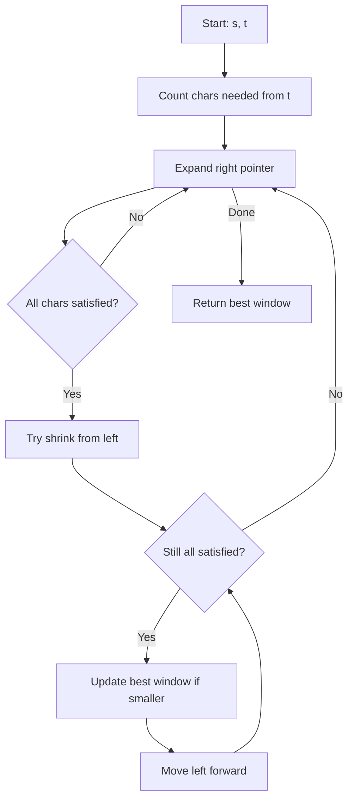

Given two strings `s` and `t` of lengths `m` and `n` respectively, return the minimum window substring of `s` such that every character in `t` (including duplicates) is included in the window. If there is no such substring, return the empty string "".

## Examples

**Input:** s = "ADOBECODEBANC", t = "ABC"
**Output:** "BANC"
**Explanation:** The minimum window substring "BANC" includes A, B, and C from string t.

**Input:** s = "a", t = "a"
**Output:** "a"
**Explanation:** The entire string s is the only window that contains all characters of t.


## Solution

```js
function minWindow(s, t) {
  if (t.length > s.length) return '';

  const need = new Map();
  for (const c of t) {
    need.set(c, (need.get(c) || 0) + 1);
  }

  let have = 0;
  const required = need.size;
  const window = new Map();
  let minLen = Infinity;
  let minStart = 0;
  let left = 0;

  for (let right = 0; right < s.length; right++) {
    const c = s[right];
    window.set(c, (window.get(c) || 0) + 1);

    if (need.has(c) && window.get(c) === need.get(c)) {
      have++;
    }

    while (have === required) {
      if (right - left + 1 < minLen) {
        minLen = right - left + 1;
        minStart = left;
      }
      const leftChar = s[left];
      window.set(leftChar, window.get(leftChar) - 1);
      if (need.has(leftChar) && window.get(leftChar) < need.get(leftChar)) {
        have--;
      }
      left++;
    }
  }

  return minLen === Infinity ? '' : s.substring(minStart, minStart + minLen);
}
```

## Explanation

APPROACH: Sliding Window with Character Frequency Maps

Expand right to include all required characters. Once valid, shrink from left to minimize window. Track required vs. current char counts.

```
s = "ADOBECODEBANC", t = "ABC"
need = {A:1, B:1, C:1}, have = 0, required = 3

Step  L   R   char   window          have   valid?   action
────  ─   ─   ────   ────────────    ────   ──────   ──────
  1   0   0   'A'    "A"              1      No      expand
  2   0   4   'E'    "ADOBE"          2      No      expand
  3   0   5   'C'    "ADOBEC"         3      Yes!    shrink
  4   1   5   shrink "DOBEC"          2      No      expand
  ...
  5   9   12  'C'    "BANC"           3      Yes!    record "BANC"(4)

```

```
A D O B E C O D E B A  N  C
0 1 2 3 4 5 6 7 8 9 10 11 12

[─────────────]              "ADOBEC"  len=6
                  [────────] "BANC"    len=4 ← optimal
```

WHY THIS WORKS:
- Expanding right ensures we eventually include all required chars
- Shrinking left after a valid window finds the minimum
- The "have" counter avoids re-checking all frequencies each step
- Each char is visited at most twice (once by R, once by L) → O(m+n)

## Diagram



## TestConfig
```json
{
  "functionName": "minWindow",
  "testCases": [
    {
      "args": [
        "ADOBECODEBANC",
        "ABC"
      ],
      "expected": "BANC"
    },
    {
      "args": [
        "a",
        "a"
      ],
      "expected": "a"
    },
    {
      "args": [
        "a",
        "aa"
      ],
      "expected": ""
    },
    {
      "args": [
        "aa",
        "aa"
      ],
      "expected": "aa",
      "isHidden": true
    },
    {
      "args": [
        "abc",
        "b"
      ],
      "expected": "b",
      "isHidden": true
    },
    {
      "args": [
        "ab",
        "b"
      ],
      "expected": "b",
      "isHidden": true
    },
    {
      "args": [
        "bba",
        "ab"
      ],
      "expected": "ba",
      "isHidden": true
    },
    {
      "args": [
        "cabwefgewcwaefgcf",
        "cae"
      ],
      "expected": "cwae",
      "isHidden": true
    },
    {
      "args": [
        "aaaaaaaaaaaabbbbbcdd",
        "abcdd"
      ],
      "expected": "abbbbbcdd",
      "isHidden": true
    },
    {
      "args": [
        "abc",
        "cba"
      ],
      "expected": "abc",
      "isHidden": true
    }
  ]
}
```
