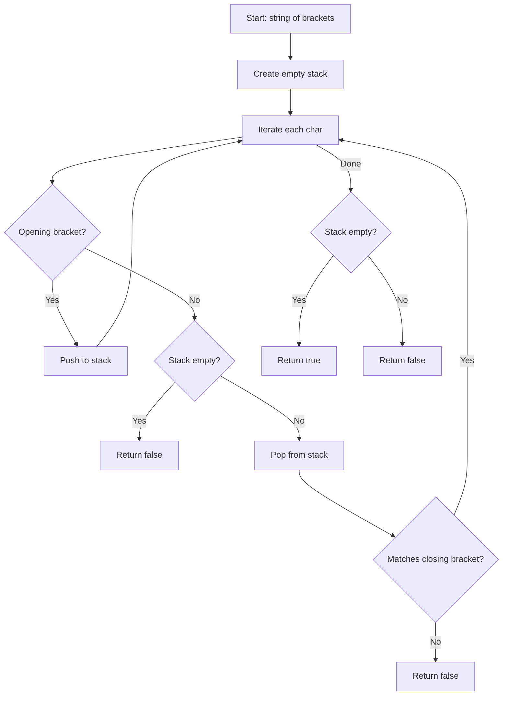

Given a string `s` containing just the characters '(', ')', '{', '}', '[' and ']', determine if the input string is valid. An input string is valid if: open brackets are closed by the same type, and open brackets are closed in the correct order.

## Examples

**Input:** s = "()"
**Output:** true
**Explanation:** The single pair of parentheses is properly opened and closed.

**Input:** s = "()[]{}"
**Output:** true
**Explanation:** Each opening bracket has a matching closing bracket in the correct order.

**Input:** s = "(]"
**Output:** false
**Explanation:** The opening parenthesis "(" does not match the closing bracket "]".


## Brute Force

```js
function isValidBrute(s) {
  let prev = '';
  while (s !== prev) {
    prev = s;
    s = s.replace('()', '').replace('[]', '').replace('{}', '');
  }
  return s.length === 0;
}
// Time: O(n^2) | Space: O(n)
```

## Solution

```js
function isValid(s) {
  const stack = [];
  const pairs = { ')': '(', ']': '[', '}': '{' };

  for (const char of s) {
    if (char in pairs) {
      if (stack.length === 0 || stack[stack.length - 1] !== pairs[char]) {
        return false;
      }
      stack.pop();
    } else {
      stack.push(char);
    }
  }

  return stack.length === 0;
}
```

## Explanation

APPROACH: Stack for Bracket Matching

Push opening brackets onto stack. For closing brackets, check if the stack top matches. If stack is empty at the end, the string is valid.

```
s = "({[]})"

Step   char   stack        action
────   ────   ─────        ──────
 1     '('    [(]          push
 2     '{'    [({]         push
 3     '['    [({[]        push
 4     ']'    [({]         pop '[' matches ']' ✓
 5     '}'    [(]          pop '{' matches '}' ✓
 6     ')'    []           pop '(' matches ')' ✓

Stack empty → VALID ✓
```

```
s = "([)]"

Step   char   stack        action
────   ────   ─────        ──────
 1     '('    [(]          push
 2     '['    [([]         push
 3     ')'    MISMATCH     top is '[' but need '(' → INVALID ✗
```

WHY THIS WORKS:
- LIFO property of stack matches the nesting structure of brackets
- Each opening bracket waits for its matching close in reverse order
- O(n) time, O(n) space worst case

## Diagram



## TestConfig
```json
{
  "functionName": "isValid",
  "testCases": [
    {
      "args": [
        "()"
      ],
      "expected": true
    },
    {
      "args": [
        "()[]{}"
      ],
      "expected": true
    },
    {
      "args": [
        "(]"
      ],
      "expected": false
    },
    {
      "args": [
        "([)]"
      ],
      "expected": false,
      "isHidden": true
    },
    {
      "args": [
        "{[]}"
      ],
      "expected": true,
      "isHidden": true
    },
    {
      "args": [
        ""
      ],
      "expected": true,
      "isHidden": true
    },
    {
      "args": [
        "("
      ],
      "expected": false,
      "isHidden": true
    },
    {
      "args": [
        ")"
      ],
      "expected": false,
      "isHidden": true
    },
    {
      "args": [
        "((()))"
      ],
      "expected": true,
      "isHidden": true
    },
    {
      "args": [
        "{[()]}"
      ],
      "expected": true,
      "isHidden": true
    }
  ]
}
```
