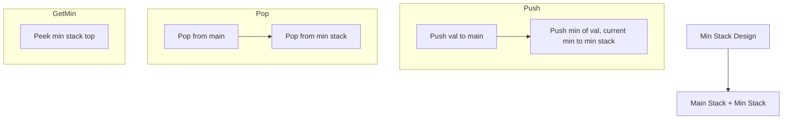

Design a stack that supports push, pop, top, and retrieving the minimum element in constant time. Implement the MinStack class with push(val), pop(), top(), and getMin() methods.

## Examples

**Input:** ["MinStack","push","push","push","getMin","pop","top","getMin"]
[[],[-2],[0],[-3],[],[],[],[]]
**Output:** [null,null,null,null,-3,null,0,-2]
**Explanation:** After pushing -2, 0, -3, the min is -3; after popping -3, the top is 0 and the min reverts to -2.


## Solution

```js
class MinStack {
  constructor() {
    this.stack = [];
    this.minStack = [];
  }

  push(val) {
    this.stack.push(val);
    const min = this.minStack.length === 0
      ? val
      : Math.min(val, this.minStack[this.minStack.length - 1]);
    this.minStack.push(min);
  }

  pop() {
    this.stack.pop();
    this.minStack.pop();
  }

  top() {
    return this.stack[this.stack.length - 1];
  }

  getMin() {
    return this.minStack[this.minStack.length - 1];
  }
}
```

## Explanation

APPROACH: Two Stacks (Main + Min Tracker)

Maintain a second stack that tracks the current minimum. When pushing, also push to min stack if value <= current min.

```
Operations: push(3), push(5), push(2), push(1), getMin(), pop(), getMin()

main stack    min stack    operation     getMin
──────────    ─────────    ─────────     ──────
[3]           [3]          push(3)       3
[3,5]         [3]          push(5)       3
[3,5,2]       [3,2]        push(2)       2
[3,5,2,1]     [3,2,1]      push(1)       1
                                         → 1
[3,5,2]       [3,2]        pop()         2
                                         → 2
```

WHY THIS WORKS:
- The min stack always has the current minimum on top
- When popping, if the popped value equals min stack top, pop min stack too
- All operations remain O(1)

## Diagram


