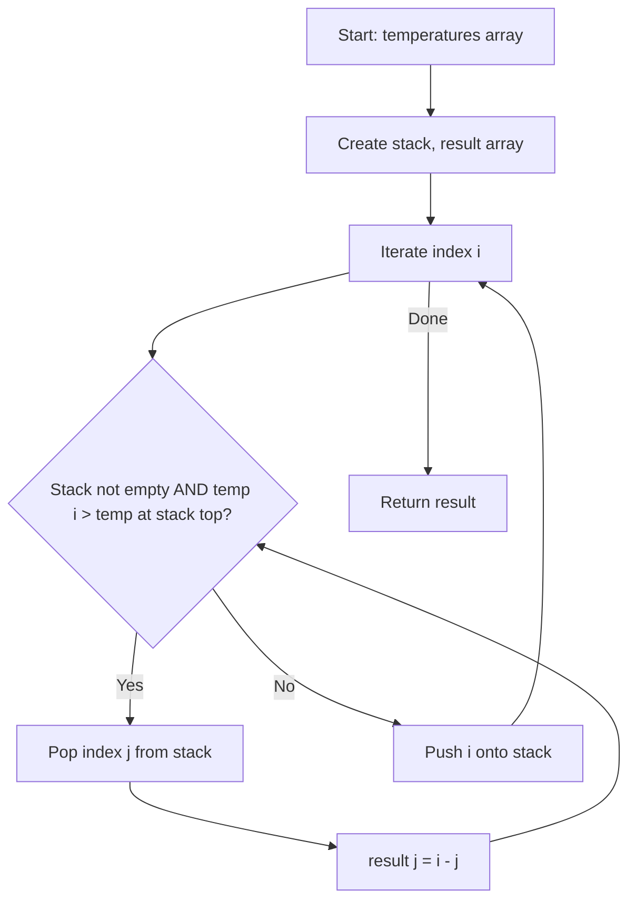

Given an array of integers `temperatures` represents the daily temperatures, return an array `answer` such that `answer[i]` is the number of days you have to wait after the ith day to get a warmer temperature. If there is no future day with a warmer temperature, set `answer[i] = 0`.

## Examples

**Input:** temperatures = [73,74,75,71,69,72,76,73]
**Output:** [1,1,4,2,1,1,0,0]
**Explanation:** For example, day 0 (73) waits 1 day for 74, and day 2 (75) waits 4 days for 76.

**Input:** temperatures = [30,40,50,60]
**Output:** [1,1,1,0]
**Explanation:** Each temperature is followed by a warmer one the next day, except the last which has no warmer day.


## Brute Force

```js
function dailyTemperaturesBrute(temperatures) {
  const n = temperatures.length;
  const answer = new Array(n).fill(0);
  for (let i = 0; i < n; i++) {
    for (let j = i + 1; j < n; j++) {
      if (temperatures[j] > temperatures[i]) {
        answer[i] = j - i;
        break;
      }
    }
  }
  return answer;
}
// Time: O(n^2) | Space: O(1)
```

## Solution

```js
function dailyTemperatures(temperatures) {
  const n = temperatures.length;
  const answer = new Array(n).fill(0);
  const stack = []; // stack of indices

  for (let i = 0; i < n; i++) {
    while (
      stack.length > 0 &&
      temperatures[i] > temperatures[stack[stack.length - 1]]
    ) {
      const prevIndex = stack.pop();
      answer[prevIndex] = i - prevIndex;
    }
    stack.push(i);
  }

  return answer;
}
```

## Explanation

APPROACH: Monotonic Decreasing Stack (stores indices)

Maintain a stack of indices with decreasing temperatures. When a warmer day is found, pop and calculate the wait time.

```
temps = [73, 74, 75, 71, 69, 72, 76, 73]

Step  i   temp   stack (indices)    pops & results
────  ─   ────   ──────────────    ──────────────
 0    0    73    [0]
 1    1    74    [1]               pop 0: res[0]=1-0=1
 2    2    75    [2]               pop 1: res[1]=2-1=1
 3    3    71    [2,3]
 4    4    69    [2,3,4]
 5    5    72    [2,5]             pop 4: res[4]=5-4=1
                                   pop 3: res[3]=5-3=2
 6    6    76    [6]               pop 5: res[5]=6-5=1
                                   pop 2: res[2]=6-2=4
 7    7    73    [6,7]

result = [1, 1, 4, 2, 1, 1, 0, 0]
```

WHY THIS WORKS:
- Stack keeps indices of days waiting for a warmer day (decreasing temps)
- When a warmer day arrives, all cooler days on the stack get their answer
- Each index pushed/popped at most once → O(n)

## Diagram



## TestConfig
```json
{
  "functionName": "dailyTemperatures",
  "testCases": [
    {
      "args": [
        [
          73,
          74,
          75,
          71,
          69,
          72,
          76,
          73
        ]
      ],
      "expected": [
        1,
        1,
        4,
        2,
        1,
        1,
        0,
        0
      ]
    },
    {
      "args": [
        [
          30,
          40,
          50,
          60
        ]
      ],
      "expected": [
        1,
        1,
        1,
        0
      ]
    },
    {
      "args": [
        [
          30,
          60,
          90
        ]
      ],
      "expected": [
        1,
        1,
        0
      ]
    },
    {
      "args": [
        [
          90,
          80,
          70,
          60
        ]
      ],
      "expected": [
        0,
        0,
        0,
        0
      ],
      "isHidden": true
    },
    {
      "args": [
        [
          50,
          50,
          50
        ]
      ],
      "expected": [
        0,
        0,
        0
      ],
      "isHidden": true
    },
    {
      "args": [
        [
          70,
          71,
          72,
          73,
          74
        ]
      ],
      "expected": [
        1,
        1,
        1,
        1,
        0
      ],
      "isHidden": true
    },
    {
      "args": [
        [
          80
        ]
      ],
      "expected": [
        0
      ],
      "isHidden": true
    },
    {
      "args": [
        [
          55,
          60,
          55,
          60,
          55,
          60
        ]
      ],
      "expected": [
        1,
        0,
        1,
        0,
        1,
        0
      ],
      "isHidden": true
    },
    {
      "args": [
        [
          40,
          35,
          32,
          37,
          50
        ]
      ],
      "expected": [
        4,
        2,
        1,
        1,
        0
      ],
      "isHidden": true
    },
    {
      "args": [
        [
          100,
          90,
          80,
          70,
          80,
          90,
          100
        ]
      ],
      "expected": [
        0,
        4,
        3,
        1,
        1,
        1,
        0
      ],
      "isHidden": true
    }
  ]
}
```
