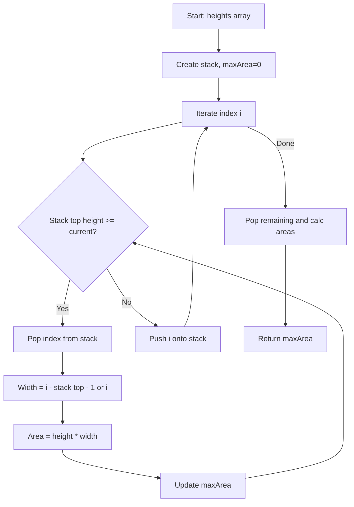

Given an array of integers `heights` representing the histogram's bar height where the width of each bar is 1, return the area of the largest rectangle in the histogram.

## Examples

**Input:** heights = [2,1,5,6,2,3]
**Output:** 10
**Explanation:** The largest rectangle has area = 10 (formed by heights[2] and heights[3] with width 2).

**Input:** heights = [2,4]
**Output:** 4
**Explanation:** The largest rectangle is the single bar of height 4 with width 1, giving area 4.


## Brute Force

```js
function largestRectangleAreaBrute(heights) {
  let maxArea = 0;
  for (let i = 0; i < heights.length; i++) {
    let minHeight = heights[i];
    for (let j = i; j < heights.length; j++) {
      minHeight = Math.min(minHeight, heights[j]);
      maxArea = Math.max(maxArea, minHeight * (j - i + 1));
    }
  }
  return maxArea;
}
// Time: O(n^2) | Space: O(1)
```

## Solution

```js
function largestRectangleArea(heights) {
  const stack = []; // indices
  let maxArea = 0;
  const n = heights.length;

  for (let i = 0; i <= n; i++) {
    const currentHeight = i === n ? 0 : heights[i];

    while (stack.length > 0 && currentHeight < heights[stack[stack.length - 1]]) {
      const height = heights[stack.pop()];
      const width = stack.length === 0 ? i : i - stack[stack.length - 1] - 1;
      maxArea = Math.max(maxArea, height * width);
    }

    stack.push(i);
  }

  return maxArea;
}
```

## Explanation

APPROACH: Monotonic Stack (Increasing)

For each bar, find the first shorter bar to its left and right. The rectangle width = rightBound - leftBound - 1. Use a stack to compute both bounds in one pass.

```
heights = [2, 1, 5, 6, 2, 3]

  6     █
  5   █ █
  4   █ █
  3   █ █     █
  2 █ █ █   █ █
  1 █ █ █ █ █ █
    ─────────────
    0 1 2 3 4 5

Stack processing (stores indices of increasing heights):

i=0  h=2  stack=[]     → push 0,  stack=[0]
i=1  h=1  stack=[0]    → pop 0: w=1, area=2×1=2. push 1, stack=[1]
i=2  h=5  stack=[1]    → push 2,  stack=[1,2]
i=3  h=6  stack=[1,2]  → push 3,  stack=[1,2,3]
i=4  h=2  stack=[1,2,3]→ pop 3: w=4-2-1=1, area=6×1=6
                        → pop 2: w=4-1-1=2, area=5×2=10 ← MAX
                        → push 4, stack=[1,4]
i=5  h=3  stack=[1,4]  → push 5,  stack=[1,4,5]
end: pop 5: w=6-4-1=1, area=3×1=3
     pop 4: w=6-1-1=4, area=2×4=8
     pop 1: w=6, area=1×6=6

Answer: 10
```

WHY THIS WORKS:
- When we pop index i, current index is the right bound, new stack top is the left bound
- Each bar pushed and popped exactly once → O(n)

## Diagram



## TestConfig
```json
{
  "functionName": "largestRectangleArea",
  "testCases": [
    {
      "args": [
        [
          2,
          1,
          5,
          6,
          2,
          3
        ]
      ],
      "expected": 10
    },
    {
      "args": [
        [
          2,
          4
        ]
      ],
      "expected": 4
    },
    {
      "args": [
        [
          1
        ]
      ],
      "expected": 1
    },
    {
      "args": [
        [
          1,
          1,
          1,
          1,
          1
        ]
      ],
      "expected": 5,
      "isHidden": true
    },
    {
      "args": [
        [
          5,
          4,
          3,
          2,
          1
        ]
      ],
      "expected": 9,
      "isHidden": true
    },
    {
      "args": [
        [
          1,
          2,
          3,
          4,
          5
        ]
      ],
      "expected": 9,
      "isHidden": true
    },
    {
      "args": [
        [
          0
        ]
      ],
      "expected": 0,
      "isHidden": true
    },
    {
      "args": [
        [
          2,
          1,
          2
        ]
      ],
      "expected": 3,
      "isHidden": true
    },
    {
      "args": [
        [
          6,
          2,
          5,
          4,
          5,
          1,
          6
        ]
      ],
      "expected": 12,
      "isHidden": true
    },
    {
      "args": [
        [
          3,
          3,
          3,
          3
        ]
      ],
      "expected": 12,
      "isHidden": true
    }
  ]
}
```
