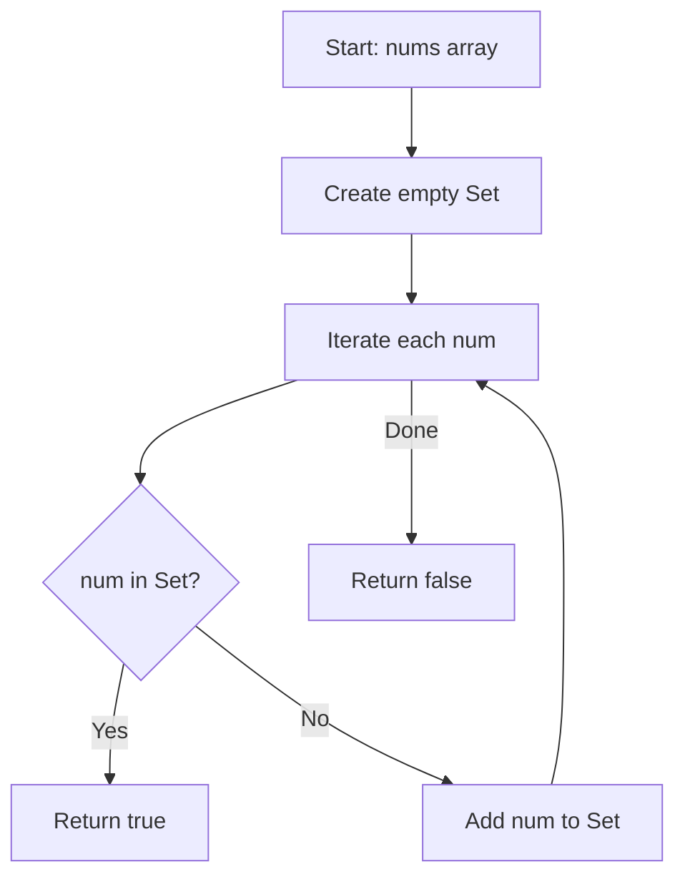

Given an integer array `nums`, return `true` if any value appears at least twice in the array, and return `false` if every element is distinct.

## Examples

**Input:** nums = [1,2,3,1]
**Output:** true
**Explanation:** The value 1 appears at index 0 and index 3, so a duplicate exists.

**Input:** nums = [1,2,3,4]
**Output:** false
**Explanation:** All four values are distinct, so no duplicate exists.


## Brute Force

```js
function containsDuplicateBrute(nums) {
  for (let i = 0; i < nums.length; i++) {
    for (let j = i + 1; j < nums.length; j++) {
      if (nums[i] === nums[j]) return true;
    }
  }
  return false;
}
```

### Brute Force Explanation

The brute force compares every pair of elements with nested loops for O(n^2) time. The Set approach reduces this to O(n) by using O(1) membership checks, trading O(n) space for a massive time improvement.

## Solution

```js
function containsDuplicate(nums) {
  const seen = new Set();
  for (const num of nums) {
    if (seen.has(num)) return true;
    seen.add(num);
  }
  return false;
}
```

## Explanation

APPROACH: Hash Set Early Return

Iterate through the array, adding each number to a Set. Before adding, check if
the number is already in the Set. If yes, we found a duplicate and return early.

```
seen = {}

For each num in nums:
  if num in seen → return true
  add num to seen
```

WALKTHROUGH with nums = [1, 2, 3, 1]:

```
Step   num   seen (before)   has(num)?   Action
────   ───   ─────────────   ─────────   ──────────────────
 1      1    {}              No          seen = {1}
 2      2    {1}             No          seen = {1, 2}
 3      3    {1, 2}          No          seen = {1, 2, 3}
 4      1    {1, 2, 3}       Yes!        return true
```

WHY THIS WORKS:
- Set.has() is O(1) average, so the total scan is O(n)
- Early return means we stop as soon as the first duplicate is found
- Worst case (no duplicates) visits all n elements once


## Diagram



## TestConfig
```json
{
  "functionName": "containsDuplicate",
  "testCases": [
    {
      "args": [
        [
          1,
          2,
          3,
          1
        ]
      ],
      "expected": true
    },
    {
      "args": [
        [
          1,
          2,
          3,
          4
        ]
      ],
      "expected": false
    },
    {
      "args": [
        [
          1,
          1,
          1,
          3,
          3,
          4,
          3,
          2,
          4,
          2
        ]
      ],
      "expected": true
    },
    {
      "args": [
        [
          1
        ]
      ],
      "expected": false,
      "isHidden": true
    },
    {
      "args": [
        []
      ],
      "expected": false,
      "isHidden": true
    },
    {
      "args": [
        [
          0,
          0
        ]
      ],
      "expected": true,
      "isHidden": true
    },
    {
      "args": [
        [
          -1,
          -1,
          2
        ]
      ],
      "expected": true,
      "isHidden": true
    },
    {
      "args": [
        [
          1,
          2,
          3,
          4,
          5,
          6,
          7,
          8,
          9,
          10
        ]
      ],
      "expected": false,
      "isHidden": true
    },
    {
      "args": [
        [
          1,
          2,
          3,
          4,
          5,
          6,
          7,
          8,
          9,
          1
        ]
      ],
      "expected": true,
      "isHidden": true
    },
    {
      "args": [
        [
          100,
          200,
          300
        ]
      ],
      "expected": false,
      "isHidden": true
    }
  ]
}
```
