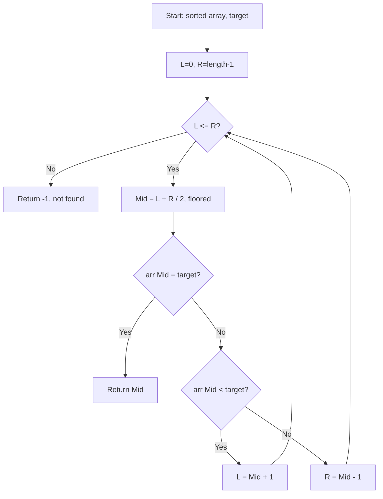

Given an array of integers `nums` which is sorted in ascending order, and an integer `target`, write a function to search `target` in `nums`. If `target` exists, then return its index. Otherwise, return -1.

## Examples

**Input:** nums = [-1,0,3,5,9,12], target = 9
**Output:** 4
**Explanation:** 9 exists in nums and its index is 4.

**Input:** nums = [-1,0,3,5,9,12], target = 2
**Output:** -1
**Explanation:** 2 does not exist in nums so return -1.


## Solution

```js
function search(nums, target) {
  let left = 0;
  let right = nums.length - 1;

  while (left <= right) {
    const mid = Math.floor((left + right) / 2);
    if (nums[mid] === target) return mid;
    if (nums[mid] < target) {
      left = mid + 1;
    } else {
      right = mid - 1;
    }
  }

  return -1;
}
```

## Explanation

APPROACH: Classic Binary Search

Maintain left and right bounds. Compare middle element with target. Narrow search space by half each step.

```
nums = [-1, 0, 3, 5, 9, 12], target = 9

Step   L    R    mid   nums[mid]   compare    action
────   ─    ─    ───   ─────────   ───────    ──────
 1     0    5     2       3        3 < 9      L = 3
 2     3    5     4       9        9 == 9     return 4 ✓

Search space halving:
[-1, 0, 3, 5, 9, 12]
             [5, 9, 12]     ← eliminated left half
                [9]         ← found!
```

WHY THIS WORKS:
- Sorted array guarantees all elements left of mid are ≤ mid, right are ≥ mid
- Each step eliminates half the remaining elements → O(log n)

## Diagram



## TestConfig
```json
{
  "functionName": "search",
  "testCases": [
    {
      "args": [
        [
          -1,
          0,
          3,
          5,
          9,
          12
        ],
        9
      ],
      "expected": 4
    },
    {
      "args": [
        [
          -1,
          0,
          3,
          5,
          9,
          12
        ],
        2
      ],
      "expected": -1
    },
    {
      "args": [
        [
          5
        ],
        5
      ],
      "expected": 0
    },
    {
      "args": [
        [
          5
        ],
        -5
      ],
      "expected": -1,
      "isHidden": true
    },
    {
      "args": [
        [
          1,
          2,
          3,
          4,
          5
        ],
        1
      ],
      "expected": 0,
      "isHidden": true
    },
    {
      "args": [
        [
          1,
          2,
          3,
          4,
          5
        ],
        5
      ],
      "expected": 4,
      "isHidden": true
    },
    {
      "args": [
        [
          1,
          2,
          3,
          4,
          5
        ],
        3
      ],
      "expected": 2,
      "isHidden": true
    },
    {
      "args": [
        [
          2,
          5
        ],
        5
      ],
      "expected": 1,
      "isHidden": true
    },
    {
      "args": [
        [
          -5,
          -3,
          0,
          1,
          4
        ],
        -3
      ],
      "expected": 1,
      "isHidden": true
    },
    {
      "args": [
        [
          1,
          3,
          5,
          7,
          9,
          11
        ],
        6
      ],
      "expected": -1,
      "isHidden": true
    }
  ]
}
```
