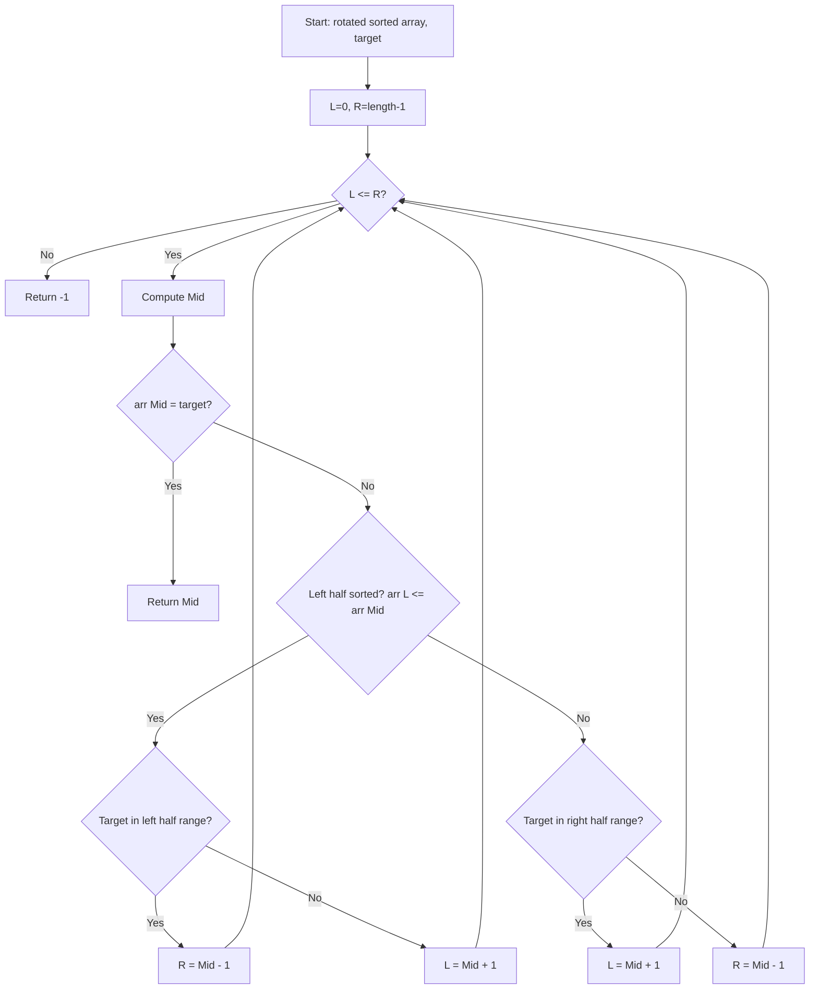

There is an integer array `nums` sorted in ascending order (with distinct values). Prior to being passed to your function, `nums` is possibly rotated at an unknown pivot index. Given the array `nums` after the possible rotation and an integer `target`, return the index of `target` if it is in `nums`, or -1 if it is not.

## Examples

**Input:** nums = [4,5,6,7,0,1,2], target = 0
**Output:** 4
**Explanation:** The value 0 is located at index 4 in the rotated array.

**Input:** nums = [4,5,6,7,0,1,2], target = 3
**Output:** -1
**Explanation:** The value 3 does not exist anywhere in the array.


## Solution

```js
function searchRotated(nums, target) {
  let left = 0;
  let right = nums.length - 1;

  while (left <= right) {
    const mid = Math.floor((left + right) / 2);
    if (nums[mid] === target) return mid;

    // Left half is sorted
    if (nums[left] <= nums[mid]) {
      if (target >= nums[left] && target < nums[mid]) {
        right = mid - 1;
      } else {
        left = mid + 1;
      }
    }
    // Right half is sorted
    else {
      if (target > nums[mid] && target <= nums[right]) {
        left = mid + 1;
      } else {
        right = mid - 1;
      }
    }
  }

  return -1;
}
```

## Explanation

APPROACH: Modified Binary Search (Identify Sorted Half)

At least one half (left or right of mid) is always sorted in a rotated array. Check if target falls in the sorted half; if so, search there, else search the other half.

```
nums = [4, 5, 6, 7, 0, 1, 2], target = 0

Step   L   R   mid   nums[mid]   left sorted?   target in range?
────   ─   ─   ───   ─────────   ────────────   ────────────────
 1     0   6    3       7        [4,5,6,7] Yes   0 not in [4,7] → go right
 2     4   6    5       1        [0,1] Yes        0 in [0,1] → go left
 3     4   4    4       0        found! return 4

```

```
 Original: [0, 1, 2, 4, 5, 6, 7]
 Rotated:  [4, 5, 6, 7, 0, 1, 2]
                        ↑ pivot

 At any mid, one side is guaranteed sorted:
 [4, 5, 6, 7 | 0, 1, 2]
  sorted ←─┘   └─→ sorted
```

WHY THIS WORKS:
- Rotation creates at most one "break" point
- At least one half around mid is always in sorted order
- We can determine if target is in the sorted half with simple bounds check

## Diagram



## TestConfig
```json
{
  "functionName": "searchRotated",
  "testCases": [
    {
      "args": [
        [
          4,
          5,
          6,
          7,
          0,
          1,
          2
        ],
        0
      ],
      "expected": 4
    },
    {
      "args": [
        [
          4,
          5,
          6,
          7,
          0,
          1,
          2
        ],
        3
      ],
      "expected": -1
    },
    {
      "args": [
        [
          1
        ],
        0
      ],
      "expected": -1
    },
    {
      "args": [
        [
          1
        ],
        1
      ],
      "expected": 0,
      "isHidden": true
    },
    {
      "args": [
        [
          3,
          1
        ],
        3
      ],
      "expected": 0,
      "isHidden": true
    },
    {
      "args": [
        [
          3,
          1
        ],
        1
      ],
      "expected": 1,
      "isHidden": true
    },
    {
      "args": [
        [
          5,
          1,
          2,
          3,
          4
        ],
        1
      ],
      "expected": 1,
      "isHidden": true
    },
    {
      "args": [
        [
          4,
          5,
          6,
          7,
          0,
          1,
          2
        ],
        5
      ],
      "expected": 1,
      "isHidden": true
    },
    {
      "args": [
        [
          2,
          3,
          4,
          5,
          1
        ],
        4
      ],
      "expected": 2,
      "isHidden": true
    },
    {
      "args": [
        [
          1,
          2,
          3,
          4,
          5
        ],
        3
      ],
      "expected": 2,
      "isHidden": true
    }
  ]
}
```
