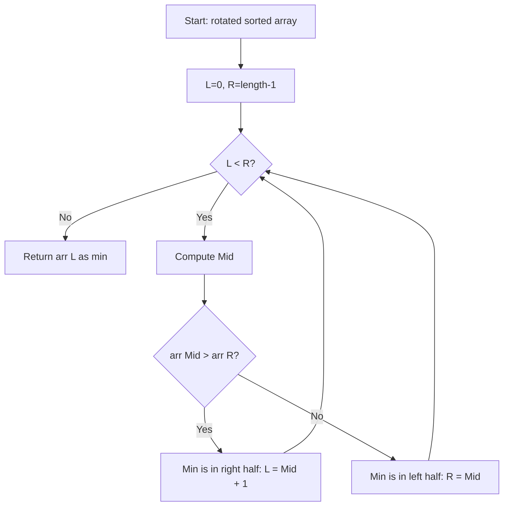

Suppose an array of length `n` sorted in ascending order is rotated between 1 and `n` times. Given the sorted rotated array `nums` of unique elements, return the minimum element of this array. You must write an algorithm that runs in O(log n) time.

## Examples

**Input:** nums = [3,4,5,1,2]
**Output:** 1
**Explanation:** The original array was [1,2,3,4,5] rotated 3 times.

**Input:** nums = [4,5,6,7,0,1,2]
**Output:** 0
**Explanation:** The original array was [0,1,2,4,5,6,7] rotated 4 times, so 0 is the minimum.


## Solution

```js
function findMin(nums) {
  let left = 0;
  let right = nums.length - 1;

  while (left < right) {
    const mid = Math.floor((left + right) / 2);
    if (nums[mid] > nums[right]) {
      // Minimum is in the right half
      left = mid + 1;
    } else {
      // Minimum is in the left half (including mid)
      right = mid;
    }
  }

  return nums[left];
}
```

## Explanation

APPROACH: Binary Search for Inflection Point

The minimum is at the rotation pivot. Compare mid with right — if mid > right, minimum is in the right half; otherwise it's in the left half (including mid).

```
nums = [3, 4, 5, 1, 2]

Step   L   R   mid   nums[mid]   nums[R]   mid > R?   action
────   ─   ─   ───   ─────────   ───────   ────────   ──────
 1     0   4    2       5          2        Yes        L = 3
 2     3   4    3       1          2        No         R = 3
 3     3   3    done → return nums[3] = 1

```

```
    5
  4   ╲
3       ╲    2
          1 ↑ minimum (inflection point)
```

WHY THIS WORKS:
- If nums[mid] > nums[R], the pivot (minimum) must be to the right
- If nums[mid] ≤ nums[R], mid could be the min, so R = mid (not mid-1)
- Converges to the single minimum element in O(log n)

## Diagram



## TestConfig
```json
{
  "functionName": "findMin",
  "testCases": [
    {
      "args": [
        [
          3,
          4,
          5,
          1,
          2
        ]
      ],
      "expected": 1
    },
    {
      "args": [
        [
          4,
          5,
          6,
          7,
          0,
          1,
          2
        ]
      ],
      "expected": 0
    },
    {
      "args": [
        [
          11,
          13,
          15,
          17
        ]
      ],
      "expected": 11
    },
    {
      "args": [
        [
          1
        ]
      ],
      "expected": 1,
      "isHidden": true
    },
    {
      "args": [
        [
          2,
          1
        ]
      ],
      "expected": 1,
      "isHidden": true
    },
    {
      "args": [
        [
          1,
          2
        ]
      ],
      "expected": 1,
      "isHidden": true
    },
    {
      "args": [
        [
          3,
          1,
          2
        ]
      ],
      "expected": 1,
      "isHidden": true
    },
    {
      "args": [
        [
          5,
          6,
          7,
          8,
          1,
          2,
          3,
          4
        ]
      ],
      "expected": 1,
      "isHidden": true
    },
    {
      "args": [
        [
          10,
          20,
          30,
          40,
          50
        ]
      ],
      "expected": 10,
      "isHidden": true
    },
    {
      "args": [
        [
          2,
          3,
          4,
          5,
          6,
          7,
          1
        ]
      ],
      "expected": 1,
      "isHidden": true
    }
  ]
}
```
