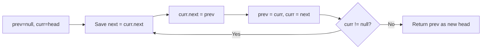

Given the head of a singly linked list, reverse the list, and return the reversed list.

## Examples

**Input:** head = [1,2,3,4,5]
**Output:** [5,4,3,2,1]
**Explanation:** Every node's pointer is reversed, so the last node becomes the new head.

**Input:** head = [1,2]
**Output:** [2,1]
**Explanation:** The two nodes swap positions when the single link between them is reversed.


## Brute Force

```js
function reverseListRecursive(head) {
  if (head === null || head.next === null) return head;
  const newHead = reverseListRecursive(head.next);
  head.next.next = head;
  head.next = null;
  return newHead;
}
// Time: O(n) | Space: O(n) due to call stack
```

### Brute Force Explanation

Copy values to an array, reverse the array, build a new list. O(n) time and O(n) space. The iterative approach does it in-place with O(1) space.

## Solution

```js
// class ListNode {
//   constructor(val = 0, next = null) {
//     this.val = val;
//     this.next = next;
//   }
// }

function reverseList(head) {
  let prev = null;
  let current = head;

  while (current !== null) {
    const next = current.next;
    current.next = prev;
    prev = current;
    current = next;
  }

  return prev;
}
```

## Explanation

APPROACH: Iterative Pointer Reversal

Walk through the list, reversing each node's next pointer to point to the previous node.

```
Initial:  1 → 2 → 3 → 4 → 5 → null

Step 1: prev=null, curr=1
  null ← 1   2 → 3 → 4 → 5 → null
  prev  curr

Step 2: prev=1, curr=2
  null ← 1 ← 2   3 → 4 → 5 → null
         prev curr

Step 3: prev=2, curr=3
  null ← 1 ← 2 ← 3   4 → 5 → null
               prev curr

Step 4: prev=3, curr=4
  null ← 1 ← 2 ← 3 ← 4   5 → null
                     prev curr

Step 5: prev=4, curr=5
  null ← 1 ← 2 ← 3 ← 4 ← 5
                           prev curr=null → done

Result: 5 → 4 → 3 → 2 → 1 → null
```

WHY THIS WORKS:
- Save next before overwriting, reverse the link, advance all pointers
- O(n) time, O(1) space — pure pointer manipulation

## Diagram



## TestConfig
```json
{
  "functionName": "reverseList",
  "argTypes": [
    "linkedList"
  ],
  "returnType": "linkedList",
  "testCases": [
    {
      "args": [
        [
          1,
          2,
          3,
          4,
          5
        ]
      ],
      "expected": [
        5,
        4,
        3,
        2,
        1
      ]
    },
    {
      "args": [
        [
          1,
          2
        ]
      ],
      "expected": [
        2,
        1
      ]
    },
    {
      "args": [
        []
      ],
      "expected": []
    },
    {
      "args": [
        [
          1
        ]
      ],
      "expected": [
        1
      ],
      "isHidden": true
    },
    {
      "args": [
        [
          1,
          2,
          3
        ]
      ],
      "expected": [
        3,
        2,
        1
      ],
      "isHidden": true
    },
    {
      "args": [
        [
          10,
          20,
          30,
          40
        ]
      ],
      "expected": [
        40,
        30,
        20,
        10
      ],
      "isHidden": true
    },
    {
      "args": [
        [
          7,
          8
        ]
      ],
      "expected": [
        8,
        7
      ],
      "isHidden": true
    },
    {
      "args": [
        [
          5,
          4,
          3,
          2,
          1
        ]
      ],
      "expected": [
        1,
        2,
        3,
        4,
        5
      ],
      "isHidden": true
    },
    {
      "args": [
        [
          -1,
          0,
          1
        ]
      ],
      "expected": [
        1,
        0,
        -1
      ],
      "isHidden": true
    },
    {
      "args": [
        [
          100,
          200,
          300,
          400,
          500
        ]
      ],
      "expected": [
        500,
        400,
        300,
        200,
        100
      ],
      "isHidden": true
    }
  ]
}
```
