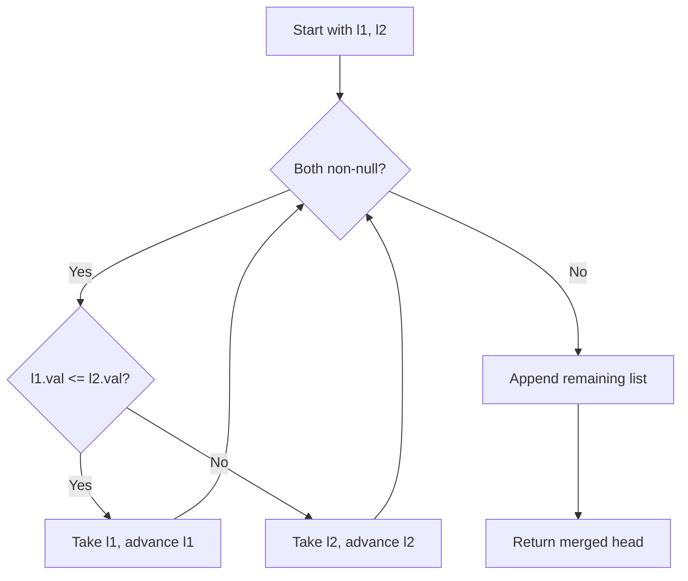

You are given the heads of two sorted linked lists `list1` and `list2`. Merge the two lists into one sorted list. The list should be made by splicing together the nodes of the first two lists. Return the head of the merged linked list.

## Examples

**Input:** list1 = [1,2,4], list2 = [1,3,4]
**Output:** [1,1,2,3,4,4]
**Explanation:** Nodes are picked in ascending order by comparing the heads of both lists at each step.

**Input:** list1 = [], list2 = [0]
**Output:** [0]
**Explanation:** Since list1 is empty, the merged result is simply list2.


## Solution

```js
function mergeTwoLists(list1, list2) {
  const dummy = { val: 0, next: null };
  let current = dummy;

  while (list1 !== null && list2 !== null) {
    if (list1.val <= list2.val) {
      current.next = list1;
      list1 = list1.next;
    } else {
      current.next = list2;
      list2 = list2.next;
    }
    current = current.next;
  }

  current.next = list1 !== null ? list1 : list2;
  return dummy.next;
}
```

## Diagram



## TestConfig
```json
{
  "functionName": "mergeTwoLists",
  "argTypes": [
    "linkedList",
    "linkedList"
  ],
  "returnType": "linkedList",
  "testCases": [
    {
      "args": [
        [
          1,
          2,
          4
        ],
        [
          1,
          3,
          4
        ]
      ],
      "expected": [
        1,
        1,
        2,
        3,
        4,
        4
      ]
    },
    {
      "args": [
        [],
        []
      ],
      "expected": []
    },
    {
      "args": [
        [],
        [
          0
        ]
      ],
      "expected": [
        0
      ]
    },
    {
      "args": [
        [
          1
        ],
        [
          2
        ]
      ],
      "expected": [
        1,
        2
      ],
      "isHidden": true
    },
    {
      "args": [
        [
          2
        ],
        [
          1
        ]
      ],
      "expected": [
        1,
        2
      ],
      "isHidden": true
    },
    {
      "args": [
        [
          1,
          3,
          5
        ],
        [
          2,
          4,
          6
        ]
      ],
      "expected": [
        1,
        2,
        3,
        4,
        5,
        6
      ],
      "isHidden": true
    },
    {
      "args": [
        [
          1,
          2,
          3
        ],
        []
      ],
      "expected": [
        1,
        2,
        3
      ],
      "isHidden": true
    },
    {
      "args": [
        [
          5,
          10,
          15
        ],
        [
          1,
          8,
          20
        ]
      ],
      "expected": [
        1,
        5,
        8,
        10,
        15,
        20
      ],
      "isHidden": true
    },
    {
      "args": [
        [
          1,
          1,
          1
        ],
        [
          1,
          1,
          1
        ]
      ],
      "expected": [
        1,
        1,
        1,
        1,
        1,
        1
      ],
      "isHidden": true
    },
    {
      "args": [
        [
          -3,
          -1,
          0
        ],
        [
          -2,
          2,
          4
        ]
      ],
      "expected": [
        -3,
        -2,
        -1,
        0,
        2,
        4
      ],
      "isHidden": true
    }
  ]
}
```
