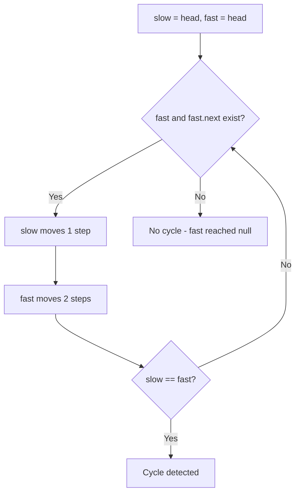

Given `head`, the head of a linked list, determine if the linked list has a cycle in it. There is a cycle if there is some node that can be reached again by continuously following the `next` pointer.

## Examples

**Input:** head = [3,2,0,-4], pos = 1
**Output:** true
**Explanation:** There is a cycle where tail connects to the 1st node (0-indexed).

**Input:** head = [1], pos = -1
**Output:** false
**Explanation:** With only one node and no tail-to-node connection (pos = -1), there is no cycle.


## Brute Force

```js
function hasCycleBrute(head) {
  const visited = new Set();
  let current = head;
  while (current !== null) {
    if (visited.has(current)) return true;
    visited.add(current);
    current = current.next;
  }
  return false;
}
// Time: O(n) | Space: O(n)
```

## Solution

```js
function hasCycle(head) {
  let slow = head;
  let fast = head;

  while (fast !== null && fast.next !== null) {
    slow = slow.next;
    fast = fast.next.next;
    if (slow === fast) return true;
  }

  return false;
}
```

## Explanation

APPROACH: Floyd's Cycle Detection (Fast & Slow Pointers)

Move slow pointer 1 step, fast pointer 2 steps. If they meet, there's a cycle.

```
List: 3 → 2 → 0 → -4 → (back to 2)

Step   slow   fast
────   ────   ────
 0     3      3
 1     2      0      (fast moves 2 steps)
 2     0      2      (fast wraps around cycle)
 3     -4     -4     MEET! → cycle exists ✓

Visualization:
  3 → 2 → 0 → -4
      ↑         │
      └─────────┘  (cycle)

  slow: 3 → 2 → 0 → -4 → 2 ...
  fast: 3 → 0 → 2 → -4 → 0 → 2 ...
                             ↑ they meet at -4
```

WHY THIS WORKS:
- If there's a cycle, fast will "lap" slow eventually (like runners on a track)
- If no cycle, fast hits null first → no cycle
- The relative speed difference of 1 step guarantees they meet within one cycle traversal

## Diagram



## TestConfig
```json
{
  "functionName": "hasCycle",
  "argTypes": [
    "linkedListCycle"
  ],
  "testCases": [
    {
      "args": [
        [
          [
            3,
            2,
            0,
            -4
          ],
          1
        ]
      ],
      "expected": true
    },
    {
      "args": [
        [
          [
            1,
            2
          ],
          0
        ]
      ],
      "expected": true
    },
    {
      "args": [
        [
          [
            1
          ],
          -1
        ]
      ],
      "expected": false
    },
    {
      "args": [
        [
          [],
          -1
        ]
      ],
      "expected": false,
      "isHidden": true
    },
    {
      "args": [
        [
          [
            1,
            2,
            3,
            4
          ],
          -1
        ]
      ],
      "expected": false,
      "isHidden": true
    },
    {
      "args": [
        [
          [
            1,
            2,
            3,
            4
          ],
          3
        ]
      ],
      "expected": true,
      "isHidden": true
    },
    {
      "args": [
        [
          [
            1,
            2,
            3,
            4
          ],
          0
        ]
      ],
      "expected": true,
      "isHidden": true
    },
    {
      "args": [
        [
          [
            1,
            2,
            3
          ],
          2
        ]
      ],
      "expected": true,
      "isHidden": true
    },
    {
      "args": [
        [
          [
            5
          ],
          0
        ]
      ],
      "expected": true,
      "isHidden": true
    },
    {
      "args": [
        [
          [
            1,
            2,
            3,
            4,
            5
          ],
          -1
        ]
      ],
      "expected": false,
      "isHidden": true
    }
  ]
}
```
