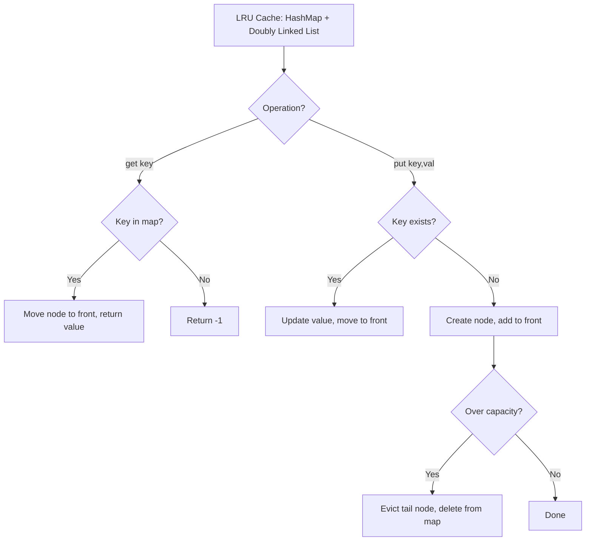

Design a data structure that follows the constraints of a Least Recently Used (LRU) cache. Implement the LRUCache class: `LRUCache(capacity)` initializes with positive size capacity, `get(key)` returns the value or -1 if not found, `put(key, value)` updates or adds the key-value pair. If the capacity is exceeded, evict the least recently used key.

## Examples

**Input:** ["LRUCache","put","put","get","put","get","put","get","get","get"]
[[2],[1,1],[2,2],[1],[3,3],[2],[4,4],[1],[3],[4]]
**Output:** [null,null,null,1,null,-1,null,-1,3,4]
**Explanation:** With capacity 2, putting key 3 evicts key 2 (least recent), and putting key 4 evicts key 1, so get(2) and get(1) return -1.


## Solution

```js
class LRUCache {
  constructor(capacity) {
    this.capacity = capacity;
    this.map = new Map();
    // Doubly linked list with dummy head and tail
    this.head = { key: 0, val: 0, prev: null, next: null };
    this.tail = { key: 0, val: 0, prev: null, next: null };
    this.head.next = this.tail;
    this.tail.prev = this.head;
  }

  _remove(node) {
    node.prev.next = node.next;
    node.next.prev = node.prev;
  }

  _insertAtHead(node) {
    node.next = this.head.next;
    node.prev = this.head;
    this.head.next.prev = node;
    this.head.next = node;
  }

  get(key) {
    if (!this.map.has(key)) return -1;
    const node = this.map.get(key);
    this._remove(node);
    this._insertAtHead(node);
    return node.val;
  }

  put(key, value) {
    if (this.map.has(key)) {
      const node = this.map.get(key);
      node.val = value;
      this._remove(node);
      this._insertAtHead(node);
    } else {
      if (this.map.size === this.capacity) {
        const lru = this.tail.prev;
        this._remove(lru);
        this.map.delete(lru.key);
      }
      const newNode = { key, val: value, prev: null, next: null };
      this._insertAtHead(newNode);
      this.map.set(key, newNode);
    }
  }
}
```

## Diagram


