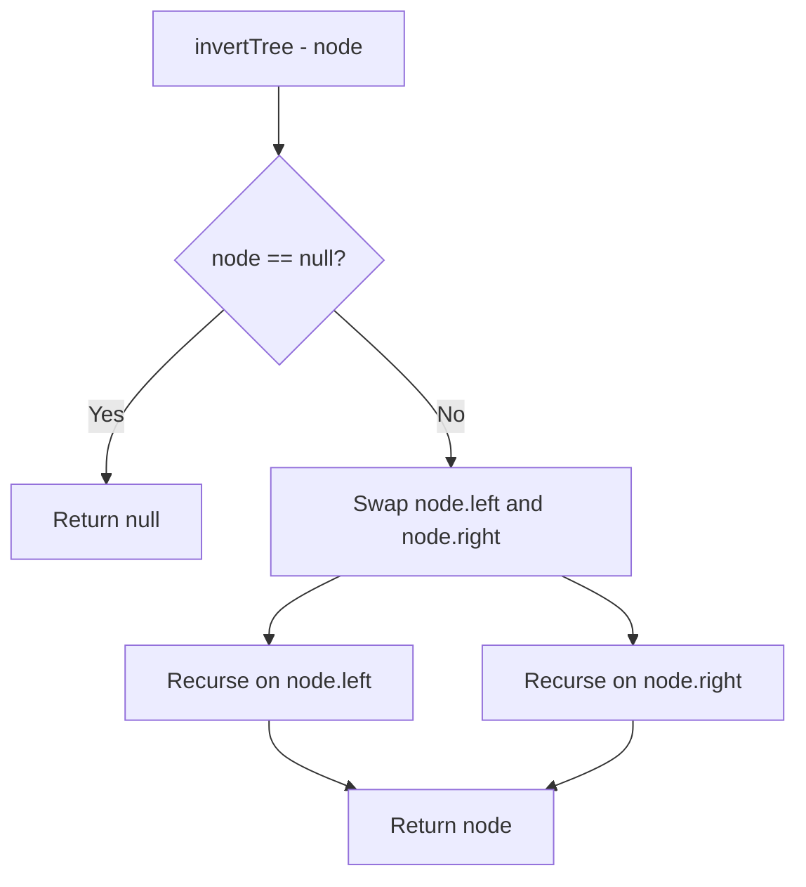

Given the root of a binary tree, invert the tree, and return its root. Inverting a binary tree means swapping every left child with its right child.

## Examples

**Input:** root = [4,2,7,1,3,6,9]
**Output:** [4,7,2,9,6,3,1]
**Explanation:** Every left and right child pair is swapped at each level, producing the mirror image of the tree.

**Input:** root = [2,1,3]
**Output:** [2,3,1]
**Explanation:** The root stays the same while its left child (1) and right child (3) are swapped.


## Solution

```js
// class TreeNode {
//   constructor(val = 0, left = null, right = null) {
//     this.val = val;
//     this.left = left;
//     this.right = right;
//   }
// }

function invertTree(root) {
  if (root === null) return null;

  const temp = root.left;
  root.left = root.right;
  root.right = temp;

  invertTree(root.left);
  invertTree(root.right);

  return root;
}
```

## Explanation

APPROACH: Recursive DFS (swap children at each node)

At each node, swap its left and right children, then recursively invert both subtrees.

```
Before:          After:
     4                4
   /   \            /   \
  2     7    →    7     2
 / \   / \      / \   / \
1   3 6   9    9   6 3   1

Step-by-step:
1. At node 4: swap children 2↔7
2. Recurse left (now 7): swap 6↔9
3. Recurse right (now 2): swap 1↔3
4. Leaf nodes: return (base case)
```

WHY THIS WORKS:
- Swapping at every level mirrors the entire tree
- Pre-order, in-order, or post-order all work — just swap at each node
- O(n) time visiting each node once, O(h) stack space

## Diagram



## TestConfig
```json
{
  "functionName": "invertTree",
  "argTypes": [
    "tree"
  ],
  "returnType": "tree",
  "testCases": [
    {
      "args": [
        [
          4,
          2,
          7,
          1,
          3,
          6,
          9
        ]
      ],
      "expected": [
        4,
        7,
        2,
        9,
        6,
        3,
        1
      ]
    },
    {
      "args": [
        [
          2,
          1,
          3
        ]
      ],
      "expected": [
        2,
        3,
        1
      ]
    },
    {
      "args": [
        []
      ],
      "expected": []
    },
    {
      "args": [
        [
          1
        ]
      ],
      "expected": [
        1
      ],
      "isHidden": true
    },
    {
      "args": [
        [
          1,
          2
        ]
      ],
      "expected": [
        1,
        null,
        2
      ],
      "isHidden": true
    },
    {
      "args": [
        [
          1,
          null,
          2
        ]
      ],
      "expected": [
        1,
        2
      ],
      "isHidden": true
    },
    {
      "args": [
        [
          1,
          2,
          3,
          4,
          5,
          6,
          7
        ]
      ],
      "expected": [
        1,
        3,
        2,
        7,
        6,
        5,
        4
      ],
      "isHidden": true
    },
    {
      "args": [
        [
          5,
          3,
          8
        ]
      ],
      "expected": [
        5,
        8,
        3
      ],
      "isHidden": true
    },
    {
      "args": [
        [
          1,
          2,
          null,
          3
        ]
      ],
      "expected": [
        1,
        null,
        2,
        null,
        3
      ],
      "isHidden": true
    },
    {
      "args": [
        [
          10,
          5,
          15,
          3,
          7
        ]
      ],
      "expected": [
        10,
        15,
        5,
        null,
        null,
        7,
        3
      ],
      "isHidden": true
    }
  ]
}
```
