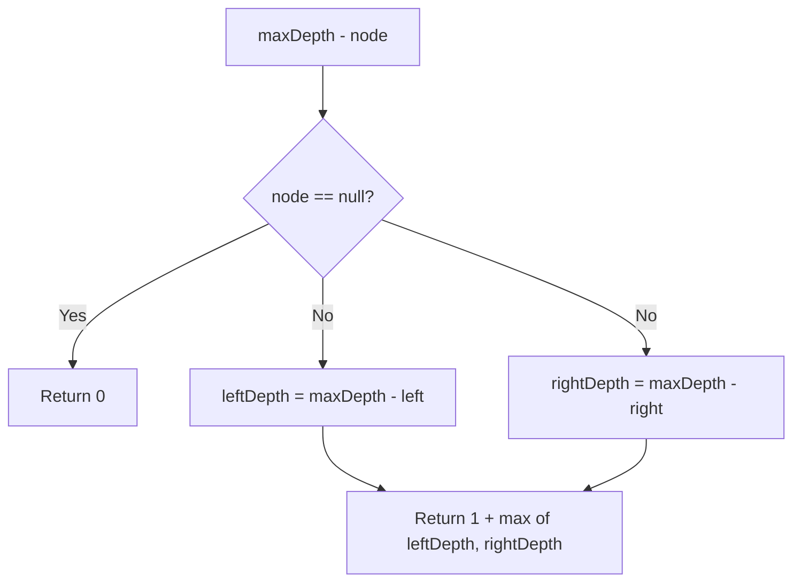

Given the root of a binary tree, return its maximum depth. A binary tree's maximum depth is the number of nodes along the longest path from the root node down to the farthest leaf node.

## Examples

**Input:** root = [3,9,20,null,null,15,7]
**Output:** 3
**Explanation:** The longest root-to-leaf path is 3 -> 20 -> 15 (or 3 -> 20 -> 7), which has 3 nodes.

**Input:** root = [1,null,2]
**Output:** 2
**Explanation:** The only path is 1 -> 2, which has a depth of 2.


## Brute Force

```js
function maxDepthIterative(root) {
  if (root === null) return 0;
  const queue = [root];
  let depth = 0;
  while (queue.length > 0) {
    const levelSize = queue.length;
    for (let i = 0; i < levelSize; i++) {
      const node = queue.shift();
      if (node.left) queue.push(node.left);
      if (node.right) queue.push(node.right);
    }
    depth++;
  }
  return depth;
}
// BFS approach: Time O(n) | Space O(n)
```

## Solution

```js
function maxDepth(root) {
  if (root === null) return 0;
  return 1 + Math.max(maxDepth(root.left), maxDepth(root.right));
}
```

## Explanation

APPROACH: Recursive DFS — depth = 1 + max(left, right)

Base case: null node has depth 0. Recursive case: 1 + max of children's depths.

```
     3
   /   \
  9    20
      /  \
    15    7

Recursion tree (bottom-up):
  maxDepth(3)
  ├── maxDepth(9) = 1  (no children: 1 + max(0,0))
  └── maxDepth(20) = 2
      ├── maxDepth(15) = 1
      └── maxDepth(7) = 1
  = 1 + max(1, 2) = 3
```

WHY THIS WORKS:
- The depth of a node is 1 (for itself) plus the maximum depth of its subtrees
- Post-order traversal: compute children first, then combine

## Diagram



## TestConfig
```json
{
  "functionName": "maxDepth",
  "argTypes": [
    "tree"
  ],
  "testCases": [
    {
      "args": [
        [
          3,
          9,
          20,
          null,
          null,
          15,
          7
        ]
      ],
      "expected": 3
    },
    {
      "args": [
        [
          1,
          null,
          2
        ]
      ],
      "expected": 2
    },
    {
      "args": [
        []
      ],
      "expected": 0
    },
    {
      "args": [
        [
          1
        ]
      ],
      "expected": 1,
      "isHidden": true
    },
    {
      "args": [
        [
          1,
          2,
          3
        ]
      ],
      "expected": 2,
      "isHidden": true
    },
    {
      "args": [
        [
          1,
          2,
          3,
          4,
          5,
          6,
          7
        ]
      ],
      "expected": 3,
      "isHidden": true
    },
    {
      "args": [
        [
          1,
          2,
          null,
          3,
          null,
          4
        ]
      ],
      "expected": 4,
      "isHidden": true
    },
    {
      "args": [
        [
          1,
          null,
          2,
          null,
          3,
          null,
          4
        ]
      ],
      "expected": 4,
      "isHidden": true
    },
    {
      "args": [
        [
          5,
          3,
          8,
          1,
          4
        ]
      ],
      "expected": 3,
      "isHidden": true
    },
    {
      "args": [
        [
          1,
          2,
          3,
          null,
          null,
          null,
          4,
          null,
          5
        ]
      ],
      "expected": 4,
      "isHidden": true
    }
  ]
}
```
