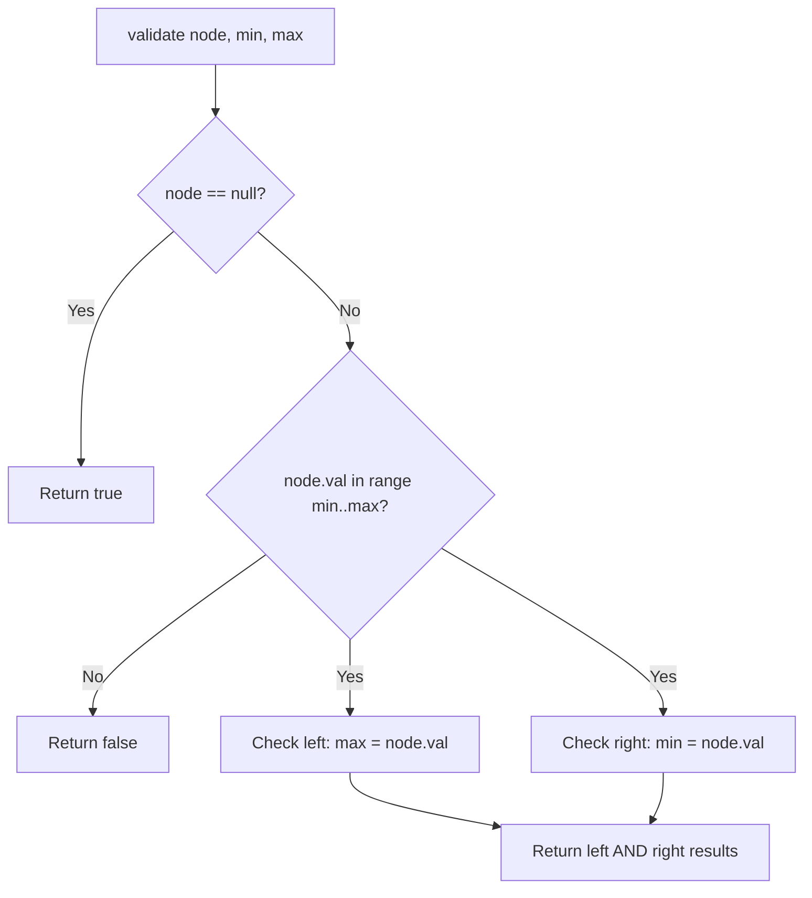

Given the root of a binary tree, determine if it is a valid binary search tree (BST). A valid BST has the property that all nodes in the left subtree have values strictly less than the root, and all nodes in the right subtree have values strictly greater than the root. Both subtrees must also be valid BSTs.

## Examples

**Input:** root = [2,1,3]
**Output:** true
**Explanation:** Left child 1 < root 2 < right child 3, satisfying the BST property at every node.

**Input:** root = [5,1,4,null,null,3,6]
**Output:** false
**Explanation:** The root node value is 5 but its right child is 4.


## Brute Force

```js
function isValidBSTInorder(root) {
  const values = [];
  function inorder(node) {
    if (node === null) return;
    inorder(node.left);
    values.push(node.val);
    inorder(node.right);
  }
  inorder(root);
  for (let i = 1; i < values.length; i++) {
    if (values[i] <= values[i - 1]) return false;
  }
  return true;
}
// Time: O(n) | Space: O(n) for values array
```

## Solution

```js
function isValidBST(root) {
  function validate(node, min, max) {
    if (node === null) return true;
    if (node.val <= min || node.val >= max) return false;
    return (
      validate(node.left, min, node.val) &&
      validate(node.right, node.val, max)
    );
  }

  return validate(root, -Infinity, Infinity);
}
```

## Explanation

APPROACH: DFS with Range Validation [min, max]

Each node must fall within a valid range. Left child narrows upper bound, right child narrows lower bound.

```
     5           Valid ranges:
   /   \         5: (-∞, +∞) ✓
  1     7        1: (-∞, 5) ✓
 / \   / \      3: (1, 5) ✓
0   3 6   8     0: (-∞, 1) ✓
                 7: (5, +∞) ✓
                 6: (5, 7) ✓
                 8: (7, +∞) ✓

Invalid example:
     5
   /   \
  1     4    ← 4 not in (5, +∞) → INVALID
       / \
      3   6
```

WHY THIS WORKS:
- BST property: left < node < right must hold for ALL ancestors, not just parent
- Passing [min, max] range ensures global BST property
- O(n) time, O(h) space

## Diagram



## TestConfig
```json
{
  "functionName": "isValidBST",
  "argTypes": [
    "tree"
  ],
  "testCases": [
    {
      "args": [
        [
          2,
          1,
          3
        ]
      ],
      "expected": true
    },
    {
      "args": [
        [
          5,
          1,
          4,
          null,
          null,
          3,
          6
        ]
      ],
      "expected": false
    },
    {
      "args": [
        [
          1
        ]
      ],
      "expected": true
    },
    {
      "args": [
        []
      ],
      "expected": true,
      "isHidden": true
    },
    {
      "args": [
        [
          5,
          3,
          7,
          2,
          4,
          6,
          8
        ]
      ],
      "expected": true,
      "isHidden": true
    },
    {
      "args": [
        [
          5,
          4,
          6,
          null,
          null,
          3,
          7
        ]
      ],
      "expected": false,
      "isHidden": true
    },
    {
      "args": [
        [
          1,
          1
        ]
      ],
      "expected": false,
      "isHidden": true
    },
    {
      "args": [
        [
          10,
          5,
          15,
          null,
          null,
          6,
          20
        ]
      ],
      "expected": false,
      "isHidden": true
    },
    {
      "args": [
        [
          3,
          1,
          5,
          0,
          2,
          4,
          6
        ]
      ],
      "expected": true,
      "isHidden": true
    },
    {
      "args": [
        [
          2,
          2,
          2
        ]
      ],
      "expected": false,
      "isHidden": true
    }
  ]
}
```
