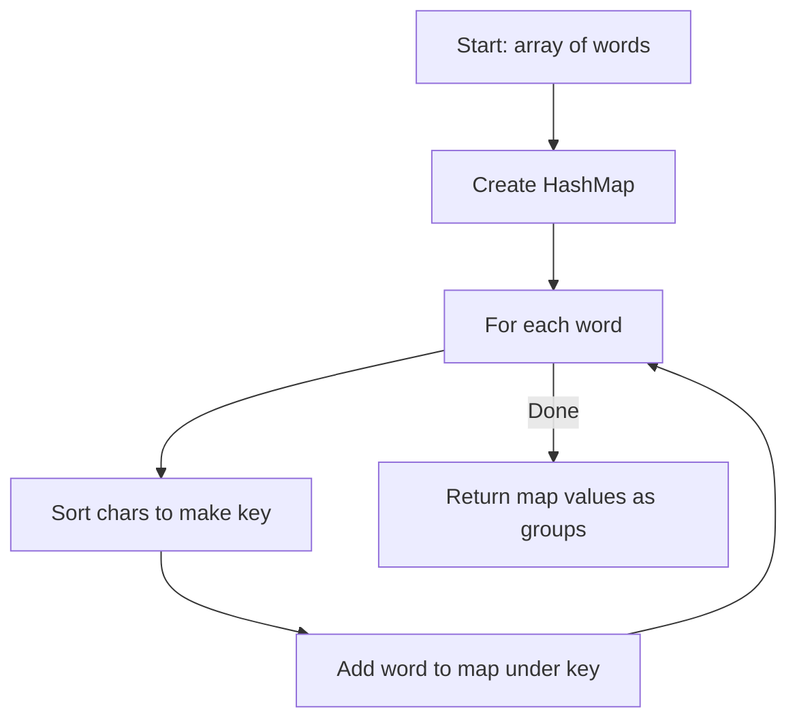

Given an array of strings `strs`, group the anagrams together. You can return the answer in any order. An anagram is a word formed by rearranging the letters of a different word, using all the original letters exactly once.

## Examples

**Input:** strs = ["eat","tea","tan","ate","nat","bat"]
**Output:** [["bat"],["nat","tan"],["ate","eat","tea"]]
**Explanation:** Words that are anagrams of each other (same letters rearranged) are grouped together.

**Input:** strs = [""]
**Output:** [[""]]
**Explanation:** A single empty string forms its own group.


## Brute Force

```js
function groupAnagramsCount(strs) {
  const map = new Map();
  for (const str of strs) {
    const count = new Array(26).fill(0);
    for (const ch of str) {
      count[ch.charCodeAt(0) - 'a'.charCodeAt(0)]++;
    }
    const key = count.join('#');
    if (!map.has(key)) map.set(key, []);
    map.get(key).push(str);
  }
  return Array.from(map.values());
}
```

### Brute Force Explanation

The character-count approach uses a 26-element frequency array as the key instead of sorting, giving O(n * k) time. It is actually an optimization over the sorted key approach, not a brute force. A true brute force would compare every pair of strings for anagram equality at O(n^2 * k).

## Solution

```js
function groupAnagrams(strs) {
  const map = new Map();
  for (const str of strs) {
    const key = str.split('').sort().join('');
    if (!map.has(key)) {
      map.set(key, []);
    }
    map.get(key).push(str);
  }
  return Array.from(map.values());
}
```

## Explanation

APPROACH: Sorted String as Hash Key

Anagrams contain the same characters, so sorting each string produces an identical
key for all anagrams. Use that sorted key to group words in a hash map.

```
word → sorted key → bucket
"eat" → "aet"   → map["aet"] = ["eat"]
"tea" → "aet"   → map["aet"] = ["eat", "tea"]
"tan" → "ant"   → map["ant"] = ["tan"]
"ate" → "aet"   → map["aet"] = ["eat", "tea", "ate"]
"nat" → "ant"   → map["ant"] = ["tan", "nat"]
"bat" → "abt"   → map["abt"] = ["bat"]
```

WALKTHROUGH with strs = ["eat","tea","tan","ate","nat","bat"]:

```
Sorted Key   Grouped Words
──────────   ──────────────────
"abt"        ["bat"]
"aet"        ["eat", "tea", "ate"]
"ant"        ["tan", "nat"]
```

Result: [["bat"], ["eat","tea","ate"], ["tan","nat"]]

WHY THIS WORKS:
- Sorting a string is O(k log k) where k is the string length
- All anagrams produce the same sorted key
- Total time: O(n * k log k) for n strings


## Diagram



## TestConfig
```json
{
  "functionName": "groupAnagrams",
  "validator": "validateGroupAnagrams",
  "testCases": [
    {
      "args": [
        [
          "eat",
          "tea",
          "tan",
          "ate",
          "nat",
          "bat"
        ]
      ],
      "expected": [
        [
          "eat",
          "tea",
          "ate"
        ],
        [
          "tan",
          "nat"
        ],
        [
          "bat"
        ]
      ]
    },
    {
      "args": [
        [
          ""
        ]
      ],
      "expected": [
        [
          ""
        ]
      ]
    },
    {
      "args": [
        [
          "a"
        ]
      ],
      "expected": [
        [
          "a"
        ]
      ]
    },
    {
      "args": [
        [
          "ab",
          "ba",
          "abc",
          "bca",
          "cab"
        ]
      ],
      "expected": [
        [
          "ab",
          "ba"
        ],
        [
          "abc",
          "bca",
          "cab"
        ]
      ],
      "isHidden": true
    },
    {
      "args": [
        [
          "no",
          "on",
          "is",
          "si"
        ]
      ],
      "expected": [
        [
          "no",
          "on"
        ],
        [
          "is",
          "si"
        ]
      ],
      "isHidden": true
    },
    {
      "args": [
        [
          "a",
          "b",
          "c"
        ]
      ],
      "expected": [
        [
          "a"
        ],
        [
          "b"
        ],
        [
          "c"
        ]
      ],
      "isHidden": true
    },
    {
      "args": [
        [
          "abc",
          "def",
          "ghi"
        ]
      ],
      "expected": [
        [
          "abc"
        ],
        [
          "def"
        ],
        [
          "ghi"
        ]
      ],
      "isHidden": true
    },
    {
      "args": [
        [
          "listen",
          "silent",
          "hello"
        ]
      ],
      "expected": [
        [
          "listen",
          "silent"
        ],
        [
          "hello"
        ]
      ],
      "isHidden": true
    },
    {
      "args": [
        [
          "",
          "",
          ""
        ]
      ],
      "expected": [
        [
          "",
          "",
          ""
        ]
      ],
      "isHidden": true
    },
    {
      "args": [
        [
          "rat",
          "tar",
          "art",
          "car"
        ]
      ],
      "expected": [
        [
          "rat",
          "tar",
          "art"
        ],
        [
          "car"
        ]
      ],
      "isHidden": true
    }
  ]
}
```
