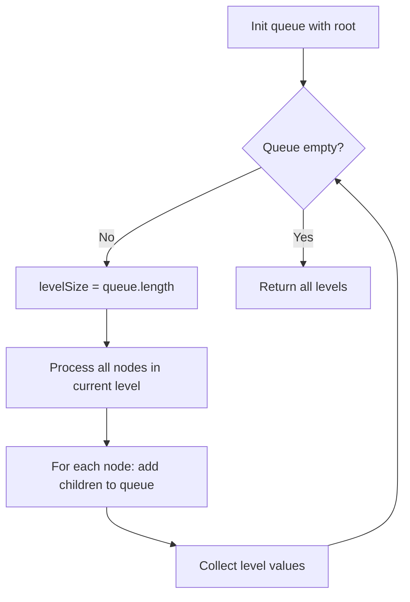

Given the root of a binary tree, return the level order traversal of its nodes' values (i.e., from left to right, level by level).

## Examples

**Input:** root = [3,9,20,null,null,15,7]
**Output:** [[3],[9,20],[15,7]]
**Explanation:** BFS visits level 0 (node 3), then level 1 (nodes 9, 20), then level 2 (nodes 15, 7).

**Input:** root = [1]
**Output:** [[1]]
**Explanation:** A single-node tree has only one level containing that node.


## Solution

```js
function levelOrder(root) {
  if (root === null) return [];

  const result = [];
  const queue = [root];

  while (queue.length > 0) {
    const levelSize = queue.length;
    const level = [];

    for (let i = 0; i < levelSize; i++) {
      const node = queue.shift();
      level.push(node.val);
      if (node.left) queue.push(node.left);
      if (node.right) queue.push(node.right);
    }

    result.push(level);
  }

  return result;
}
```

## Explanation

APPROACH: BFS with Queue (process level by level)

Use a queue. At each level, process all nodes in the queue (current level size), collecting their values and enqueueing children.

```
     3
   /   \
  9    20
      /  \
    15    7

Queue state at each level:
Level 0: queue = [3]      → process 3, enqueue 9,20   → result: [[3]]
Level 1: queue = [9,20]   → process 9,20, enqueue 15,7 → result: [[3],[9,20]]
Level 2: queue = [15,7]   → process 15,7               → result: [[3],[9,20],[15,7]]

```

WHY THIS WORKS:
- BFS naturally processes nodes level by level
- Recording queue size at each level separates levels cleanly
- O(n) time, O(w) space where w is max width

## Diagram



## TestConfig
```json
{
  "functionName": "levelOrder",
  "argTypes": [
    "tree"
  ],
  "testCases": [
    {
      "args": [
        [
          3,
          9,
          20,
          null,
          null,
          15,
          7
        ]
      ],
      "expected": [
        [
          3
        ],
        [
          9,
          20
        ],
        [
          15,
          7
        ]
      ]
    },
    {
      "args": [
        [
          1
        ]
      ],
      "expected": [
        [
          1
        ]
      ]
    },
    {
      "args": [
        []
      ],
      "expected": []
    },
    {
      "args": [
        [
          1,
          2,
          3
        ]
      ],
      "expected": [
        [
          1
        ],
        [
          2,
          3
        ]
      ],
      "isHidden": true
    },
    {
      "args": [
        [
          1,
          2,
          3,
          4,
          5,
          6,
          7
        ]
      ],
      "expected": [
        [
          1
        ],
        [
          2,
          3
        ],
        [
          4,
          5,
          6,
          7
        ]
      ],
      "isHidden": true
    },
    {
      "args": [
        [
          1,
          null,
          2,
          null,
          3
        ]
      ],
      "expected": [
        [
          1
        ],
        [
          2
        ],
        [
          3
        ]
      ],
      "isHidden": true
    },
    {
      "args": [
        [
          1,
          2
        ]
      ],
      "expected": [
        [
          1
        ],
        [
          2
        ]
      ],
      "isHidden": true
    },
    {
      "args": [
        [
          1,
          null,
          2
        ]
      ],
      "expected": [
        [
          1
        ],
        [
          2
        ]
      ],
      "isHidden": true
    },
    {
      "args": [
        [
          5,
          3,
          8,
          1,
          4,
          7,
          9
        ]
      ],
      "expected": [
        [
          5
        ],
        [
          3,
          8
        ],
        [
          1,
          4,
          7,
          9
        ]
      ],
      "isHidden": true
    },
    {
      "args": [
        [
          1,
          2,
          3,
          4,
          null,
          null,
          5
        ]
      ],
      "expected": [
        [
          1
        ],
        [
          2,
          3
        ],
        [
          4,
          5
        ]
      ],
      "isHidden": true
    }
  ]
}
```
