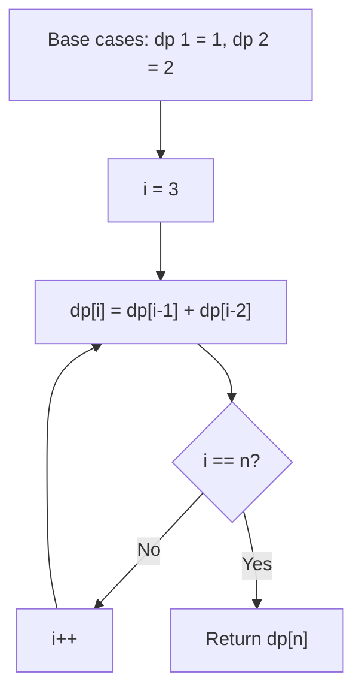

You are climbing a staircase. It takes `n` steps to reach the top. Each time you can either climb 1 or 2 steps. In how many distinct ways can you climb to the top?

## Examples

**Input:** n = 2
**Output:** 2
**Explanation:** Two ways: (1+1) or (2).

**Input:** n = 3
**Output:** 3
**Explanation:** Three ways: (1+1+1), (1+2), (2+1).


## Brute Force

```js
function climbStairsBrute(n) {
  if (n <= 2) return n;
  return climbStairsBrute(n - 1) + climbStairsBrute(n - 2);
}
// Time: O(2^n) | Space: O(n)
```

## Solution

```js
function climbStairs(n) {
  if (n <= 2) return n;
  let prev2 = 1;
  let prev1 = 2;

  for (let i = 3; i <= n; i++) {
    const current = prev1 + prev2;
    prev2 = prev1;
    prev1 = current;
  }

  return prev1;
}
```

## Explanation

APPROACH: Dynamic Programming (Fibonacci Pattern)

dp[i] = ways to reach step i = dp[i-1] + dp[i-2] (you can arrive from 1 or 2 steps below).

```
n = 5

  Step:  0   1   2   3   4   5
  Ways:  1   1   2   3   5   8

  dp[0] = 1 (base: standing at ground)
  dp[1] = 1 (one way: single step)
  dp[2] = dp[1] + dp[0] = 1 + 1 = 2
  dp[3] = dp[2] + dp[1] = 2 + 1 = 3
  dp[4] = dp[3] + dp[2] = 3 + 2 = 5
  dp[5] = dp[4] + dp[3] = 5 + 3 = 8

Decision tree (shows overlapping subproblems):
              5
           /     \
          4       3
         / \     / \
        3   2   2   1
       /\  /\  /\
      2 1 1 0 1 0
     /\
    1 0
```

WHY THIS WORKS:
- From step i, you could have come from step i-1 (1 step) or i-2 (2 steps)
- This is exactly the Fibonacci sequence
- Can optimize to O(1) space by only keeping last two values

## Diagram



## TestConfig
```json
{
  "functionName": "climbStairs",
  "testCases": [
    {
      "args": [
        2
      ],
      "expected": 2
    },
    {
      "args": [
        3
      ],
      "expected": 3
    },
    {
      "args": [
        1
      ],
      "expected": 1
    },
    {
      "args": [
        4
      ],
      "expected": 5,
      "isHidden": true
    },
    {
      "args": [
        5
      ],
      "expected": 8,
      "isHidden": true
    },
    {
      "args": [
        6
      ],
      "expected": 13,
      "isHidden": true
    },
    {
      "args": [
        7
      ],
      "expected": 21,
      "isHidden": true
    },
    {
      "args": [
        10
      ],
      "expected": 89,
      "isHidden": true
    },
    {
      "args": [
        20
      ],
      "expected": 10946,
      "isHidden": true
    },
    {
      "args": [
        30
      ],
      "expected": 1346269,
      "isHidden": true
    }
  ]
}
```
