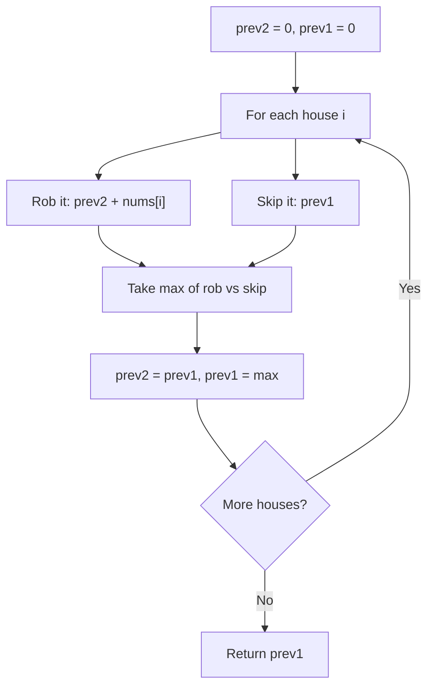

You are a professional robber planning to rob houses along a street. Each house has a certain amount of money stashed. Adjacent houses have security systems connected and will automatically contact the police if two adjacent houses were broken into on the same night. Given an array `nums` representing the amount of money of each house, return the maximum amount of money you can rob tonight without alerting the police.

## Examples

**Input:** nums = [1,2,3,1]
**Output:** 4
**Explanation:** Rob house 1 (money = 1) and house 3 (money = 3) = 4.

**Input:** nums = [2,7,9,3,1]
**Output:** 12
**Explanation:** Rob house 1 (2) + house 3 (9) + house 5 (1) = 12.


## Brute Force

```js
function robBrute(nums, i = 0) {
  if (i >= nums.length) return 0;
  return Math.max(
    nums[i] + robBrute(nums, i + 2), // rob this house
    robBrute(nums, i + 1)             // skip this house
  );
}
// Time: O(2^n) | Space: O(n)
```

## Solution

```js
function rob(nums) {
  if (nums.length === 0) return 0;
  if (nums.length === 1) return nums[0];

  let prev2 = 0; // max money two houses back
  let prev1 = 0; // max money one house back

  for (const num of nums) {
    const current = Math.max(prev1, prev2 + num);
    prev2 = prev1;
    prev1 = current;
  }

  return prev1;
}
```

## Diagram



## TestConfig
```json
{
  "functionName": "rob",
  "testCases": [
    {
      "args": [
        [
          1,
          2,
          3,
          1
        ]
      ],
      "expected": 4
    },
    {
      "args": [
        [
          2,
          7,
          9,
          3,
          1
        ]
      ],
      "expected": 12
    },
    {
      "args": [
        [
          2,
          1,
          1,
          2
        ]
      ],
      "expected": 4
    },
    {
      "args": [
        [
          0
        ]
      ],
      "expected": 0,
      "isHidden": true
    },
    {
      "args": [
        [
          5
        ]
      ],
      "expected": 5,
      "isHidden": true
    },
    {
      "args": [
        [
          1,
          2
        ]
      ],
      "expected": 2,
      "isHidden": true
    },
    {
      "args": [
        [
          2,
          1
        ]
      ],
      "expected": 2,
      "isHidden": true
    },
    {
      "args": [
        [
          1,
          3,
          1,
          3,
          100
        ]
      ],
      "expected": 103,
      "isHidden": true
    },
    {
      "args": [
        [
          6,
          7,
          1,
          30,
          8,
          2,
          4
        ]
      ],
      "expected": 41,
      "isHidden": true
    },
    {
      "args": [
        [
          10,
          1,
          1,
          10,
          1,
          1,
          10
        ]
      ],
      "expected": 30,
      "isHidden": true
    }
  ]
}
```
