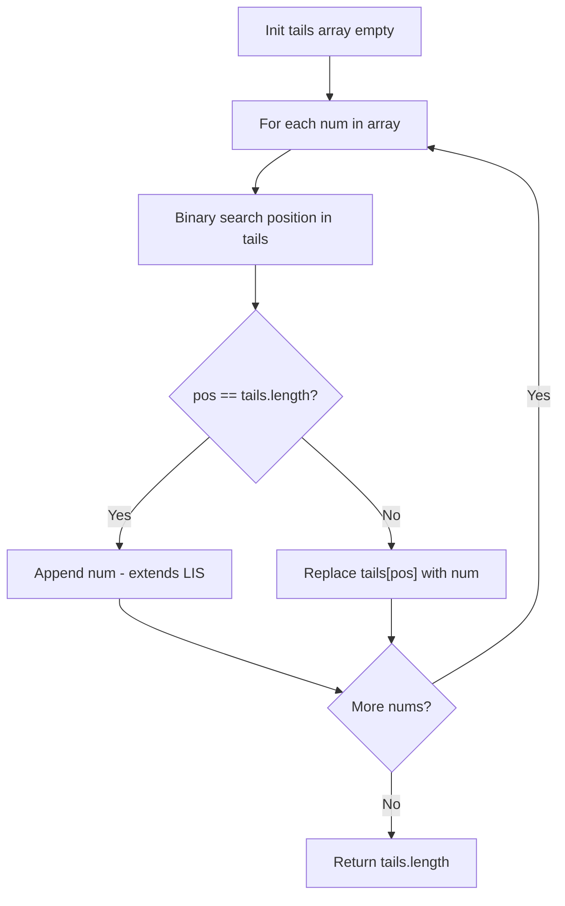

Given an integer array `nums`, return the length of the longest strictly increasing subsequence.

## Examples

**Input:** nums = [10,9,2,5,3,7,101,18]
**Output:** 4
**Explanation:** The longest increasing subsequence is [2,3,7,101], therefore the length is 4.

**Input:** nums = [0,1,0,3,2,3]
**Output:** 4
**Explanation:** One longest increasing subsequence is [0,1,2,3], which has length 4.


## Brute Force

```js
function lengthOfLISDP(nums) {
  const n = nums.length;
  const dp = new Array(n).fill(1);

  for (let i = 1; i < n; i++) {
    for (let j = 0; j < i; j++) {
      if (nums[j] < nums[i]) {
        dp[i] = Math.max(dp[i], dp[j] + 1);
      }
    }
  }

  return Math.max(...dp);
}
// Time: O(n^2) | Space: O(n)
```

## Solution

```js
function lengthOfLIS(nums) {
  // Patience sorting with binary search
  const tails = [];

  for (const num of nums) {
    let left = 0;
    let right = tails.length;

    while (left < right) {
      const mid = Math.floor((left + right) / 2);
      if (tails[mid] < num) {
        left = mid + 1;
      } else {
        right = mid;
      }
    }

    tails[left] = num;
  }

  return tails.length;
}
```

## Diagram



## TestConfig
```json
{
  "functionName": "lengthOfLIS",
  "testCases": [
    {
      "args": [
        [
          10,
          9,
          2,
          5,
          3,
          7,
          101,
          18
        ]
      ],
      "expected": 4
    },
    {
      "args": [
        [
          0,
          1,
          0,
          3,
          2,
          3
        ]
      ],
      "expected": 4
    },
    {
      "args": [
        [
          7,
          7,
          7,
          7,
          7,
          7,
          7
        ]
      ],
      "expected": 1
    },
    {
      "args": [
        [
          1
        ]
      ],
      "expected": 1,
      "isHidden": true
    },
    {
      "args": [
        [
          1,
          2,
          3,
          4,
          5
        ]
      ],
      "expected": 5,
      "isHidden": true
    },
    {
      "args": [
        [
          5,
          4,
          3,
          2,
          1
        ]
      ],
      "expected": 1,
      "isHidden": true
    },
    {
      "args": [
        [
          3,
          5,
          6,
          2,
          5,
          4,
          19,
          5,
          6,
          7,
          12
        ]
      ],
      "expected": 6,
      "isHidden": true
    },
    {
      "args": [
        [
          1,
          3,
          6,
          7,
          9,
          4,
          10,
          5,
          6
        ]
      ],
      "expected": 6,
      "isHidden": true
    },
    {
      "args": [
        [
          2,
          2
        ]
      ],
      "expected": 1,
      "isHidden": true
    },
    {
      "args": [
        [
          4,
          10,
          4,
          3,
          8,
          9
        ]
      ],
      "expected": 3,
      "isHidden": true
    }
  ]
}
```
