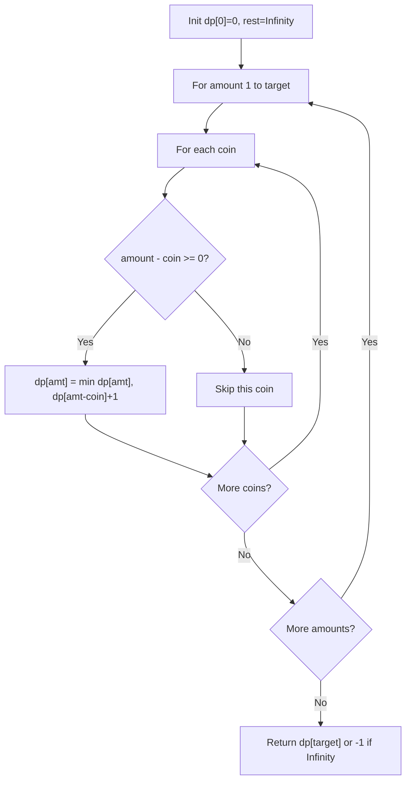

You are given an integer array `coins` representing coins of different denominations and an integer `amount` representing a total amount of money. Return the fewest number of coins that you need to make up that amount. If that amount of money cannot be made up by any combination of the coins, return -1.

## Examples

**Input:** coins = [1,5,11], amount = 11
**Output:** 3
**Explanation:** 11 = 5 + 5 + 1

**Input:** coins = [2], amount = 3
**Output:** -1
**Explanation:** No combination of 2s can sum to the odd number 3.

**Input:** coins = [1], amount = 0
**Output:** 0
**Explanation:** Zero coins are needed to make an amount of 0.


## Brute Force

```js
function coinChangeBrute(coins, amount) {
  if (amount === 0) return 0;
  if (amount < 0) return -1;

  let minCoins = Infinity;
  for (const coin of coins) {
    const result = coinChangeBrute(coins, amount - coin);
    if (result !== -1) {
      minCoins = Math.min(minCoins, result + 1);
    }
  }
  return minCoins === Infinity ? -1 : minCoins;
}
// Time: O(amount^coins) | Space: O(amount)
```

## Solution

```js
function coinChange(coins, amount) {
  const dp = new Array(amount + 1).fill(Infinity);
  dp[0] = 0;

  for (let i = 1; i <= amount; i++) {
    for (const coin of coins) {
      if (coin <= i && dp[i - coin] !== Infinity) {
        dp[i] = Math.min(dp[i], dp[i - coin] + 1);
      }
    }
  }

  return dp[amount] === Infinity ? -1 : dp[amount];
}
```

## Explanation

APPROACH: Bottom-Up DP (Unbounded Knapsack variant)

dp[amount] = minimum coins needed. For each amount from 1 to target, try every coin and take the minimum.

```
coins = [1, 3, 4], amount = 6

dp[i] = min coins to make amount i

amt:  0   1   2   3   4   5   6
dp:   0   1   2   1   1   2   2

Building the table:
dp[0] = 0 (base case)
dp[1] = min(dp[1-1]+1) = min(dp[0]+1) = 1          using coin 1
dp[2] = min(dp[2-1]+1) = min(dp[1]+1) = 2          using coin 1
dp[3] = min(dp[3-1]+1, dp[3-3]+1) = min(3, 1) = 1  using coin 3
dp[4] = min(dp[3]+1, dp[1]+1, dp[0]+1) = min(2,2,1) = 1  using coin 4
dp[5] = min(dp[4]+1, dp[2]+1) = min(2, 3) = 2      using coins 4+1
dp[6] = min(dp[5]+1, dp[3]+1, dp[2]+1) = min(3,2,3) = 2  using coins 3+3
```

WHY THIS WORKS:
- For each amount, the optimal solution uses some coin c, leaving amount-c to solve
- dp[amount - coin] + 1 represents using that coin
- Building bottom-up ensures subproblems are solved before they're needed

## Diagram



## TestConfig
```json
{
  "functionName": "coinChange",
  "testCases": [
    {
      "args": [
        [
          1,
          5,
          10
        ],
        11
      ],
      "expected": 2
    },
    {
      "args": [
        [
          2
        ],
        3
      ],
      "expected": -1
    },
    {
      "args": [
        [
          1
        ],
        0
      ],
      "expected": 0
    },
    {
      "args": [
        [
          1,
          2,
          5
        ],
        11
      ],
      "expected": 3,
      "isHidden": true
    },
    {
      "args": [
        [
          1
        ],
        1
      ],
      "expected": 1,
      "isHidden": true
    },
    {
      "args": [
        [
          1
        ],
        2
      ],
      "expected": 2,
      "isHidden": true
    },
    {
      "args": [
        [
          2,
          5,
          10,
          1
        ],
        27
      ],
      "expected": 4,
      "isHidden": true
    },
    {
      "args": [
        [
          1,
          3,
          5
        ],
        15
      ],
      "expected": 3,
      "isHidden": true
    },
    {
      "args": [
        [
          2,
          3
        ],
        7
      ],
      "expected": 3,
      "isHidden": true
    },
    {
      "args": [
        [
          5
        ],
        3
      ],
      "expected": -1,
      "isHidden": true
    }
  ]
}
```
