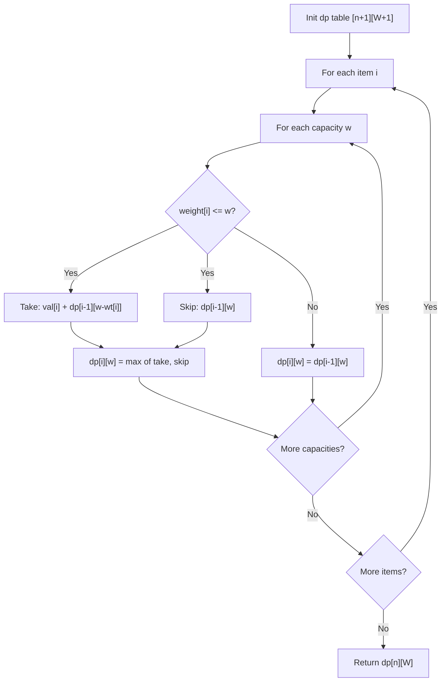

Given weights and values of n items, put these items in a knapsack of capacity W to get the maximum total value in the knapsack. Each item can only be used once (0/1 property).

## Examples

**Input:** values = [60,100,120], weights = [10,20,30], capacity = 50
**Output:** 220
**Explanation:** Take items with weights 20 and 30, values 100 and 120. Total value = 220.


## Brute Force

```js
function knapsackBrute(values, weights, capacity, i = 0) {
  if (i === values.length || capacity === 0) return 0;

  // Skip current item
  let result = knapsackBrute(values, weights, capacity, i + 1);

  // Include current item if it fits
  if (weights[i] <= capacity) {
    result = Math.max(
      result,
      values[i] + knapsackBrute(values, weights, capacity - weights[i], i + 1)
    );
  }

  return result;
}
// Time: O(2^n) | Space: O(n)
```

## Solution

```js
function knapsack(values, weights, capacity) {
  const n = values.length;
  // 1D DP array; iterate capacity in reverse to avoid using an item twice
  const dp = new Array(capacity + 1).fill(0);

  for (let i = 0; i < n; i++) {
    for (let w = capacity; w >= weights[i]; w--) {
      dp[w] = Math.max(dp[w], dp[w - weights[i]] + values[i]);
    }
  }

  return dp[capacity];
}
```

## Diagram



## TestConfig
```json
{
  "functionName": "knapsack",
  "testCases": [
    {
      "args": [
        [
          60,
          100,
          120
        ],
        [
          10,
          20,
          30
        ],
        50
      ],
      "expected": 220
    },
    {
      "args": [
        [
          10,
          20,
          30
        ],
        [
          1,
          1,
          1
        ],
        2
      ],
      "expected": 50
    },
    {
      "args": [
        [
          1,
          2,
          3
        ],
        [
          4,
          5,
          6
        ],
        3
      ],
      "expected": 0
    },
    {
      "args": [
        [
          10
        ],
        [
          5
        ],
        5
      ],
      "expected": 10,
      "isHidden": true
    },
    {
      "args": [
        [
          10
        ],
        [
          5
        ],
        4
      ],
      "expected": 0,
      "isHidden": true
    },
    {
      "args": [
        [
          1,
          4,
          5,
          7
        ],
        [
          1,
          3,
          4,
          5
        ],
        7
      ],
      "expected": 9,
      "isHidden": true
    },
    {
      "args": [
        [
          20,
          5,
          10,
          40,
          15,
          25
        ],
        [
          1,
          2,
          3,
          8,
          7,
          4
        ],
        10
      ],
      "expected": 60,
      "isHidden": true
    },
    {
      "args": [
        [
          3,
          4,
          5,
          6
        ],
        [
          2,
          3,
          4,
          5
        ],
        5
      ],
      "expected": 7,
      "isHidden": true
    },
    {
      "args": [
        [],
        [],
        10
      ],
      "expected": 0,
      "isHidden": true
    },
    {
      "args": [
        [
          5,
          6,
          7
        ],
        [
          1,
          2,
          3
        ],
        6
      ],
      "expected": 18,
      "isHidden": true
    }
  ]
}
```
