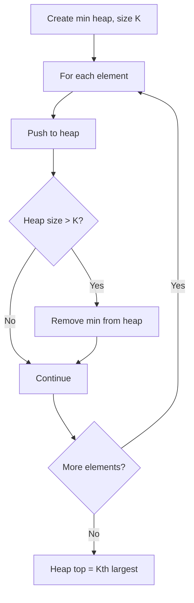

Given an integer array `nums` and an integer `k`, return the kth largest element in the array. Note that it is the kth largest element in the sorted order, not the kth distinct element.

## Examples

**Input:** nums = [3,2,1,5,6,4], k = 2
**Output:** 5
**Explanation:** Sorted in descending order: [6,5,4,3,2,1], so the 2nd largest is 5.

**Input:** nums = [3,2,3,1,2,4,5,5,6], k = 4
**Output:** 4
**Explanation:** Sorted in descending order: [6,5,5,4,3,3,2,2,1], so the 4th largest is 4.


## Brute Force

```js
function findKthLargestSort(nums, k) {
  nums.sort((a, b) => b - a);
  return nums[k - 1];
}
// Time: O(n log n) | Space: O(log n)
```

## Solution

```js
function findKthLargest(nums, k) {
  // Quickselect algorithm (Hoare's selection)
  function quickSelect(left, right, targetIdx) {
    const pivot = nums[right];
    let storeIdx = left;

    for (let i = left; i < right; i++) {
      if (nums[i] <= pivot) {
        [nums[i], nums[storeIdx]] = [nums[storeIdx], nums[i]];
        storeIdx++;
      }
    }
    [nums[storeIdx], nums[right]] = [nums[right], nums[storeIdx]];

    if (storeIdx === targetIdx) return nums[storeIdx];
    if (storeIdx < targetIdx) return quickSelect(storeIdx + 1, right, targetIdx);
    return quickSelect(left, storeIdx - 1, targetIdx);
  }

  // kth largest is at index (n - k) in sorted order
  return quickSelect(0, nums.length - 1, nums.length - k);
}
```

## Diagram



## TestConfig
```json
{
  "functionName": "findKthLargest",
  "testCases": [
    {
      "args": [
        [
          3,
          2,
          1,
          5,
          6,
          4
        ],
        2
      ],
      "expected": 5
    },
    {
      "args": [
        [
          3,
          2,
          3,
          1,
          2,
          4,
          5,
          5,
          6
        ],
        4
      ],
      "expected": 4
    },
    {
      "args": [
        [
          1
        ],
        1
      ],
      "expected": 1
    },
    {
      "args": [
        [
          1,
          2
        ],
        1
      ],
      "expected": 2,
      "isHidden": true
    },
    {
      "args": [
        [
          1,
          2
        ],
        2
      ],
      "expected": 1,
      "isHidden": true
    },
    {
      "args": [
        [
          7,
          6,
          5,
          4,
          3,
          2,
          1
        ],
        5
      ],
      "expected": 3,
      "isHidden": true
    },
    {
      "args": [
        [
          3,
          3,
          3,
          3
        ],
        2
      ],
      "expected": 3,
      "isHidden": true
    },
    {
      "args": [
        [
          -1,
          -2,
          -3,
          -4
        ],
        1
      ],
      "expected": -1,
      "isHidden": true
    },
    {
      "args": [
        [
          5,
          2,
          4,
          1,
          3,
          6,
          0
        ],
        4
      ],
      "expected": 3,
      "isHidden": true
    },
    {
      "args": [
        [
          99,
          99,
          98,
          97,
          96
        ],
        3
      ],
      "expected": 98,
      "isHidden": true
    }
  ]
}
```
