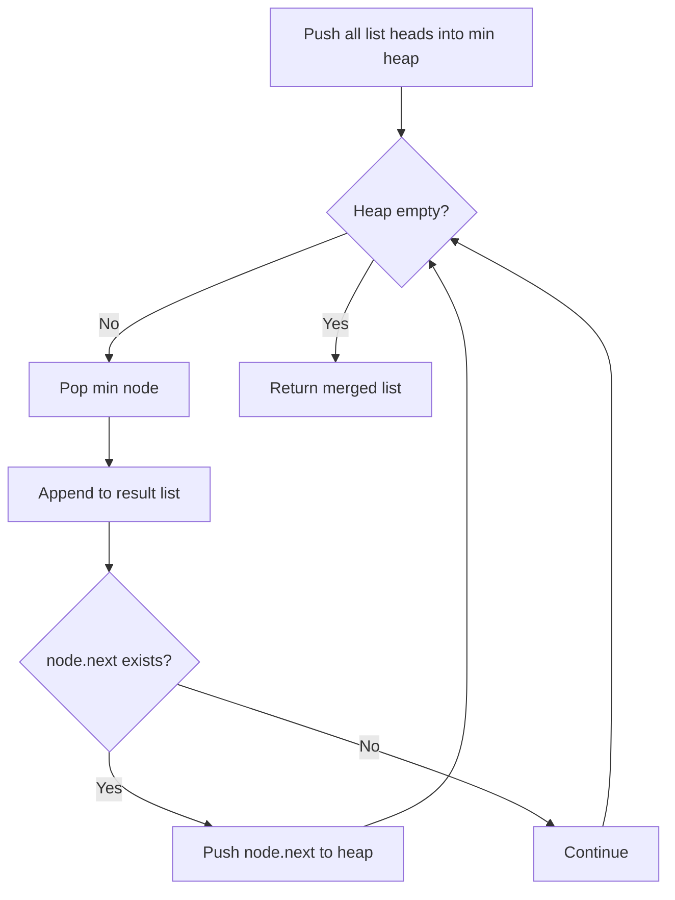

You are given an array of `k` linked-lists, each linked-list is sorted in ascending order. Merge all the linked-lists into one sorted linked-list and return it.

## Examples

**Input:** lists = [[1,4,5],[1,3,4],[2,6]]
**Output:** [1,1,2,3,4,4,5,6]
**Explanation:** Merging all three sorted lists into one produces [1,1,2,3,4,4,5,6].

**Input:** lists = []
**Output:** []
**Explanation:** An empty input contains no lists to merge, so the result is empty.


## Brute Force

```js
function mergeKListsBrute(lists) {
  const values = [];
  for (const list of lists) {
    let node = list;
    while (node) {
      values.push(node.val);
      node = node.next;
    }
  }
  values.sort((a, b) => a - b);
  const dummy = { val: 0, next: null };
  let curr = dummy;
  for (const val of values) {
    curr.next = { val, next: null };
    curr = curr.next;
  }
  return dummy.next;
}
// Time: O(N log N) | Space: O(N)
```

## Solution

```js
function mergeKLists(lists) {
  if (lists.length === 0) return null;

  function mergeTwoLists(l1, l2) {
    const dummy = { val: 0, next: null };
    let curr = dummy;
    while (l1 && l2) {
      if (l1.val <= l2.val) {
        curr.next = l1;
        l1 = l1.next;
      } else {
        curr.next = l2;
        l2 = l2.next;
      }
      curr = curr.next;
    }
    curr.next = l1 || l2;
    return dummy.next;
  }

  // Divide and conquer: merge lists in pairs
  let interval = 1;
  while (interval < lists.length) {
    for (let i = 0; i + interval < lists.length; i += interval * 2) {
      lists[i] = mergeTwoLists(lists[i], lists[i + interval]);
    }
    interval *= 2;
  }

  return lists[0];
}
```

## Diagram


