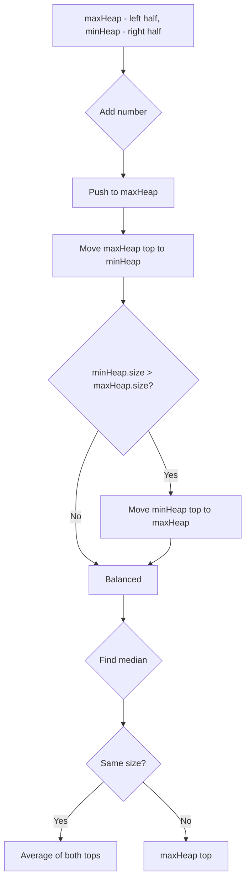

The median is the middle value in an ordered integer list. If the size of the list is even, the median is the average of the two middle values. Implement the MedianFinder class: `addNum(num)` adds an integer from the data stream, and `findMedian()` returns the median of all elements so far.

## Examples

**Input:** ["MedianFinder","addNum","addNum","findMedian","addNum","findMedian"]
[[],[1],[2],[],[3],[]]
**Output:** [null,null,null,1.5,null,2.0]
**Explanation:** After adding 1 and 2, the median is (1+2)/2 = 1.5; after adding 3, the sorted list is [1,2,3] and the median is 2.0.


## Solution

```js
class MinHeap {
  constructor() { this.data = []; }
  size() { return this.data.length; }
  peek() { return this.data[0]; }
  push(val) {
    this.data.push(val);
    let i = this.data.length - 1;
    while (i > 0) {
      const parent = Math.floor((i - 1) / 2);
      if (this.data[parent] > this.data[i]) {
        [this.data[parent], this.data[i]] = [this.data[i], this.data[parent]];
        i = parent;
      } else break;
    }
  }
  pop() {
    const top = this.data[0];
    const last = this.data.pop();
    if (this.data.length > 0) {
      this.data[0] = last;
      let i = 0;
      while (true) {
        let smallest = i;
        const l = 2 * i + 1, r = 2 * i + 2;
        if (l < this.data.length && this.data[l] < this.data[smallest]) smallest = l;
        if (r < this.data.length && this.data[r] < this.data[smallest]) smallest = r;
        if (smallest !== i) {
          [this.data[i], this.data[smallest]] = [this.data[smallest], this.data[i]];
          i = smallest;
        } else break;
      }
    }
    return top;
  }
}

class MaxHeap {
  constructor() { this.data = []; }
  size() { return this.data.length; }
  peek() { return this.data[0]; }
  push(val) {
    this.data.push(val);
    let i = this.data.length - 1;
    while (i > 0) {
      const parent = Math.floor((i - 1) / 2);
      if (this.data[parent] < this.data[i]) {
        [this.data[parent], this.data[i]] = [this.data[i], this.data[parent]];
        i = parent;
      } else break;
    }
  }
  pop() {
    const top = this.data[0];
    const last = this.data.pop();
    if (this.data.length > 0) {
      this.data[0] = last;
      let i = 0;
      while (true) {
        let largest = i;
        const l = 2 * i + 1, r = 2 * i + 2;
        if (l < this.data.length && this.data[l] > this.data[largest]) largest = l;
        if (r < this.data.length && this.data[r] > this.data[largest]) largest = r;
        if (largest !== i) {
          [this.data[i], this.data[largest]] = [this.data[largest], this.data[i]];
          i = largest;
        } else break;
      }
    }
    return top;
  }
}

class MedianFinder {
  constructor() {
    this.lo = new MaxHeap(); // max-heap for lower half
    this.hi = new MinHeap(); // min-heap for upper half
  }

  addNum(num) {
    this.lo.push(num);
    this.hi.push(this.lo.pop());

    if (this.lo.size() < this.hi.size()) {
      this.lo.push(this.hi.pop());
    }
  }

  findMedian() {
    if (this.lo.size() > this.hi.size()) {
      return this.lo.peek();
    }
    return (this.lo.peek() + this.hi.peek()) / 2;
  }
}
```

## Diagram


