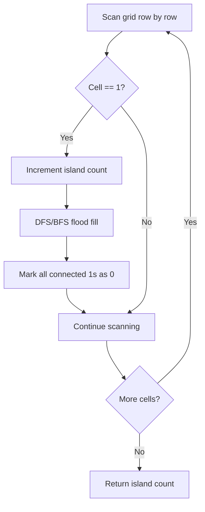

Given an `m x n` 2D binary grid `grid` which represents a map of '1's (land) and '0's (water), return the number of islands. An island is surrounded by water and is formed by connecting adjacent lands horizontally or vertically.

## Examples

**Input:** grid = [
  ["1","1","1","1","0"],
  ["1","1","0","1","0"],
  ["1","1","0","0","0"],
  ["0","0","0","0","0"]
]
**Output:** 1
**Explanation:** All the 1s in the grid are connected horizontally or vertically, forming a single island.

**Input:** grid = [
  ["1","1","0","0","0"],
  ["1","1","0","0","0"],
  ["0","0","1","0","0"],
  ["0","0","0","1","1"]
]
**Output:** 3
**Explanation:** There are three separate groups of connected 1s: top-left, center, and bottom-right.


## Brute Force

```js
function numIslandsBFS(grid) {
  if (grid.length === 0) return 0;
  const rows = grid.length;
  const cols = grid[0].length;
  let count = 0;
  const dirs = [[1,0],[-1,0],[0,1],[0,-1]];

  for (let r = 0; r < rows; r++) {
    for (let c = 0; c < cols; c++) {
      if (grid[r][c] === '1') {
        count++;
        const queue = [[r, c]];
        grid[r][c] = '0';
        while (queue.length > 0) {
          const [cr, cc] = queue.shift();
          for (const [dr, dc] of dirs) {
            const nr = cr + dr;
            const nc = cc + dc;
            if (nr >= 0 && nr < rows && nc >= 0 && nc < cols && grid[nr][nc] === '1') {
              grid[nr][nc] = '0';
              queue.push([nr, nc]);
            }
          }
        }
      }
    }
  }
  return count;
}
// BFS approach: Time O(m*n) | Space O(min(m,n))
```

## Solution

```js
function numIslands(grid) {
  if (grid.length === 0) return 0;

  const rows = grid.length;
  const cols = grid[0].length;
  let count = 0;

  function dfs(r, c) {
    if (r < 0 || r >= rows || c < 0 || c >= cols || grid[r][c] === '0') {
      return;
    }
    grid[r][c] = '0'; // mark as visited
    dfs(r + 1, c);
    dfs(r - 1, c);
    dfs(r, c + 1);
    dfs(r, c - 1);
  }

  for (let r = 0; r < rows; r++) {
    for (let c = 0; c < cols; c++) {
      if (grid[r][c] === '1') {
        count++;
        dfs(r, c);
      }
    }
  }

  return count;
}
```

## Explanation

APPROACH: DFS/BFS Flood Fill

Scan the grid. When a '1' is found, increment island count and flood-fill (DFS/BFS) to mark all connected '1's as visited.

```
Grid:
  1 1 0 0 0
  1 1 0 0 0
  0 0 1 0 0
  0 0 0 1 1

Scan & flood fill:
  (0,0) = '1' → island #1, DFS marks (0,0),(0,1),(1,0),(1,1)
  (2,2) = '1' → island #2, DFS marks (2,2)
  (3,3) = '1' → island #3, DFS marks (3,3),(3,4)

  After marking:
  x x 0 0 0
  x x 0 0 0
  0 0 x 0 0
  0 0 0 x x

  Answer: 3 islands
```

WHY THIS WORKS:
- Each cell is visited at most once (marked as '0' after visiting)
- DFS/BFS from a land cell reaches all connected land → one complete island
- O(m×n) time and space

## Diagram



## TestConfig
```json
{
  "functionName": "numIslands",
  "testCases": [
    {
      "args": [
        [
          [
            "1",
            "1",
            "1",
            "1",
            "0"
          ],
          [
            "1",
            "1",
            "0",
            "1",
            "0"
          ],
          [
            "1",
            "1",
            "0",
            "0",
            "0"
          ],
          [
            "0",
            "0",
            "0",
            "0",
            "0"
          ]
        ]
      ],
      "expected": 1
    },
    {
      "args": [
        [
          [
            "1",
            "1",
            "0",
            "0",
            "0"
          ],
          [
            "1",
            "1",
            "0",
            "0",
            "0"
          ],
          [
            "0",
            "0",
            "1",
            "0",
            "0"
          ],
          [
            "0",
            "0",
            "0",
            "1",
            "1"
          ]
        ]
      ],
      "expected": 3
    },
    {
      "args": [
        [
          [
            "1",
            "0",
            "1",
            "0",
            "1"
          ]
        ]
      ],
      "expected": 3
    },
    {
      "args": [
        [
          [
            "0",
            "0",
            "0"
          ],
          [
            "0",
            "0",
            "0"
          ]
        ]
      ],
      "expected": 0,
      "isHidden": true
    },
    {
      "args": [
        [
          [
            "1"
          ]
        ]
      ],
      "expected": 1,
      "isHidden": true
    },
    {
      "args": [
        [
          [
            "1",
            "1"
          ],
          [
            "1",
            "1"
          ]
        ]
      ],
      "expected": 1,
      "isHidden": true
    },
    {
      "args": [
        [
          [
            "1",
            "0"
          ],
          [
            "0",
            "1"
          ]
        ]
      ],
      "expected": 2,
      "isHidden": true
    },
    {
      "args": [
        [
          [
            "1",
            "0",
            "1"
          ],
          [
            "0",
            "1",
            "0"
          ],
          [
            "1",
            "0",
            "1"
          ]
        ]
      ],
      "expected": 5,
      "isHidden": true
    },
    {
      "args": [
        [
          [
            "1",
            "1",
            "1"
          ],
          [
            "0",
            "1",
            "0"
          ],
          [
            "1",
            "1",
            "1"
          ]
        ]
      ],
      "expected": 1,
      "isHidden": true
    },
    {
      "args": [
        [
          [
            "0"
          ]
        ]
      ],
      "expected": 0,
      "isHidden": true
    }
  ]
}
```
