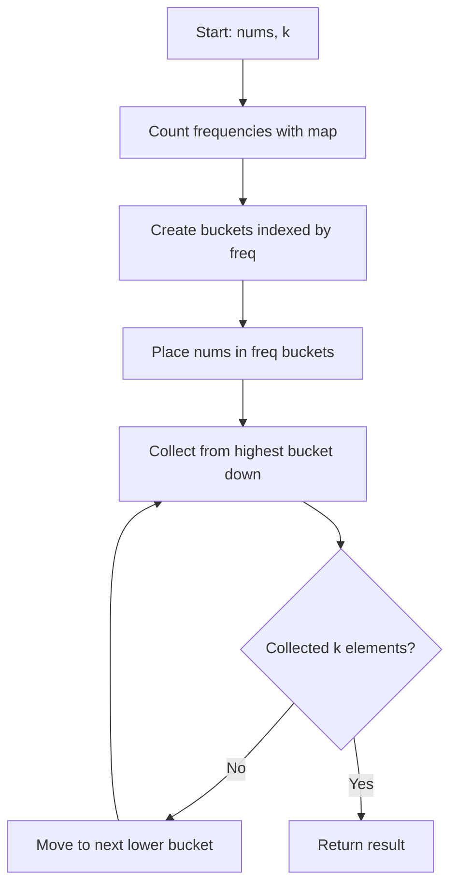

Given an integer array `nums` and an integer `k`, return the `k` most frequent elements. You may return the answer in any order.

## Examples

**Input:** nums = [1,1,1,2,2,3], k = 2
**Output:** [1,2]
**Explanation:** The value 1 appears 3 times and 2 appears 2 times, making them the two most frequent elements.

**Input:** nums = [1], k = 1
**Output:** [1]
**Explanation:** There is only one element, so it is trivially the most frequent.


## Brute Force

```js
function topKFrequentBrute(nums, k) {
  const freqMap = new Map();
  for (const num of nums) {
    freqMap.set(num, (freqMap.get(num) || 0) + 1);
  }
  return Array.from(freqMap.entries())
    .sort((a, b) => b[1] - a[1])
    .slice(0, k)
    .map(([num]) => num);
}
```

### Brute Force Explanation

The brute force counts frequencies then sorts by frequency in O(n log n) time. Bucket sort avoids the sorting step entirely, achieving O(n) by using frequency as an array index.

## Solution

```js
function topKFrequent(nums, k) {
  const freqMap = new Map();
  for (const num of nums) {
    freqMap.set(num, (freqMap.get(num) || 0) + 1);
  }

  const buckets = new Array(nums.length + 1).fill(null).map(() => []);
  for (const [num, freq] of freqMap) {
    buckets[freq].push(num);
  }

  const result = [];
  for (let i = buckets.length - 1; i >= 0 && result.length < k; i--) {
    for (const num of buckets[i]) {
      result.push(num);
      if (result.length === k) break;
    }
  }
  return result;
}
```

## Explanation

APPROACH: Bucket Sort by Frequency

Step 1: Count frequency of each number with a hash map.
Step 2: Create buckets where index = frequency. Place each number in its frequency bucket.
Step 3: Iterate buckets from highest index down, collecting numbers until we have k.

```
nums = [1,1,1,2,2,3], k = 2

Step 1 - Frequency count:
  num   freq
  ───   ────
   1     3
   2     2
   3     1

Step 2 - Bucket sort (index = frequency):
  Index:  0    1    2    3    4    5    6
  Bucket: []  [3]  [2]  [1]  []   []   []

Step 3 - Scan from right to left, collect k=2 elements:
  i=6: [] → skip
  i=5: [] → skip
  i=4: [] → skip
  i=3: [1] → result = [1]
  i=2: [2] → result = [1, 2] → done!
```

WHY THIS WORKS:
- Max possible frequency is n (array length), so bucket array is bounded
- Scanning from right gives highest-frequency elements first
- Total time is O(n): counting is O(n), bucketing is O(n), scanning is O(n)


## Diagram



## TestConfig
```json
{
  "functionName": "topKFrequent",
  "compareType": "sorted",
  "testCases": [
    {
      "args": [
        [
          1,
          1,
          1,
          2,
          2,
          3
        ],
        2
      ],
      "expected": [
        1,
        2
      ]
    },
    {
      "args": [
        [
          1
        ],
        1
      ],
      "expected": [
        1
      ]
    },
    {
      "args": [
        [
          4,
          4,
          4,
          1,
          1,
          2,
          2,
          2,
          3
        ],
        2
      ],
      "expected": [
        2,
        4
      ]
    },
    {
      "args": [
        [
          1,
          2,
          3,
          4,
          5
        ],
        5
      ],
      "expected": [
        1,
        2,
        3,
        4,
        5
      ],
      "isHidden": true
    },
    {
      "args": [
        [
          3,
          3,
          3,
          3,
          1,
          1,
          2
        ],
        1
      ],
      "expected": [
        3
      ],
      "isHidden": true
    },
    {
      "args": [
        [
          -1,
          -1,
          2,
          2,
          3
        ],
        2
      ],
      "expected": [
        -1,
        2
      ],
      "isHidden": true
    },
    {
      "args": [
        [
          5,
          5,
          5,
          5,
          6,
          6,
          6,
          7,
          7,
          8
        ],
        3
      ],
      "expected": [
        5,
        6,
        7
      ],
      "isHidden": true
    },
    {
      "args": [
        [
          1,
          1,
          2,
          2,
          3,
          3
        ],
        3
      ],
      "expected": [
        1,
        2,
        3
      ],
      "isHidden": true
    },
    {
      "args": [
        [
          10,
          20,
          10,
          20,
          30,
          10
        ],
        1
      ],
      "expected": [
        10
      ],
      "isHidden": true
    },
    {
      "args": [
        [
          0,
          0,
          0,
          1,
          1,
          2
        ],
        2
      ],
      "expected": [
        0,
        1
      ],
      "isHidden": true
    }
  ]
}
```
