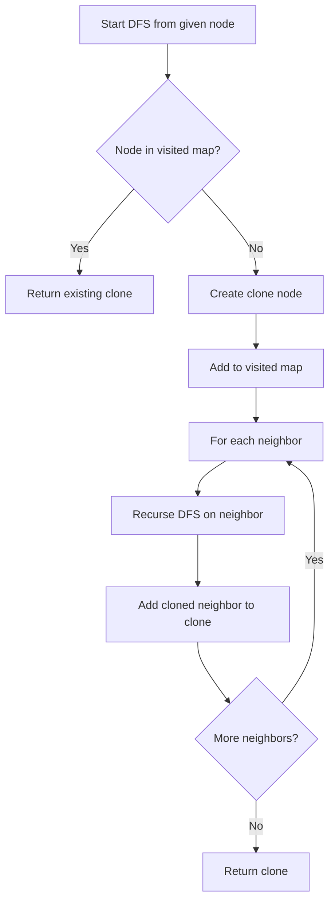

Given a reference of a node in a connected undirected graph, return a deep copy (clone) of the graph. Each node in the graph contains a value (int) and a list of its neighbors.

## Examples

**Input:** adjList = [[2,4],[1,3],[2,4],[1,3]]
**Output:** [[2,4],[1,3],[2,4],[1,3]]
**Explanation:** The graph has 4 nodes. Node 1 neighbors are [2,4], node 2 neighbors are [1,3], etc.


## Solution

```js
// class GraphNode {
//   constructor(val = 0, neighbors = []) {
//     this.val = val;
//     this.neighbors = neighbors;
//   }
// }

function cloneGraph(node) {
  if (node === null) return null;

  const visited = new Map();

  function dfs(original) {
    if (visited.has(original)) return visited.get(original);

    const clone = { val: original.val, neighbors: [] };
    visited.set(original, clone);

    for (const neighbor of original.neighbors) {
      clone.neighbors.push(dfs(neighbor));
    }

    return clone;
  }

  return dfs(node);
}
```

## Diagram


