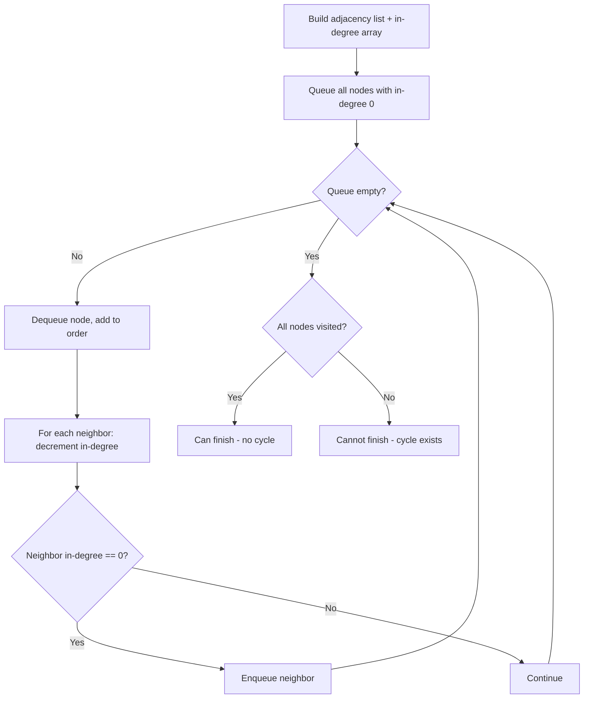

There are a total of `numCourses` courses you have to take, labeled from 0 to `numCourses - 1`. You are given an array `prerequisites` where `prerequisites[i] = [a, b]` indicates that you must take course `b` before course `a`. Return `true` if you can finish all courses, or `false` if there is a cycle in the prerequisite graph.

## Examples

**Input:** numCourses = 2, prerequisites = [[1,0]]
**Output:** true
**Explanation:** Take course 0 first, then course 1. There are no cycles.

**Input:** numCourses = 2, prerequisites = [[1,0],[0,1]]
**Output:** false
**Explanation:** Courses 0 and 1 depend on each other, forming a cycle.


## Brute Force

```js
function canFinishDFS(numCourses, prerequisites) {
  const graph = Array.from({ length: numCourses }, () => []);
  for (const [course, prereq] of prerequisites) {
    graph[prereq].push(course);
  }

  // 0 = unvisited, 1 = in current path, 2 = fully processed
  const state = new Array(numCourses).fill(0);

  function hasCycle(node) {
    if (state[node] === 1) return true;  // cycle detected
    if (state[node] === 2) return false; // already processed
    state[node] = 1;
    for (const neighbor of graph[node]) {
      if (hasCycle(neighbor)) return true;
    }
    state[node] = 2;
    return false;
  }

  for (let i = 0; i < numCourses; i++) {
    if (hasCycle(i)) return false;
  }
  return true;
}
// DFS cycle detection: Time O(V+E) | Space O(V+E)
```

## Solution

```js
function canFinish(numCourses, prerequisites) {
  const graph = Array.from({ length: numCourses }, () => []);
  const inDegree = new Array(numCourses).fill(0);

  for (const [course, prereq] of prerequisites) {
    graph[prereq].push(course);
    inDegree[course]++;
  }

  // Kahn's algorithm (BFS topological sort)
  const queue = [];
  for (let i = 0; i < numCourses; i++) {
    if (inDegree[i] === 0) queue.push(i);
  }

  let completed = 0;
  while (queue.length > 0) {
    const course = queue.shift();
    completed++;

    for (const next of graph[course]) {
      inDegree[next]--;
      if (inDegree[next] === 0) {
        queue.push(next);
      }
    }
  }

  return completed === numCourses;
}
```

## Explanation

APPROACH: Topological Sort (Kahn's Algorithm / BFS)

Build adjacency list and in-degree count. Start with nodes having in-degree 0. Process them, reducing in-degree of neighbors. If all nodes processed, no cycle exists.

```
numCourses = 4, prerequisites = [[1,0],[2,0],[3,1],[3,2]]

  0 → 1 → 3
  0 → 2 → 3

In-degrees: [0:0, 1:1, 2:1, 3:2]

BFS Queue processing:
Step  Queue    Process   Update in-degrees
────  ─────    ───────   ─────────────────
 1    [0]      0         1: 1→0, 2: 1→0
 2    [1,2]    1         3: 2→1
 3    [2]      2         3: 1→0
 4    [3]      3         (none)

Processed 4 nodes = numCourses → Can finish! ✓
Order: [0, 1, 2, 3]
```

WHY THIS WORKS:
- In-degree 0 means no prerequisites remaining → safe to take
- Reducing in-degrees simulates "completing" a course
- If we can't process all nodes, there's a cycle (circular dependency)

## Diagram



## TestConfig
```json
{
  "functionName": "canFinish",
  "testCases": [
    {
      "args": [
        2,
        [
          [
            1,
            0
          ]
        ]
      ],
      "expected": true
    },
    {
      "args": [
        2,
        [
          [
            1,
            0
          ],
          [
            0,
            1
          ]
        ]
      ],
      "expected": false
    },
    {
      "args": [
        1,
        []
      ],
      "expected": true
    },
    {
      "args": [
        3,
        [
          [
            1,
            0
          ],
          [
            2,
            1
          ]
        ]
      ],
      "expected": true,
      "isHidden": true
    },
    {
      "args": [
        3,
        [
          [
            0,
            1
          ],
          [
            1,
            2
          ],
          [
            2,
            0
          ]
        ]
      ],
      "expected": false,
      "isHidden": true
    },
    {
      "args": [
        4,
        [
          [
            1,
            0
          ],
          [
            2,
            0
          ],
          [
            3,
            1
          ],
          [
            3,
            2
          ]
        ]
      ],
      "expected": true,
      "isHidden": true
    },
    {
      "args": [
        5,
        []
      ],
      "expected": true,
      "isHidden": true
    },
    {
      "args": [
        2,
        []
      ],
      "expected": true,
      "isHidden": true
    },
    {
      "args": [
        3,
        [
          [
            1,
            0
          ],
          [
            2,
            0
          ],
          [
            0,
            2
          ]
        ]
      ],
      "expected": false,
      "isHidden": true
    },
    {
      "args": [
        4,
        [
          [
            0,
            1
          ],
          [
            3,
            1
          ],
          [
            1,
            3
          ],
          [
            3,
            2
          ]
        ]
      ],
      "expected": false,
      "isHidden": true
    }
  ]
}
```
