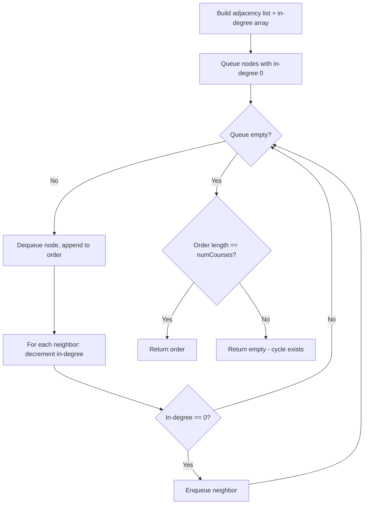

Given the root of a binary tree, imagine yourself standing on the right side of it, return the values of the nodes you can see ordered from top to bottom.

## Examples

**Input:** root = [1,2,3,null,5,null,4]
**Output:** [1,3,4]
**Explanation:** From the right side, you see nodes 1, 3, and 4.

**Input:** root = [1,null,3]
**Output:** [1,3]
**Explanation:** The tree only has right children, so both nodes 1 and 3 are visible from the right side.


## Solution

```js
function rightSideView(root) {
  if (!root) return [];

  const result = [];
  const queue = [root];

  while (queue.length > 0) {
    const levelSize = queue.length;

    for (let i = 0; i < levelSize; i++) {
      const node = queue.shift();

      // Last node of this level is visible from right side
      if (i === levelSize - 1) {
        result.push(node.val);
      }

      if (node.left) queue.push(node.left);
      if (node.right) queue.push(node.right);
    }
  }

  return result;
}
```

## Diagram



## TestConfig
```json
{
  "functionName": "rightSideView",
  "argTypes": [
    "tree"
  ],
  "testCases": [
    {
      "args": [
        [
          1,
          2,
          3,
          null,
          5,
          null,
          4
        ]
      ],
      "expected": [
        1,
        3,
        4
      ]
    },
    {
      "args": [
        [
          1,
          null,
          3
        ]
      ],
      "expected": [
        1,
        3
      ]
    },
    {
      "args": [
        []
      ],
      "expected": []
    },
    {
      "args": [
        [
          1
        ]
      ],
      "expected": [
        1
      ],
      "isHidden": true
    },
    {
      "args": [
        [
          1,
          2
        ]
      ],
      "expected": [
        1,
        2
      ],
      "isHidden": true
    },
    {
      "args": [
        [
          1,
          2,
          3
        ]
      ],
      "expected": [
        1,
        3
      ],
      "isHidden": true
    },
    {
      "args": [
        [
          1,
          2,
          3,
          4
        ]
      ],
      "expected": [
        1,
        3,
        4
      ],
      "isHidden": true
    },
    {
      "args": [
        [
          1,
          2,
          3,
          null,
          5
        ]
      ],
      "expected": [
        1,
        3,
        5
      ],
      "isHidden": true
    },
    {
      "args": [
        [
          1,
          2,
          3,
          4,
          null,
          null,
          null,
          5
        ]
      ],
      "expected": [
        1,
        3,
        4,
        5
      ],
      "isHidden": true
    },
    {
      "args": [
        [
          1,
          2,
          null,
          3,
          null,
          4
        ]
      ],
      "expected": [
        1,
        2,
        3,
        4
      ],
      "isHidden": true
    }
  ]
}
```
