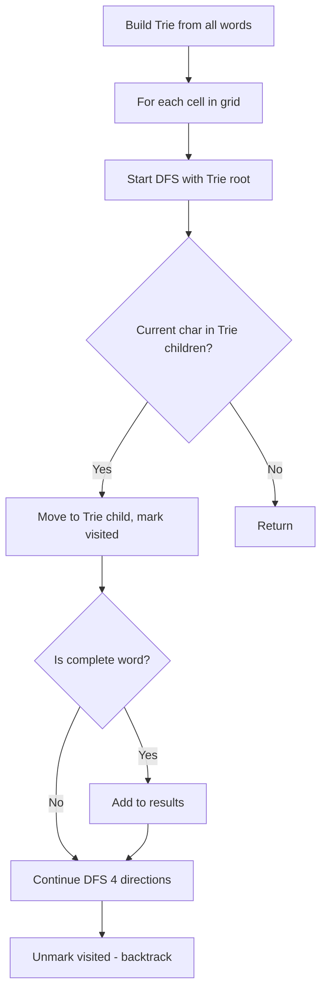

Given the root of a binary tree, check whether it is a mirror of itself (i.e., symmetric around its center).

## Examples

**Input:** root = [1,2,2,3,4,4,3]
**Output:** true
**Explanation:** The tree is symmetric because the left subtree mirrors the right subtree.

**Input:** root = [1,2,2,null,3,null,3]
**Output:** false
**Explanation:** Both left subtrees have node 3 on the same side, so the tree is not a mirror image.


## Solution

```js
function isSymmetric(root) {
  if (!root) return true;

  function isMirror(left, right) {
    if (!left && !right) return true;
    if (!left || !right) return false;
    return (
      left.val === right.val &&
      isMirror(left.left, right.right) &&
      isMirror(left.right, right.left)
    );
  }

  return isMirror(root.left, root.right);
}
```

## Diagram



## TestConfig
```json
{
  "functionName": "isSymmetric",
  "argTypes": [
    "tree"
  ],
  "testCases": [
    {
      "args": [
        [
          1,
          2,
          2,
          3,
          4,
          4,
          3
        ]
      ],
      "expected": true
    },
    {
      "args": [
        [
          1,
          2,
          2,
          null,
          3,
          null,
          3
        ]
      ],
      "expected": false
    },
    {
      "args": [
        [
          1
        ]
      ],
      "expected": true
    },
    {
      "args": [
        []
      ],
      "expected": true,
      "isHidden": true
    },
    {
      "args": [
        [
          1,
          2,
          2
        ]
      ],
      "expected": true,
      "isHidden": true
    },
    {
      "args": [
        [
          1,
          2,
          3
        ]
      ],
      "expected": false,
      "isHidden": true
    },
    {
      "args": [
        [
          1,
          2,
          2,
          null,
          3,
          3
        ]
      ],
      "expected": true,
      "isHidden": true
    },
    {
      "args": [
        [
          1,
          2,
          2,
          3,
          null,
          null,
          3
        ]
      ],
      "expected": true,
      "isHidden": true
    },
    {
      "args": [
        [
          1,
          2,
          2,
          3,
          4,
          4,
          3,
          5,
          6,
          7,
          8,
          8,
          7,
          6,
          5
        ]
      ],
      "expected": true,
      "isHidden": true
    },
    {
      "args": [
        [
          1,
          2,
          2,
          3,
          null,
          3
        ]
      ],
      "expected": false,
      "isHidden": true
    }
  ]
}
```
