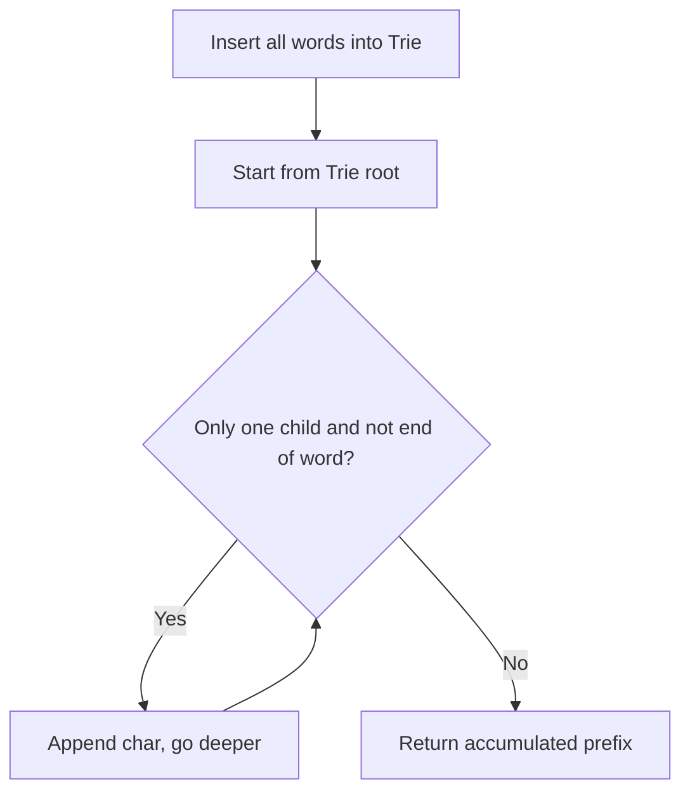

Given the root of a binary tree and an integer `targetSum`, return `true` if the tree has a root-to-leaf path such that adding up all the values along the path equals `targetSum`. A leaf is a node with no children.

## Examples

**Input:** root = [5,4,8,11,null,13,4,7,2,null,null,null,1], targetSum = 22
**Output:** true
**Explanation:** The path 5 -> 4 -> 11 -> 2 sums to 22.

**Input:** root = [1,2,3], targetSum = 5
**Output:** false
**Explanation:** No root-to-leaf path sums to 5; the paths are 1->2 (sum 3) and 1->3 (sum 4).


## Solution

```js
function hasPathSum(root, targetSum) {
  if (!root) return false;

  // Leaf node check
  if (!root.left && !root.right) {
    return root.val === targetSum;
  }

  const remaining = targetSum - root.val;
  return hasPathSum(root.left, remaining) || hasPathSum(root.right, remaining);
}
```

## Diagram



## TestConfig
```json
{
  "functionName": "hasPathSum",
  "argTypes": [
    "tree",
    "primitive"
  ],
  "testCases": [
    {
      "args": [
        [
          5,
          4,
          8,
          11,
          null,
          13,
          4,
          7,
          2,
          null,
          null,
          null,
          1
        ],
        22
      ],
      "expected": true
    },
    {
      "args": [
        [
          1,
          2,
          3
        ],
        5
      ],
      "expected": false
    },
    {
      "args": [
        [],
        0
      ],
      "expected": false
    },
    {
      "args": [
        [
          1
        ],
        1
      ],
      "expected": true,
      "isHidden": true
    },
    {
      "args": [
        [
          1
        ],
        0
      ],
      "expected": false,
      "isHidden": true
    },
    {
      "args": [
        [
          1,
          2
        ],
        3
      ],
      "expected": true,
      "isHidden": true
    },
    {
      "args": [
        [
          1,
          2
        ],
        1
      ],
      "expected": false,
      "isHidden": true
    },
    {
      "args": [
        [
          1,
          2,
          3
        ],
        4
      ],
      "expected": true,
      "isHidden": true
    },
    {
      "args": [
        [
          -2,
          null,
          -3
        ],
        -5
      ],
      "expected": true,
      "isHidden": true
    },
    {
      "args": [
        [
          1,
          -2,
          -3,
          1,
          3,
          -2,
          null,
          -1
        ],
        -1
      ],
      "expected": true,
      "isHidden": true
    }
  ]
}
```
