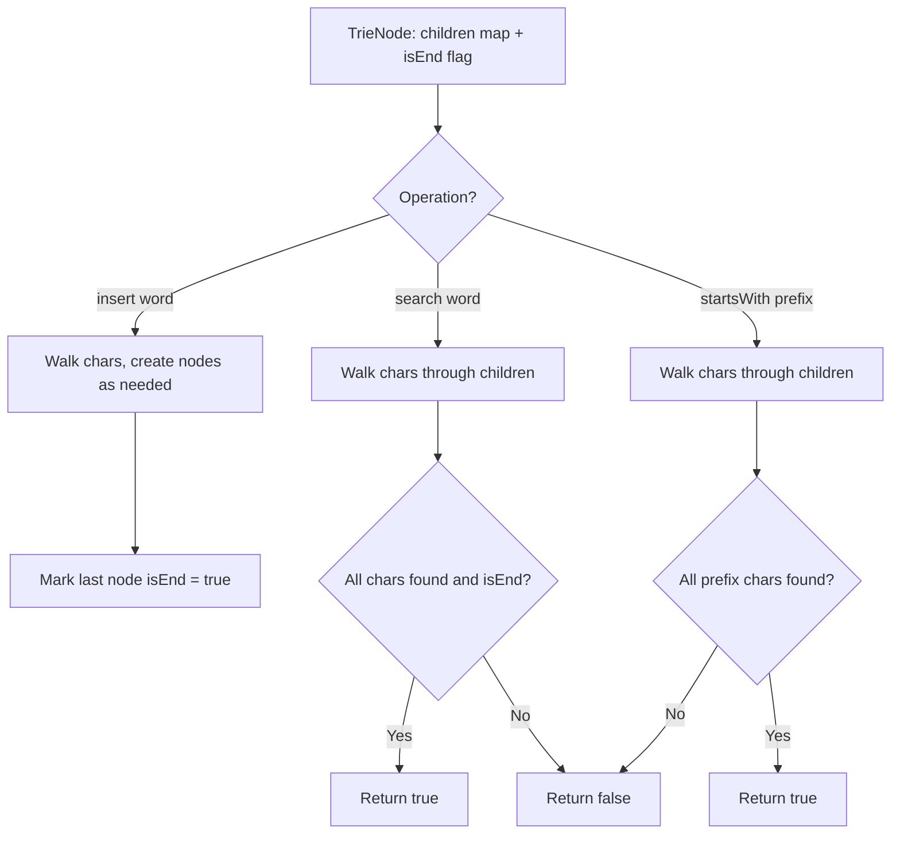

Given the root of a binary tree, return the length of the diameter of the tree. The diameter is the length of the longest path between any two nodes in a tree. This path may or may not pass through the root. The length of a path is the number of edges between two nodes.

## Examples

**Input:** root = [1,2,3,4,5]
**Output:** 3
**Explanation:** The longest path is [4,2,1,3] or [5,2,1,3], which has length 3.

**Input:** root = [1,2]
**Output:** 1
**Explanation:** The only path is from node 1 to node 2, which has 1 edge.


## Solution

```js
function diameterOfBinaryTree(root) {
  let maxDiameter = 0;

  function depth(node) {
    if (!node) return 0;

    const leftDepth = depth(node.left);
    const rightDepth = depth(node.right);

    // Update diameter: path through this node is leftDepth + rightDepth
    maxDiameter = Math.max(maxDiameter, leftDepth + rightDepth);

    return 1 + Math.max(leftDepth, rightDepth);
  }

  depth(root);
  return maxDiameter;
}
```

## Diagram



## TestConfig
```json
{
  "functionName": "diameterOfBinaryTree",
  "argTypes": [
    "tree"
  ],
  "testCases": [
    {
      "args": [
        [
          1,
          2,
          3,
          4,
          5
        ]
      ],
      "expected": 3
    },
    {
      "args": [
        [
          1,
          2
        ]
      ],
      "expected": 1
    },
    {
      "args": [
        [
          1
        ]
      ],
      "expected": 0
    },
    {
      "args": [
        []
      ],
      "expected": 0,
      "isHidden": true
    },
    {
      "args": [
        [
          1,
          2,
          3
        ]
      ],
      "expected": 2,
      "isHidden": true
    },
    {
      "args": [
        [
          1,
          2,
          3,
          4,
          5,
          6,
          7
        ]
      ],
      "expected": 4,
      "isHidden": true
    },
    {
      "args": [
        [
          1,
          2,
          null,
          3,
          null,
          4
        ]
      ],
      "expected": 3,
      "isHidden": true
    },
    {
      "args": [
        [
          1,
          null,
          2,
          null,
          3
        ]
      ],
      "expected": 2,
      "isHidden": true
    },
    {
      "args": [
        [
          1,
          2,
          3,
          4,
          null,
          null,
          null,
          5
        ]
      ],
      "expected": 4,
      "isHidden": true
    },
    {
      "args": [
        [
          4,
          -7,
          -3,
          null,
          null,
          -9,
          -3,
          9,
          -7,
          -4,
          null,
          6,
          null,
          -6,
          -6,
          null,
          null,
          0,
          6,
          5,
          null,
          9,
          null,
          null,
          -1,
          -4,
          null,
          null,
          null,
          -2
        ]
      ],
      "expected": 8,
      "isHidden": true
    }
  ]
}
```
