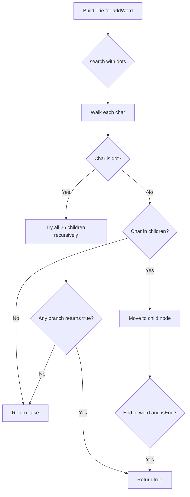

Given a binary tree, find the lowest common ancestor (LCA) of two given nodes in the tree. The LCA is defined as the lowest node in the tree that has both `p` and `q` as descendants (where a node can be a descendant of itself).

## Examples

**Input:** root = [3,5,1,6,2,0,8,null,null,7,4], p = 5, q = 1
**Output:** 3
**Explanation:** The LCA of nodes 5 and 1 is 3.

**Input:** root = [3,5,1,6,2,0,8,null,null,7,4], p = 5, q = 4
**Output:** 5
**Explanation:** The LCA of nodes 5 and 4 is 5, since a node can be a descendant of itself.


## Solution

```js
function lowestCommonAncestor(root, p, q) {
  if (!root || root === p || root === q) return root;

  const left = lowestCommonAncestor(root.left, p, q);
  const right = lowestCommonAncestor(root.right, p, q);

  if (left && right) return root; // p and q are in different subtrees
  return left || right; // both are in the same subtree
}
```

## Diagram


