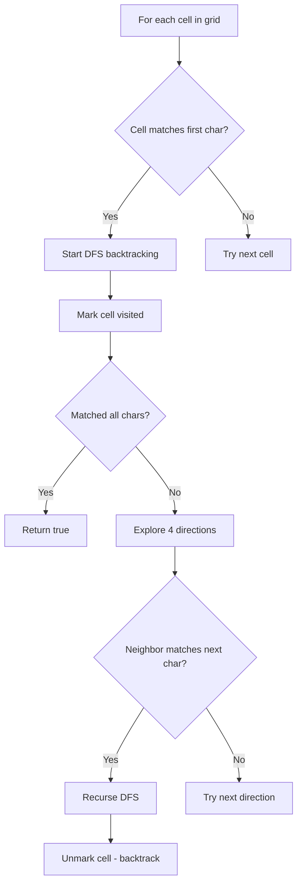

Given an `m x n` grid of characters `board` and a string `word`, return `true` if `word` exists in the grid. The word can be constructed from letters of sequentially adjacent cells, where adjacent cells are horizontally or vertically neighboring. The same letter cell may not be used more than once.

## Examples

**Input:** board = [["A","B","C","E"],["S","F","C","S"],["A","D","E","E"]], word = "ABCCED"
**Output:** true
**Explanation:** The path A->B->C->C->E->D can be traced through adjacent cells.

**Input:** board = [["A","B","C","E"],["S","F","C","S"],["A","D","E","E"]], word = "SEE"
**Output:** true
**Explanation:** The path S->E->E can be traced starting from cell (2,1).

**Input:** board = [["A","B","C","E"],["S","F","C","S"],["A","D","E","E"]], word = "ABCB"
**Output:** false
**Explanation:** The path A->B->C->B would require reusing the B cell, which is not allowed.


## Solution

```js
function exist(board, word) {
  const rows = board.length;
  const cols = board[0].length;

  function dfs(r, c, idx) {
    if (idx === word.length) return true;
    if (r < 0 || r >= rows || c < 0 || c >= cols) return false;
    if (board[r][c] !== word[idx]) return false;

    const temp = board[r][c];
    board[r][c] = '#'; // mark visited

    const found =
      dfs(r + 1, c, idx + 1) ||
      dfs(r - 1, c, idx + 1) ||
      dfs(r, c + 1, idx + 1) ||
      dfs(r, c - 1, idx + 1);

    board[r][c] = temp; // backtrack
    return found;
  }

  for (let r = 0; r < rows; r++) {
    for (let c = 0; c < cols; c++) {
      if (dfs(r, c, 0)) return true;
    }
  }

  return false;
}
```

## Diagram



## TestConfig
```json
{
  "functionName": "exist",
  "testCases": [
    {
      "args": [
        [
          [
            "A",
            "B",
            "C",
            "E"
          ],
          [
            "S",
            "F",
            "C",
            "S"
          ],
          [
            "A",
            "D",
            "E",
            "E"
          ]
        ],
        "ABCCED"
      ],
      "expected": true
    },
    {
      "args": [
        [
          [
            "A",
            "B",
            "C",
            "E"
          ],
          [
            "S",
            "F",
            "C",
            "S"
          ],
          [
            "A",
            "D",
            "E",
            "E"
          ]
        ],
        "SEE"
      ],
      "expected": true
    },
    {
      "args": [
        [
          [
            "A",
            "B",
            "C",
            "E"
          ],
          [
            "S",
            "F",
            "C",
            "S"
          ],
          [
            "A",
            "D",
            "E",
            "E"
          ]
        ],
        "ABCB"
      ],
      "expected": false
    },
    {
      "args": [
        [
          [
            "A"
          ]
        ],
        "A"
      ],
      "expected": true,
      "isHidden": true
    },
    {
      "args": [
        [
          [
            "A"
          ]
        ],
        "B"
      ],
      "expected": false,
      "isHidden": true
    },
    {
      "args": [
        [
          [
            "A",
            "B"
          ],
          [
            "C",
            "D"
          ]
        ],
        "ABDC"
      ],
      "expected": true,
      "isHidden": true
    },
    {
      "args": [
        [
          [
            "A",
            "B"
          ],
          [
            "C",
            "D"
          ]
        ],
        "ABCD"
      ],
      "expected": false,
      "isHidden": true
    },
    {
      "args": [
        [
          [
            "a",
            "a"
          ]
        ],
        "aaa"
      ],
      "expected": false,
      "isHidden": true
    },
    {
      "args": [
        [
          [
            "C",
            "A",
            "A"
          ],
          [
            "A",
            "A",
            "A"
          ],
          [
            "B",
            "C",
            "D"
          ]
        ],
        "AAB"
      ],
      "expected": true,
      "isHidden": true
    },
    {
      "args": [
        [
          [
            "A",
            "B"
          ],
          [
            "C",
            "D"
          ]
        ],
        "ACDB"
      ],
      "expected": true,
      "isHidden": true
    }
  ]
}
```
