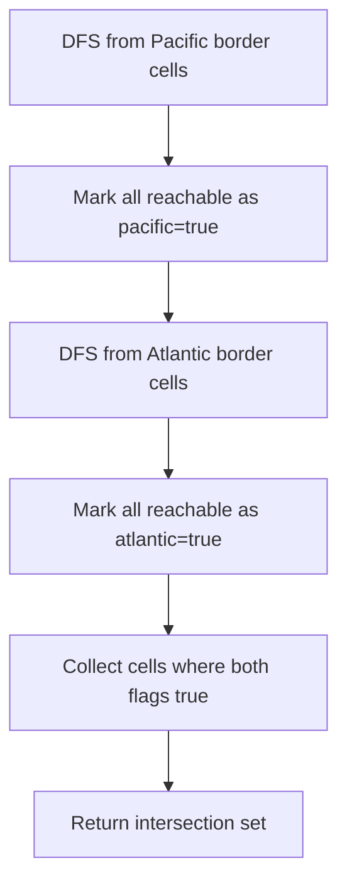

There is an `m x n` rectangular island that borders both the Pacific Ocean and Atlantic Ocean. The Pacific Ocean touches the left and top edges, and the Atlantic Ocean touches the right and bottom edges. Water can flow from a cell to adjacent cells (up, down, left, right) if the adjacent cell's height is less than or equal to the current cell's height. Return a list of grid coordinates where water can flow to both the Pacific and Atlantic oceans.

## Examples

**Input:** heights = [[1,2,2,3,5],[3,2,3,4,4],[2,4,5,3,1],[6,7,1,4,5],[5,1,1,2,4]]
**Output:** [[0,4],[1,3],[1,4],[2,2],[3,0],[3,1],[4,0]]
**Explanation:** These cells can reach both oceans.


## Solution

```js
function pacificAtlantic(heights) {
  if (!heights.length) return [];

  const rows = heights.length;
  const cols = heights[0].length;
  const pacific = Array.from({ length: rows }, () => new Array(cols).fill(false));
  const atlantic = Array.from({ length: rows }, () => new Array(cols).fill(false));

  function dfs(r, c, reachable, prevHeight) {
    if (r < 0 || r >= rows || c < 0 || c >= cols) return;
    if (reachable[r][c] || heights[r][c] < prevHeight) return;

    reachable[r][c] = true;
    dfs(r + 1, c, reachable, heights[r][c]);
    dfs(r - 1, c, reachable, heights[r][c]);
    dfs(r, c + 1, reachable, heights[r][c]);
    dfs(r, c - 1, reachable, heights[r][c]);
  }

  // DFS from Pacific edges (top row and left col)
  for (let c = 0; c < cols; c++) dfs(0, c, pacific, 0);
  for (let r = 0; r < rows; r++) dfs(r, 0, pacific, 0);

  // DFS from Atlantic edges (bottom row and right col)
  for (let c = 0; c < cols; c++) dfs(rows - 1, c, atlantic, 0);
  for (let r = 0; r < rows; r++) dfs(r, cols - 1, atlantic, 0);

  const result = [];
  for (let r = 0; r < rows; r++) {
    for (let c = 0; c < cols; c++) {
      if (pacific[r][c] && atlantic[r][c]) {
        result.push([r, c]);
      }
    }
  }

  return result;
}
```

## Diagram


