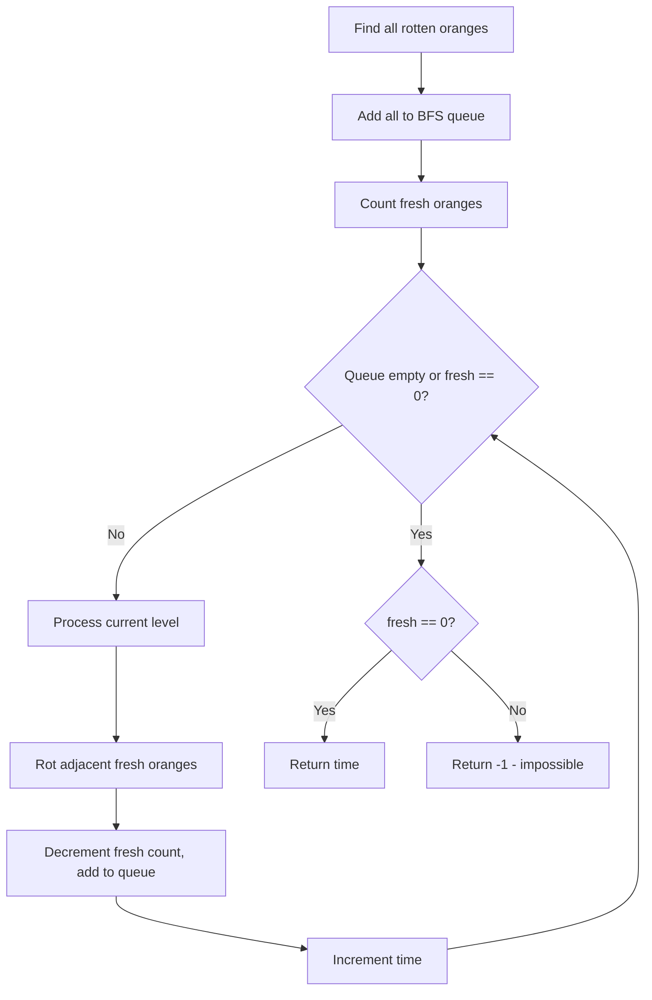

You are given an `m x n` grid where each cell can have one of three values: 0 (empty), 1 (fresh orange), or 2 (rotten orange). Every minute, any fresh orange that is 4-directionally adjacent to a rotten orange becomes rotten. Return the minimum number of minutes that must elapse until no cell has a fresh orange. If this is impossible, return -1.

## Examples

**Input:** grid = [[2,1,1],[1,1,0],[0,1,1]]
**Output:** 4
**Explanation:** It takes 4 minutes for all oranges to rot.

**Input:** grid = [[2,1,1],[0,1,1],[1,0,1]]
**Output:** -1
**Explanation:** The orange at [2,0] can never rot.


## Solution

```js
function orangesRotting(grid) {
  const rows = grid.length;
  const cols = grid[0].length;
  const queue = [];
  let fresh = 0;

  // Find all initially rotten oranges and count fresh ones
  for (let r = 0; r < rows; r++) {
    for (let c = 0; c < cols; c++) {
      if (grid[r][c] === 2) queue.push([r, c]);
      if (grid[r][c] === 1) fresh++;
    }
  }

  if (fresh === 0) return 0;

  const dirs = [[1, 0], [-1, 0], [0, 1], [0, -1]];
  let minutes = 0;

  while (queue.length > 0 && fresh > 0) {
    const size = queue.length;
    for (let i = 0; i < size; i++) {
      const [r, c] = queue.shift();
      for (const [dr, dc] of dirs) {
        const nr = r + dr;
        const nc = c + dc;
        if (nr >= 0 && nr < rows && nc >= 0 && nc < cols && grid[nr][nc] === 1) {
          grid[nr][nc] = 2;
          fresh--;
          queue.push([nr, nc]);
        }
      }
    }
    minutes++;
  }

  return fresh === 0 ? minutes : -1;
}
```

## Explanation

APPROACH: Multi-Source BFS

Start BFS from ALL rotten oranges simultaneously. Each BFS level = 1 minute. Track fresh orange count.

```
Grid at t=0:       t=1:           t=2:           t=3:
2 1 1              2 2 1          2 2 2          2 2 2
1 1 0    →         2 1 0    →     2 2 0    →     2 2 0
0 1 1              0 1 1          0 2 1          0 2 2

Rotten(2) spreads to adjacent fresh(1) each minute.
Initial queue: [(0,0)]  fresh=6
t=1: process (0,0) → rot (0,1),(1,0)  queue: [(0,1),(1,0)]  fresh=4
t=2: process (0,1),(1,0) → rot (0,2),(1,1)  queue: [(0,2),(1,1)]  fresh=2
t=3: process (0,2),(1,1) → rot (2,1),(2,2)  fresh=0

Answer: 3 minutes
```

WHY THIS WORKS:
- Multi-source BFS models simultaneous spreading from all rotten oranges
- Each BFS level = one time unit
- If fresh > 0 at end, some oranges are unreachable → return -1

## Diagram


