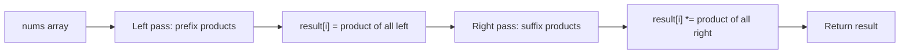

Given an integer array `nums`, return an array `answer` such that `answer[i]` is equal to the product of all the elements of `nums` except `nums[i]`. You must write an algorithm that runs in O(n) time and without using the division operation.

## Examples

**Input:** nums = [1,2,3,4]
**Output:** [24,12,8,6]
**Explanation:** Each element is the product of all other elements: 2x3x4=24, 1x3x4=12, 1x2x4=8, 1x2x3=6.

**Input:** nums = [-1,1,0,-3,3]
**Output:** [0,0,9,0,0]
**Explanation:** The zero at index 2 makes every product zero except at index 2 itself, where the product is (-1)x1x(-3)x3=9.


## Brute Force

```js
function productExceptSelfBrute(nums) {
  const n = nums.length;
  const result = [];
  for (let i = 0; i < n; i++) {
    let product = 1;
    for (let j = 0; j < n; j++) {
      if (i !== j) product *= nums[j];
    }
    result.push(product);
  }
  return result;
}
```

### Brute Force Explanation

The brute force recomputes the product for each index by iterating all other elements, giving O(n^2) time. The prefix/suffix approach precomputes running products in two O(n) passes, reducing total time to O(n).

## Solution

```js
function productExceptSelf(nums) {
  const n = nums.length;
  const result = new Array(n).fill(1);

  let leftProduct = 1;
  for (let i = 0; i < n; i++) {
    result[i] = leftProduct;
    leftProduct *= nums[i];
  }

  let rightProduct = 1;
  for (let i = n - 1; i >= 0; i--) {
    result[i] *= rightProduct;
    rightProduct *= nums[i];
  }

  return result;
}
```

## Explanation

APPROACH: Prefix and Suffix Products (Two Passes)

For each index i, the answer is (product of everything left of i) * (product of
everything right of i). We build these in two passes without extra arrays.

WALKTHROUGH with nums = [1, 2, 3, 4]:

```
LEFT PASS (prefix products):
  i     nums[i]   leftProduct (before)   result[i]   leftProduct (after)
  ─     ───────   ────────────────────   ─────────   ───────────────────
  0       1              1                  1               1
  1       2              1                  1               2
  2       3              2                  2               6
  3       4              6                  6              24

  result after left pass: [1, 1, 2, 6]

RIGHT PASS (suffix products):
  i     nums[i]   rightProduct (before)  result[i]   rightProduct (after)
  ─     ───────   ─────────────────────  ─────────   ────────────────────
  3       4              1                6*1= 6            4
  2       3              4                2*4= 8           12
  1       2             12                1*12=12          24
  0       1             24                1*24=24          24

  result after right pass: [24, 12, 8, 6]
```

WHY THIS WORKS:
- Left pass stores product of all elements before index i
- Right pass multiplies in the product of all elements after index i
- result[i] = prefix[i] * suffix[i] = product of all except nums[i]
- O(1) extra space since we reuse the output array for prefix storage


## Diagram



## TestConfig
```json
{
  "functionName": "productExceptSelf",
  "testCases": [
    {
      "args": [
        [
          1,
          2,
          3,
          4
        ]
      ],
      "expected": [
        24,
        12,
        8,
        6
      ]
    },
    {
      "args": [
        [
          -1,
          1,
          0,
          -3,
          3
        ]
      ],
      "expected": [
        0,
        0,
        9,
        0,
        0
      ]
    },
    {
      "args": [
        [
          2,
          3,
          4,
          5
        ]
      ],
      "expected": [
        60,
        40,
        30,
        24
      ]
    },
    {
      "args": [
        [
          1,
          1,
          1,
          1
        ]
      ],
      "expected": [
        1,
        1,
        1,
        1
      ],
      "isHidden": true
    },
    {
      "args": [
        [
          0,
          0,
          0
        ]
      ],
      "expected": [
        0,
        0,
        0
      ],
      "isHidden": true
    },
    {
      "args": [
        [
          1,
          0,
          3,
          4
        ]
      ],
      "expected": [
        0,
        12,
        0,
        0
      ],
      "isHidden": true
    },
    {
      "args": [
        [
          2,
          2
        ]
      ],
      "expected": [
        2,
        2
      ],
      "isHidden": true
    },
    {
      "args": [
        [
          -1,
          -2,
          -3
        ]
      ],
      "expected": [
        6,
        3,
        2
      ],
      "isHidden": true
    },
    {
      "args": [
        [
          5,
          1,
          1,
          1,
          1
        ]
      ],
      "expected": [
        1,
        5,
        5,
        5,
        5
      ],
      "isHidden": true
    },
    {
      "args": [
        [
          1,
          2,
          3,
          0,
          0
        ]
      ],
      "expected": [
        0,
        0,
        0,
        0,
        0
      ],
      "isHidden": true
    }
  ]
}
```
