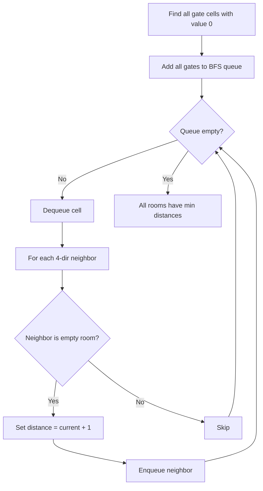

You are given an `m x n` grid rooms initialized with three possible values: -1 (a wall), 0 (a gate), or Infinity (an empty room). Fill each empty room with the distance to its nearest gate. If it is impossible to reach a gate, leave it as Infinity.

## Examples

**Input:** rooms = [[Infinity,-1,0,Infinity],[Infinity,Infinity,Infinity,-1],[Infinity,-1,Infinity,-1],[0,-1,Infinity,Infinity]]
**Output:** [[3,-1,0,1],[2,2,1,-1],[1,-1,2,-1],[0,-1,3,4]]
**Explanation:** Each empty room is filled with the distance to the nearest gate.


## Solution

```js
function wallsAndGates(rooms) {
  if (!rooms.length) return;

  const rows = rooms.length;
  const cols = rooms[0].length;
  const queue = [];
  const INF = 2147483647;

  // Collect all gates as BFS starting points
  for (let r = 0; r < rows; r++) {
    for (let c = 0; c < cols; c++) {
      if (rooms[r][c] === 0) queue.push([r, c]);
    }
  }

  const dirs = [[1, 0], [-1, 0], [0, 1], [0, -1]];

  while (queue.length > 0) {
    const [r, c] = queue.shift();
    for (const [dr, dc] of dirs) {
      const nr = r + dr;
      const nc = c + dc;
      if (nr >= 0 && nr < rows && nc >= 0 && nc < cols && rooms[nr][nc] === INF) {
        rooms[nr][nc] = rooms[r][c] + 1;
        queue.push([nr, nc]);
      }
    }
  }
}
```

## Diagram


