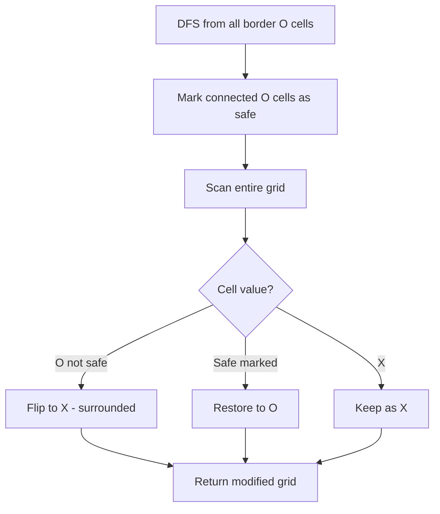

Given an `m x n` matrix `board` containing 'X' and 'O', capture all regions that are 4-directionally surrounded by 'X'. A region is captured by flipping all 'O's into 'X's in that surrounded region. An 'O' on the border (or connected to a border 'O') is not surrounded.

## Examples

**Input:** board = [["X","X","X","X"],["X","O","O","X"],["X","X","O","X"],["X","O","X","X"]]
**Output:** [["X","X","X","X"],["X","X","X","X"],["X","X","X","X"],["X","O","X","X"]]
**Explanation:** The O at [3,1] is on the border so it is not captured. The surrounded Os at [1,1], [1,2], [2,2] are captured.


## Solution

```js
function solve(board) {
  if (!board.length) return;

  const rows = board.length;
  const cols = board[0].length;

  function dfs(r, c) {
    if (r < 0 || r >= rows || c < 0 || c >= cols) return;
    if (board[r][c] !== 'O') return;

    board[r][c] = 'T'; // temporary marker for non-surrounded O
    dfs(r + 1, c);
    dfs(r - 1, c);
    dfs(r, c + 1);
    dfs(r, c - 1);
  }

  // Mark all O's connected to borders
  for (let r = 0; r < rows; r++) {
    dfs(r, 0);
    dfs(r, cols - 1);
  }
  for (let c = 0; c < cols; c++) {
    dfs(0, c);
    dfs(rows - 1, c);
  }

  // Flip: T -> O (border-connected), O -> X (surrounded)
  for (let r = 0; r < rows; r++) {
    for (let c = 0; c < cols; c++) {
      if (board[r][c] === 'O') board[r][c] = 'X';
      if (board[r][c] === 'T') board[r][c] = 'O';
    }
  }
}
```

## Diagram


