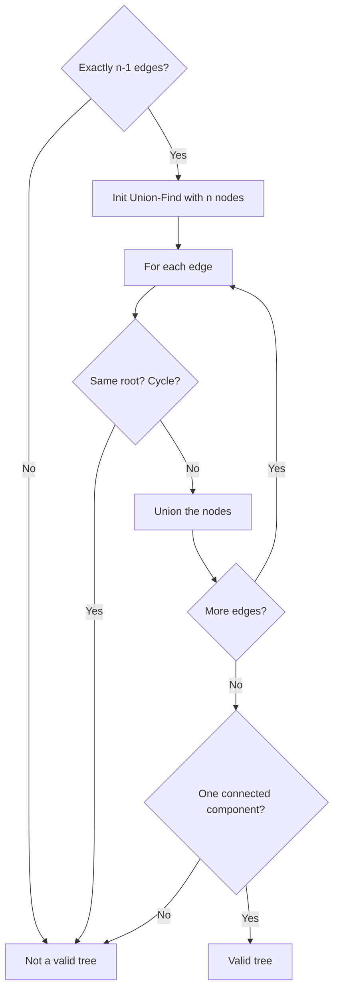

Given `n` nodes labeled from 0 to n-1 and a list of undirected edges (each edge is a pair of nodes), check whether these edges make up a valid tree. A valid tree has n-1 edges and is fully connected with no cycles.

## Examples

**Input:** n = 5, edges = [[0,1],[0,2],[0,3],[1,4]]
**Output:** true
**Explanation:** The graph forms a valid tree with 4 edges connecting 5 nodes.

**Input:** n = 5, edges = [[0,1],[1,2],[2,3],[1,3],[1,4]]
**Output:** false
**Explanation:** There is a cycle: 1-2-3-1.


## Solution

```js
function validTree(n, edges) {
  if (edges.length !== n - 1) return false;

  // Build adjacency list
  const adj = Array.from({ length: n }, () => []);
  for (const [a, b] of edges) {
    adj[a].push(b);
    adj[b].push(a);
  }

  // BFS to check connectivity
  const visited = new Set();
  const queue = [0];
  visited.add(0);

  while (queue.length > 0) {
    const node = queue.shift();
    for (const neighbor of adj[node]) {
      if (!visited.has(neighbor)) {
        visited.add(neighbor);
        queue.push(neighbor);
      }
    }
  }

  return visited.size === n;
}
```

## Diagram


