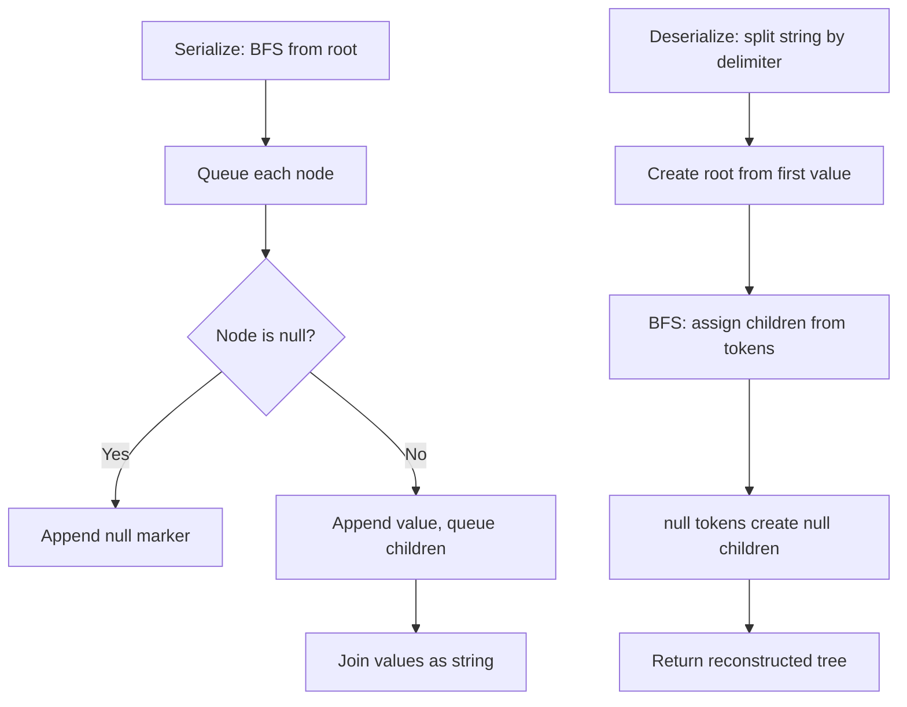

Design an algorithm to serialize a binary tree into a string and deserialize that string back into the original tree structure. Serialization is the process of converting a data structure into a sequence of bits so that it can be stored or transmitted and reconstructed later.

## Examples

**Input:** root = [1,2,3,null,null,4,5]
**Output:** [1,2,3,null,null,4,5]
**Explanation:** The tree is serialized to a string and then deserialized back to the same tree.

**Input:** root = []
**Output:** []
**Explanation:** An empty tree serializes to an empty representation and deserializes back to an empty tree.


## Solution

```js
function serialize(root) {
  const result = [];

  function dfs(node) {
    if (!node) {
      result.push('null');
      return;
    }
    result.push(String(node.val));
    dfs(node.left);
    dfs(node.right);
  }

  dfs(root);
  return result.join(',');
}

function deserialize(data) {
  const values = data.split(',');
  let index = 0;

  function dfs() {
    if (index >= values.length || values[index] === 'null') {
      index++;
      return null;
    }

    const node = { val: parseInt(values[index]), left: null, right: null };
    index++;
    node.left = dfs();
    node.right = dfs();
    return node;
  }

  return dfs();
}
```

## Diagram


